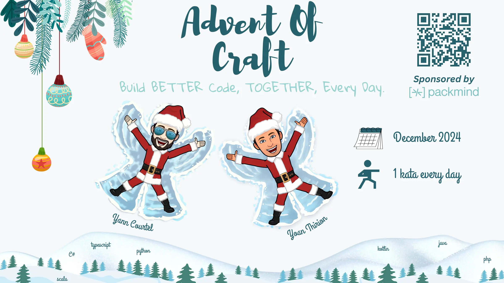
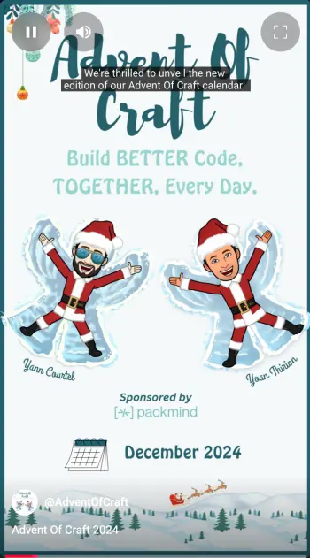
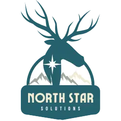

# Advent Of Craft

 

Join us on [`Discord`](https://discord.gg/E5Z9s9UKTS) and [`Linkedin`](https://www.linkedin.com/company/advent-of-craft) to follow the initiative.

> Christmas is closing, December is looming. Winter is coming...

The Advent of Craft team wants to bring you a new adventure both human and technical. Something you have not done before, something that will undoubtedly make you grow.
You are about to enter a territory that is going to make you work hard.
Get your IDE ready!

## Table of Contents
- [What you can expect this year.](#what-you-can-expect-this-year)
    - [More explanation](#more-explanation)
- [Welcome at `North Star Solutions`](#welcome-at-north-star-solutions)
    - [Instructions](#instructions)
- [Challenges](#challenges)
  - [Solutions](#solutions)
- [Who are we?](#who-are-we)
    - [Founders](#founders)
    - [Contributors](#contributors)

## What you can expect this year.

This year, you will have a similar format as last year with exercises everyday and solutions the next day.

Each challenge follow the next and the repository is updated daily.

This year we will cover about 7 languages:

- `C#`
- `Java`
- `Kotlin`
- `Typescript`
- `Php`
- `Scala`
- `Python`

A repository is available and each day a topic will appear with a proposed solution for the day before.

A brand-new folder of original exercises you've never seen.

We know you will enjoy the journey 🎅.
Happy Crafting!

### More explanation
Please take a look at our introduction video:

## Welcome at `North Star Solutions`
As a journeymen and women in software craftsmanship, there are challenges you face every day.
They are challenges that require you to search, to be patient. Others to be quick and to trust your instincts.

In this story, you have been working as a new consultant at `North Star Solutions` since a couple of months.

### Instructions
[Here are the instructions for your journey](docs/INSTRUCTIONS.md)

## Challenges
- [Day 0: An encrypted email...](docs/day00/challenge.md)
- [Day 1: Too many parameters...](docs/day01/challenge.md)
- [Day 2: Extend the program.](docs/day02/challenge.md)

### Solutions
- [Day 0: An encrypted email...](docs/day00/solution/step-by-step.md)
- [Day 1: Fight primitive obsession...](docs/day01/solution/step-by-step.md)

## Who are we?
### Founders
<table>
<tr>
    <td align="center" style="word-wrap: break-word; width: 150.0; height: 150.0">
        <a href=https://github.com/yanncourtel>
            
             
            <b>Yann Courtel</b>
        </a>
    </td>
    <td align="center" style="word-wrap: break-word; width: 150.0; height: 150.0">
        <a href=https://github.com/ythirion>
            
             
            <b>Yoan Thirion</b>
        </a>
    </td>
</tr>
</table>

### Contributors
<table>
<tr>
    <td align="center" style="word-wrap: break-word; width: 150.0; height: 150.0">
        <a href=https://github.com/mengdaming>
            
             
            <b>Damien Menanteau</b>
        </a>
    </td>
    <td align="center" style="word-wrap: break-word; width: 150.0; height: 150.0">
        <a href=https://github.com/drkaine>
            
             
            <b>Drkaine</b>
        </a>
    </td>
    <td align="center" style="word-wrap: break-word; width: 150.0; height: 150.0">
        <a href=https://github.com/tr00d>
            
             
            <b>Guillaume Faas</b>
        </a>
    </td>
    <td align="center" style="word-wrap: break-word; width: 150.0; height: 150.0">
        <a href=https://github.com/Audmqx>
            
             
            <b>Maxim Ric Iangaev</b>
        </a>
    </td>
    <td align="center" style="word-wrap: break-word; width: 150.0; height: 150.0">
        <a href=https://github.com/Mirna-Mfd>
            
             
            <b>Mirna Mahfoud</b>
        </a>
    </td>
    <td align="center" style="word-wrap: break-word; width: 150.0; height: 150.0">
        <a href=https://github.com/pierrebelin>
            
             
            <b>Pierre Belin</b>
        </a>
    </td>
	<td align="center" style="word-wrap: break-word; width: 150.0; height: 150.0">
        <a href=https://github.com/rabahkahil>
            
             
            <b>Rabah KAHIL</b>
        </a>
    </td>
</tr>
</table>
