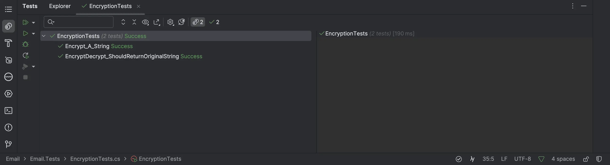
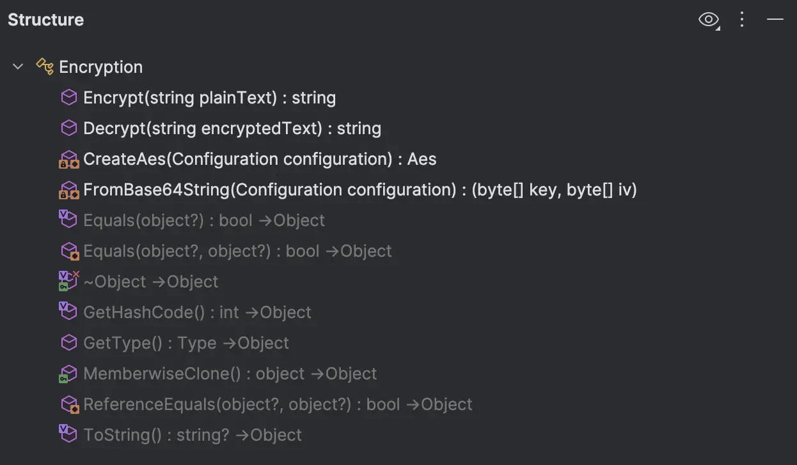
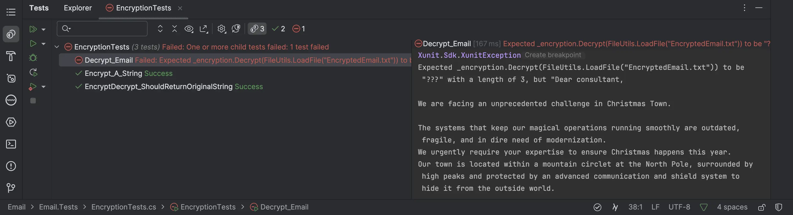

## Day 0: An encrypted email...
We are facing our first `project / solution` of this journey.

We start by running the tests to ensure that everything compiles, and we are able to develop:


We can either run it from our `IDE` or in our Terminal:

```shell
dotnet test
```

> Everything is green, we are OK to move on.

Let's take a look at the code (production and tests):

What can we learn from it?
- Structure of `Encryption`
  - It seems pretty easy to use, especially if we look at the usage (the tests)



- The encrypted email is already stored in the `Tests`

## Write a new test
We can use a test to decrypt the file.

- We need to load the `string` from the encrypted email and can use this method from `FileUtils`:

```csharp
public static string LoadFile(string fileName)
    => File.ReadAllText(
        Combine(
            GetDirectoryName(Assembly.GetExecutingAssembly().Location)!,
            fileName)
    );
```

Here is our first test:

```csharp
[Fact]
public void Decrypt_Email()
    => _encryption
        .Decrypt(FileUtils.LoadFile("EncryptedEmail.txt"))
        .Should()
        // Of course we do not know what it contains so let's assert ???
        .Be("???");
```



The feedback is good, we can see some decrypted characters: `Dear consultant, ...`

Let's adapt the test to write the result in the outcome of the test (or write its content in a file as you prefer).

```csharp
public class EncryptionTests(ITestOutputHelper testOutputHelper)
{
    ...
    [Fact]
    public void Decrypt_Email()
    {
        var decryptedContent = _encryption.Decrypt(FileUtils.LoadFile("EncryptedEmail.txt"));
        decryptedContent.Should().NotBeNullOrEmpty();
        // Use ITestOutputHelper to Write in the outcome of the test
        testOutputHelper.WriteLine(decryptedContent);
    }
}
```

Here is the result:


> You stared at the screen, blinking in disbelief. Could this be a prank? But the email was detailed, with travel instructions and a digital copy of the NDA, stamped with an official-looking seal.

> Wait, is it really a message from Santa? 

Congratulations!!! 🥳 You are ready to go 🎅
With this exercise, you `checked` that you were able to: 

- Open / compile and run the tests for the `day00`
- Find the instructions for the given day
- Find the `step-by-step` guide that will be published the day after each `exercise`