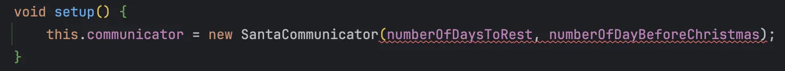
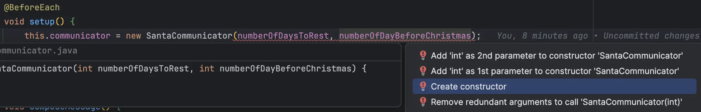
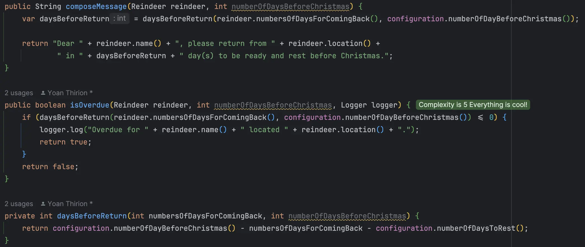

## Day 1: Fight primitive obsession...

> What is the problem with this kind of code?

```java
public String composeMessage(String reindeerName, String currentLocation, int numbersOfDaysForComingBack, int numberOfDaysBeforeChristmas) {
    var daysBeforeReturn = daysBeforeReturn(numbersOfDaysForComingBack, numberOfDaysBeforeChristmas);

    return "Dear " + reindeerName + ", please return from " + currentLocation +
            " in " + daysBeforeReturn + " day(s) to be ready and rest before Christmas.";
}
```

There are 4 parameters of primitive types... it can be really confusing when using this kind of code.

Indeed, even if he has written it, Santa made a mistake by probably inverting the parameters of the same type `numbersOfDaysForComingBack` and `numberOfDaysBeforeChristmas`.
Primitive types are very general and could represent anything... they can not carry behaviors as well...

We may use a data structure to [`fight primitive obsession`](https://xtrem-tdd.netlify.app/Flavours/Design/no-primitive-types) and represent the `reindeer` information here.

> Primitive obsession is a code smell in which primitive data types are used excessively to represent your data models.

### Introduce Reindeer Object
Our IDEs can really help us fight this `code smell`.

- `Introduce Parameter Object` refactoring can help us
  - It will create a `class` based on our method parameters


- Configure the `class` by selecting which parameters should go inside the class
    - We exclude `numberOfDaysBeforeChristmas` to create a cohesive abstraction of the `Reindeer` in this context


- Here is the impact on the code
  - The IDE has instantiated the `Reindeer` in the test by itself 😎

```java
// Reindeer
public record Reindeer(String reindeerName, String currentLocation, int numbersOfDaysForComingBack) {
}

// SantaCommunicator
public String composeMessage(Reindeer reindeer, int numberOfDaysBeforeChristmas) {
    var daysBeforeReturn = daysBeforeReturn(reindeer.numbersOfDaysForComingBack(), numberOfDaysBeforeChristmas);

    return "Dear " + reindeer.reindeerName() + ", please return from " + reindeer.currentLocation() +
            " in " + daysBeforeReturn + " day(s) to be ready and rest before Christmas.";
}

// SantaCommunicatorTest
@Test
void composeMessage() {
    var message = communicator.composeMessage(new Reindeer(DASHER, NORTH_POLE, 5), numberOfDayBeforeChristmas);
    assertThat(message).isEqualTo("Dear Dasher, please return from North Pole in 17 day(s) to be ready and rest before Christmas.");
}
```

- We do the same for the `isOverdue` method
  - The configuration is slightly different because the `class` already exists here


🔵 let's rename some fields

```java
// No need to have a redundant reindeerName field
public record Reindeer(String name, String location, int numbersOfDaysForComingBack) {
}
```

> What could still be improved?

```java
public class SantaCommunicator {
    private final int numberOfDaysToRest;

    public SantaCommunicator(int numberOfDaysToRest) {
        this.numberOfDaysToRest = numberOfDaysToRest;
    }

    public String composeMessage(Reindeer reindeer, int numberOfDaysBeforeChristmas) {
      ...
    }

    public boolean isOverdue(Reindeer reindeer, int numberOfDaysBeforeChristmas, Logger logger) {
      ...
    }

    private int daysBeforeReturn(int numbersOfDaysForComingBack, int numberOfDaysBeforeChristmas) {
      ...
    }
}
```

`int numberOfDaysBeforeChristmas` is passed as an argument in each method... we may pass it to the `SantaCommunicator` constructor.

### Configure the `SantaCommunicator`
We may inject `numberOfDaysToRest` and `numberOfDaysBeforeChristmas` in the constructor.

🔴 we add an expectation on the `SantaCommunicator` constructor from our test



🟢 we generate the constructor from our test



- we call the primary constructor

```java
public SantaCommunicator(int numberOfDaysToRest, int numberOfDayBeforeChristmas) {
    this(numberOfDaysToRest);
}
```

🔵 let's use a type to represent the configuration
- We use the same refactoring technique:


- The code now looks like this:

```java
public SantaCommunicator(int numberOfDaysToRest) {
    this.numberOfDaysToRest = numberOfDaysToRest;
}

public SantaCommunicator(Configuration configuration) {
    this(configuration.numberOfDaysToRest());
}
```

- We can store the `Configuration` in a private field
  - And use it in the methods below

```java
public class SantaCommunicator {
    private final int numberOfDaysToRest;
    private Configuration configuration;

    public SantaCommunicator(int numberOfDaysToRest) {
        this.numberOfDaysToRest = numberOfDaysToRest;
    }

    public SantaCommunicator(Configuration configuration) {
        this(configuration.numberOfDaysToRest());
        this.configuration = configuration;
    }

    public String composeMessage(Reindeer reindeer, int numberOfDaysBeforeChristmas) {
        var daysBeforeReturn = daysBeforeReturn(reindeer.numbersOfDaysForComingBack(), configuration.numberOfDayBeforeChristmas());

        return "Dear " + reindeer.name() + ", please return from " + reindeer.location() +
                " in " + daysBeforeReturn + " day(s) to be ready and rest before Christmas.";
    }

    public boolean isOverdue(Reindeer reindeer, int numberOfDaysBeforeChristmas, Logger logger) {
        if (daysBeforeReturn(reindeer.numbersOfDaysForComingBack(), configuration.numberOfDayBeforeChristmas()) <= 0) {
            logger.log("Overdue for " + reindeer.name() + " located " + reindeer.location() + ".");
            return true;
        }
        return false;
    }

    private int daysBeforeReturn(int numbersOfDaysForComingBack, int numberOfDaysBeforeChristmas) {
        return configuration.numberOfDayBeforeChristmas() - numbersOfDaysForComingBack - configuration.numberOfDaysToRest();
    }
}
```

- We can now clean our code
  - Our IDE is giving us a lot of hints on that



- We use those hints to refactor the code


- We end up with this code

```java
public class SantaCommunicator {
    private final Configuration configuration;

    public SantaCommunicator(Configuration configuration) {
        this.configuration = configuration;
    }

    public String composeMessage(Reindeer reindeer) {
        var daysBeforeReturn = daysBeforeReturn(reindeer.numbersOfDaysForComingBack());

        return "Dear " + reindeer.name() + ", please return from " + reindeer.location() +
                " in " + daysBeforeReturn + " day(s) to be ready and rest before Christmas.";
    }

    public boolean isOverdue(Reindeer reindeer, Logger logger) {
        if (daysBeforeReturn(reindeer.numbersOfDaysForComingBack()) <= 0) {
            logger.log("Overdue for " + reindeer.name() + " located " + reindeer.location() + ".");
            return true;
        }
        return false;
    }

    private int daysBeforeReturn(int numbersOfDaysForComingBack) {
        return configuration.numberOfDayBeforeChristmas() - numbersOfDaysForComingBack - configuration.numberOfDaysToRest();
    }
}
```

- We clean as well the tests and end up with

```java
class SantaCommunicatorTest {
    private final int numberOfDaysToRest = 2;
    private final int numberOfDayBeforeChristmas = 24;
    private final TestLogger logger = new TestLogger();
    private SantaCommunicator communicator;

    @BeforeEach
    void setup() {
        this.communicator = new SantaCommunicator(new Configuration(numberOfDaysToRest, numberOfDayBeforeChristmas));
    }

    @Test
    void composeMessage() {
        assertThat(communicator.composeMessage(
                reindeer(5)
        )).isEqualTo("Dear Dasher, please return from North Pole in 17 day(s) to be ready and rest before Christmas.");
    }

    @Test
    void shouldDetectOverdueReindeer() {
        var overdue = communicator.isOverdue(
                reindeer(numberOfDayBeforeChristmas),
                logger);

        assertThat(overdue).isTrue();
        assertThat(logger.getLog())
                .isEqualTo("Overdue for Dasher located North Pole.");
    }

    @Test
    void shouldReturnFalseWhenNoOverdue() {
        assertThat(communicator.isOverdue(
                reindeer(numberOfDayBeforeChristmas - numberOfDaysToRest - 1),
                logger)
        ).isFalse();
    }

    private static Reindeer reindeer(int numbersOfDaysForComingBack) {
        return new Reindeer("Dasher", "North Pole", numbersOfDaysForComingBack);
    }
}
```

### Reflect
- When was the last time you observed `primitive types everywhere`?
- `How could it be useful to use the refactoring practiced here?
- `Which cohesive data` structures could be introduced in your `current project`?