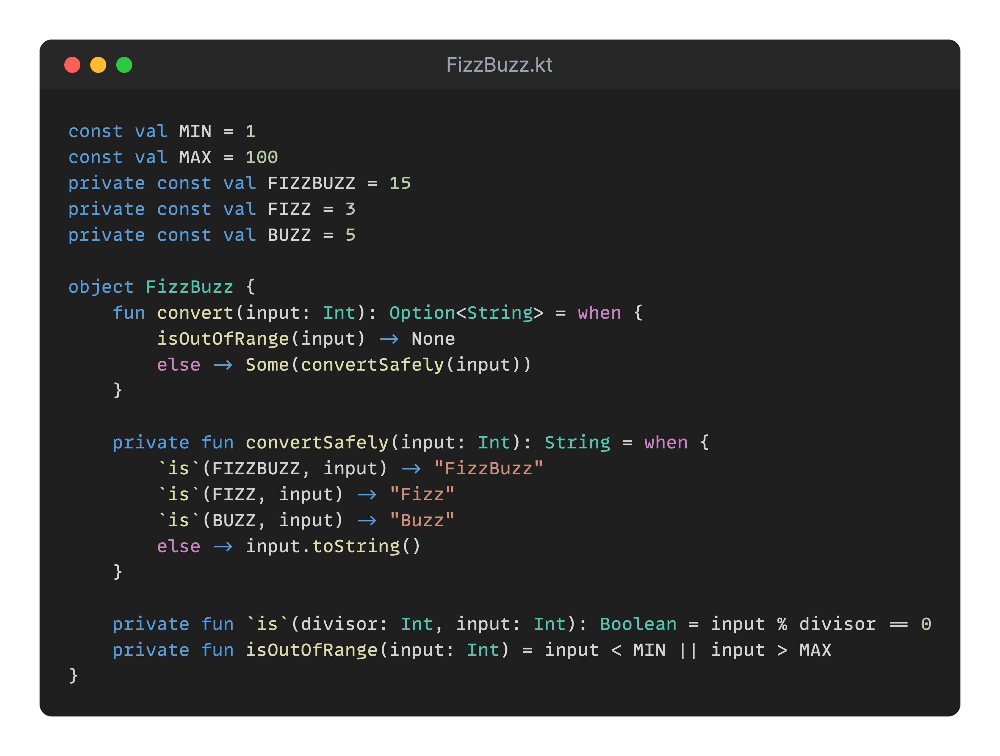

## Day 2: Extend the program.

On the second day, it's apparently game day! 🎯
A special horn startled you at breakfast and Teo sent you a note that they are starting the production of toys. 🎁📦

Santa and the elves have a tradition and love to play together at `FizzBuzz` during production throughout the day.

They find it a little bit too easy and would like to extend the rules of the game like this:

- Multiples of 7 are `Whizz`
- Multiples of 11 are `Bang`

They would like to be able to configure the game from the outside as well. 🎮

✅🚀 **Challenge: Make the game configurable and add new cases.** 🚀✅

- <u>💡HINT:</u> how can the rules be outside of the class?

### Proposed Solution
