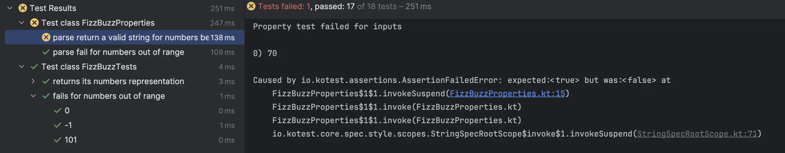

## Day 2: Extend the program.
🔵 We start by **removing duplication** and configuring the current implementation with a `Map`:

```kotlin
object FizzBuzz {
    private val mapping = mapOf(3 to "Fizz", 5 to "Buzz")

    fun convert(input: Int): Option<String> = when {
        isOutOfRange(input) -> None
        else -> Some(convertSafely(input))
    }

    private fun isOutOfRange(input: Int) = input < MIN || input > MAX

	 // Remove the duplication by finding matching divisors for the input
	 // Then concatenate the values
    private fun convertSafely(input: Int): String =
        mapping.matchingDivisors(input)
            .values
            .toResult(input)

    private fun Map.matchingDivisors(input: Int) = filter { (key, _) -> `is`(key, input) }
    private fun `is`(divisor: Int, input: Int): Boolean = input % divisor == 0

    private fun MatchingDivisors.toResult(input: Int) = when {
        any() -> joinToString("")
        else -> input.toString()
    }
}
```

Now we can, extend the `FizzBuzz` class :

- Multiples of 7 are `Whizz`
- Multiples of 11 are `Bang`
- Inject the configuration map into the function

🔴 let's start by adding the new `Whizz` multiples

```kotlin
class FizzBuzzTests : FunSpec({
    context("returns its numbers representation") {
        withData(
            ...
            ValidInput(7, "Whizz")
        ) { (input, expectedResult) ->
            FizzBuzz.convert(input).shouldBeSome(expectedResult)
        }
    }
```

🟢 add the value in the map

```kotlin
private val mapping = mapOf(3 to "Fizz", 5 to "Buzz", 7 to "Whizz")
```

🔴 when we run all our test suite, we identify a broken test (the "parse return a valid string for numbers between 1 and 100" property)


🟢 we fix the property by adding the new valid values
- `FizzWhizz` for multiples of `21`
- `BuzzWhizz` for multiples of `35`

```kotlin
val fizzBuzzStrings = listOf("Fizz", "Buzz", "Whizz", "Bang", "FizzBuzz", "FizzWhizz", "FizzBang", "BuzzWhizz", "BuzzBang", "WhizzBang")
```

We add other test cases as well
```kotlin
ValidInput(7, "Whizz"),
ValidInput(28, "Whizz"),
ValidInput(77, "Whizz"),
ValidInput(21, "FizzWhizz"),
ValidInput(42, "FizzWhizz"),
ValidInput(84, "FizzWhizz"),
ValidInput(35, "BuzzWhizz"),
ValidInput(70, "BuzzWhizz")
```

Notice how simple it is to extend the program 😉

### Inject the configuration in the function
🔴 we start by adapting a test

```kotlin
FizzBuzz.convert(Configuration.mapping, input).shouldBeSome(expectedResult)
```

🟢 we add the parameter through our IDE


and generate the configuration

```kotlin
object Configuration {
    val mapping = mapOf<Int, String>()
}
```

we adapt the production code to use the `map`

```kotlin
fun convert(mapping: Map, input: Int): Option<String> = when {
        isOutOfRange(input) -> None
        else -> Some(convertSafely(mapping, input))
    }

private fun isOutOfRange(input: Int) = input < MIN || input > MAX

private fun convertSafely(mapping: Map, input: Int): String =
    mapping.matchingDivisors(input)
        .values
        .toResult(input)
```

Now that we pass a configuration we should check that the configuration should not be empty

🔴 we add a new test case

```kotlin
"parse fail for valid numbers with no configuration" {
    forAll(Arb.int(MIN..MAX)) { x ->
        FizzBuzz.convert(emptyMap(), x).isNone()
    }
}
```

🟢 add the check on the map

```kotlin
fun convert(mapping: Map, input: Int): Option<String> = when {
    isOutOfRange(input) -> None
    mapping.isEmpty() -> None
    else -> Some(convertSafely(mapping, input))
}
```

🔵 we can refactor the tests by 

- extracting the validNumbers and removing duplication

```kotlin
val validNumbers = Arb.int(MIN..MAX)
```

- generating valid strings based on the configuration

```kotlin
fun Map<Int, String>.generateValidStrings(): List<String> =
    this.values + flatMap { first ->
        filter { second -> second.key > first.key }
            .map { second -> first.key * second.key to first.value + second.value }
    }.toMap().values

fun validStringsFor(x: Int): List<String> = Configuration.mapping.generateValidStrings() + x.toString()
```

Now that the values are configured, how should we call the `FizzBuzz` class? 🧐

## Reflect
- How might this refactoring `impact future maintainability and readability` of the code?
- What are some potential `trade-offs or risks` introduced by this refactoring?
- Where, in your `current codebase`, might you find `similar patterns or duplication`?
