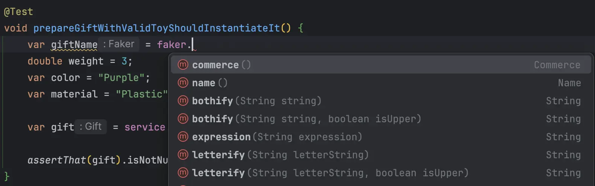
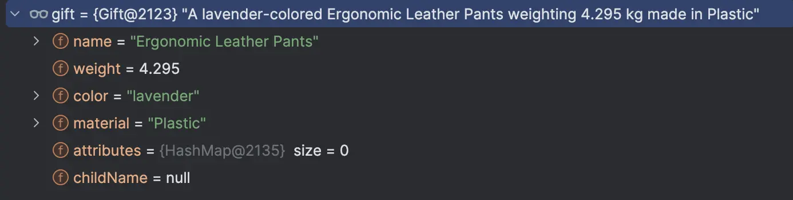
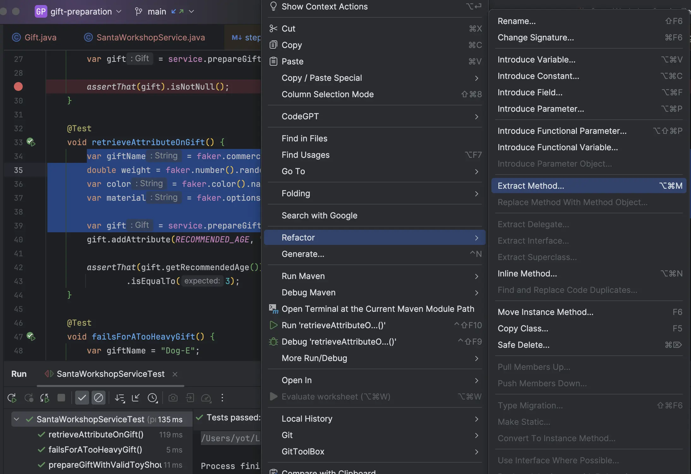
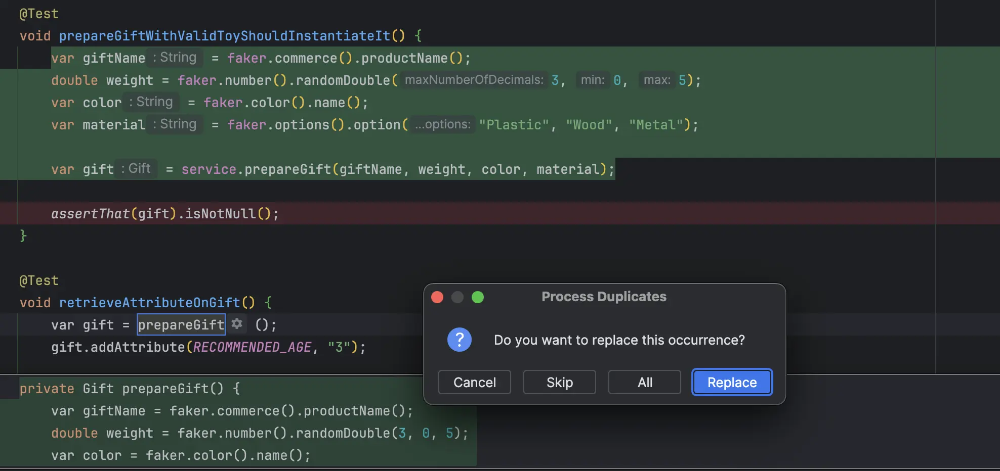

## Day 3: Fuzzy or not?
Utilizing random data in our tests enables us to:
- Identify the data that influence the test outcomes 
- Discover edge cases and develop stronger, more resilient code 

### Which data may be randomized in the tests
Let's look at Santa's code and identify what could be randomized:

```java
class SantaWorkshopServiceTest {
    private static final String RECOMMENDED_AGE = "recommendedAge";
    private SantaWorkshopService service;

    @BeforeEach
    void setUp() {
        service = new SantaWorkshopService();
    }

    @Test
    void prepareGiftWithValidToyShouldInstantiateIt() {
        // Names have no impact
        var giftName = "Bitzee";
        // Weight impacts the behavior because Santa can carry only gifts under 5 kg
        double weight = 3;
        // Color is useless for the outcome nor material
        var color = "Purple";
        var material = "Plastic";

        var gift = service.prepareGift(giftName, weight, color, material);

        assertThat(gift).isNotNull();
    }

    @Test
    void retrieveAttributeOnGift() {
        var giftName = "Furby";
        double weight = 1;
        var color = "Multi";
        var material = "Cotton";

        var gift = service.prepareGift(giftName, weight, color, material);
        gift.addAttribute(RECOMMENDED_AGE, "3");

        assertThat(gift.getRecommendedAge())
                .isEqualTo(3);
    }

    @Test
    void failsForATooHeavyGift() {
        var giftName = "Dog-E";
        // A value greater than 5
        double weight = 6;
        var color = "White";
        var material = "Metal";

        assertThatThrownBy(() -> service.prepareGift(giftName, weight, color, material))
                .isInstanceOf(IllegalArgumentException.class)
                .hasMessage("Gift is too heavy for Santa's sleigh");
    }
}
```

### Randomize some Data
In `java`, we can use [`faker`](https://github.com/DiUS/java-faker) to do so:

```xml
<dependency>
    <groupId>com.github.javafaker</groupId>
    <artifactId>javafaker</artifactId>
    <version>1.0.2</version>
</dependency>
```

We instantiate `Faker` for the tests:

```java
import com.github.javafaker.Faker;
...

class SantaWorkshopServiceTest {
    private static final String RECOMMENDED_AGE = "recommendedAge";
    private final Faker faker = new Faker();
    private SantaWorkshopService service;
    ...
}
```

Then, we start using it from a first test for the git name to start:



We remove hardcoded values from the test:

```java
@Test
void prepareGiftWithValidToyShouldInstantiateIt() {
    // Defined product names
    var giftName = faker.commerce().productName();
    // We define how to generate a valid weight value
    double weight = faker.number().randomDouble(3, 0, 5);
    // Defined colors names
    var color = faker.color().name();
    // We configure different valid / realistic options for materials
    var material = faker.options().option("Plastic", "Wood", "Metal");

    var gift = service.prepareGift(giftName, weight, color, material);

    assertThat(gift).isNotNull();
}
```

Here is an example of generated `Gift` as an input:



Here are some other examples of generated data:

```text
A teal-colored Mediocre Marble Computer weighting 4.371 kg made in Metal
A sky blue-colored Gorgeous Plastic Plate weighting 1.283 kg made in Metal
A tan-colored Lightweight Paper Bench weighting 2.244 kg made in Plastic
A gold-colored Awesome Concrete Hat weighting 3.102 kg made in Plastic
```

We do the same for the `retrieveAttributeOnGift` test:

```java
@Test
void prepareGiftWithValidToyShouldInstantiateIt() {
    var giftName = faker.commerce().productName();
    double weight = faker.number().randomDouble(3, 0, 5);
    var color = faker.color().name();
    var material = faker.options().option("Plastic", "Wood", "Metal");

    var gift = service.prepareGift(giftName, weight, color, material);

    assertThat(gift).isNotNull();
}

@Test
void retrieveAttributeOnGift() {
    var giftName = faker.commerce().productName();
    double weight = faker.number().randomDouble(3, 0, 5);
    var color = faker.color().name();
    var material = faker.options().option("Plastic", "Wood", "Metal");
    
    var gift = service.prepareGift(giftName, weight, color, material);
    gift.addAttribute(RECOMMENDED_AGE, "3");

    assertThat(gift.getRecommendedAge())
            .isEqualTo(3);
}
```

🔵 Let's remove duplication in the tests by centralizing gift preparation logic:



Then our `IDE` proposes to remove duplication 🤩



Our 2 tests now look like this now:

```java
class SantaWorkshopServiceTest {
    ...
    @Test
    void prepareGiftWithValidToyShouldInstantiateIt() {
        var gift = prepareGift();
        assertThat(gift).isNotNull();
    }

    @Test
    void retrieveAttributeOnGift() {
        var gift = prepareGift();
        gift.addAttribute(RECOMMENDED_AGE, "3");

        assertThat(gift.getRecommendedAge())
                .isEqualTo(3);
    }

    private Gift prepareGift() {
        return service.prepareGift(
                faker.commerce().productName(),
                faker.number().randomDouble(3, 0, 5),
                faker.color().name(),
                faker.options().option("Plastic", "Wood", "Metal"));
    }
    ...
```

We finish by refactoring the third test.
- We may use the `prepareGift` method from this test as well
- We configure the method to take `weight` as a parameter

We end up with tests that look like this:

```java
class SantaWorkshopServiceTest {
    private static final String RECOMMENDED_AGE = "recommendedAge";
    private final Faker faker = new Faker();
    private SantaWorkshopService service;

    @BeforeEach
    void setUp() {
        service = new SantaWorkshopService();
    }

    @Test
    void prepareGiftWithValidToyShouldInstantiateIt() {
        assertThat(prepareGiftFor(aValidWeight())).isNotNull();
    }

    @Test
    void retrieveAttributeOnGift() {
        var gift = prepareGiftFor(aValidWeight());
        gift.addAttribute(RECOMMENDED_AGE, "3");

        assertThat(gift.getRecommendedAge())
                .isEqualTo(3);
    }

    private Gift prepareGiftFor(double weight) {
        return service.prepareGift(
                faker.commerce().productName(),
                weight,
                faker.color().name(),
                faker.options().option("Plastic", "Wood", "Metal"));
    }

    private double aValidWeight() {
        return faker.number().randomDouble(3, 0, 5);
    }

    @Test
    void failsForATooHeavyGift() {
        var invalidWeight = faker.number().randomDouble(3, 6, MAX_VALUE);
        assertThatThrownBy(() -> prepareGiftFor(invalidWeight))
                .isInstanceOf(IllegalArgumentException.class)
                .hasMessage("Gift is too heavy for Santa's sleigh");
    }
}
```

> It amplifies what is relevant for the outcome of the test.

### Reflect
- How `random data in unit tests` could help detect `edge cases`?  
- How can the systematic use of random data in tests encourage the `development of more general solutions`?