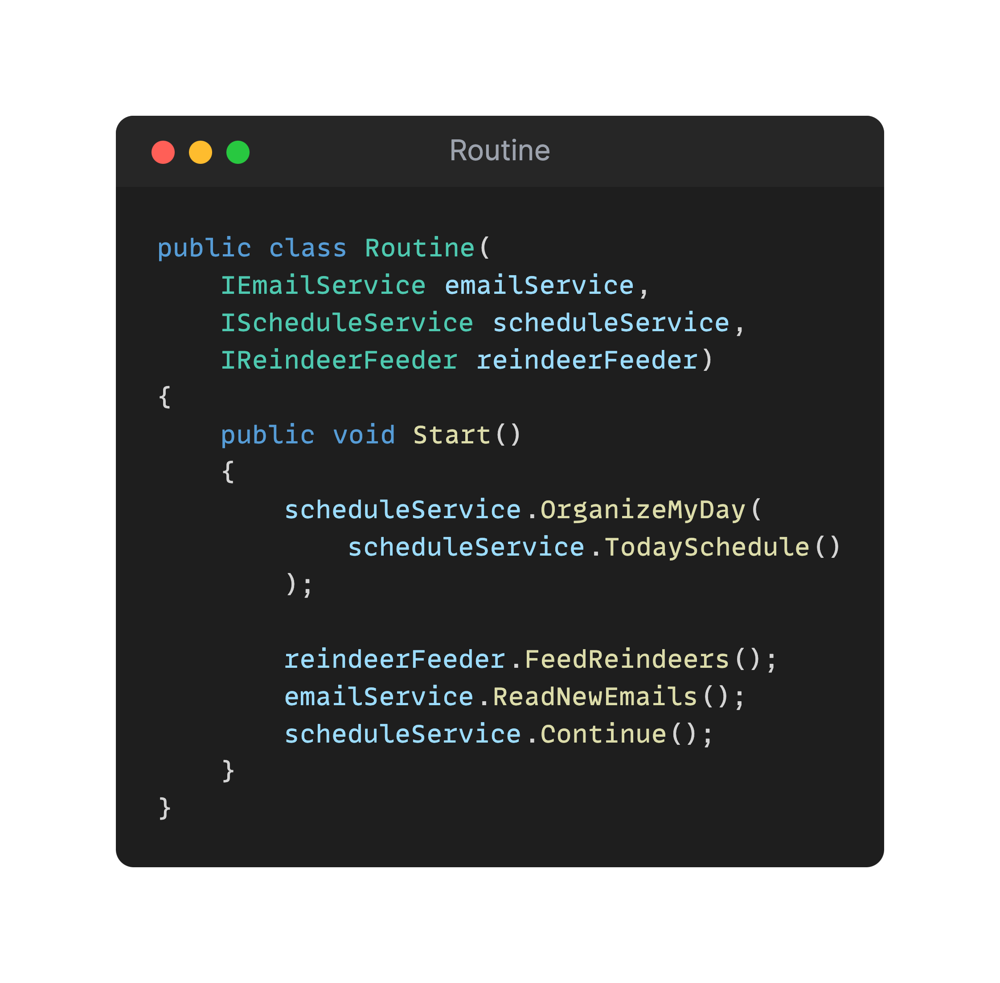

## Day 4: A routine with Fakes and Mocks.
Santa has created a program representing his daily routine.

He would like to add tests on it but does not know how to test it. He has heard a lot of stuff regarding simulating dependencies.

Here are his findings:

- `Test Double`: replace a component on which the Subject Under Test (`SUT`) depends with a "test-specific equivalent".
- `Dummy`: we pass an object that has no implementation as an argument of a method called on the SUT.
- `Spy`: double to capture the indirect output calls made to another component by the system under test (SUT) for later verification by the test.
- `Fake`: replace a component that the SUT depends on with a much lighter-weight implementation.
- `Stub`: replace a real object with a test-specific object that feeds the desired indirect inputs into the system under test. 
- `Mock`: replace an object the system under test (SUT) depends on with a test-specific object that verifies it is being used correctly by the SUT.

He understood that using `Test Doubles` will make his tests ensure those characteristics:
- `Isolation`: allow us to break the original dependencies by isolating the unit / System Under Test (SUT) from its collaborators.
- `Repeatability`: ensure repeatability of our tests as well by replacing external dependencies: call to an API, non deterministic data, ...
- `Fast`: keep our tests Fast.

> Please write the Unit Tests for this Routine program (1 with a library and another 1 with your own fakes) to demonstrate what are Test Doubles to Santa. 

✅🚀 **Challenge: Demonstrate the test doubles by comparing it to using a mock library.** 🚀✅

### Proposed Solution
