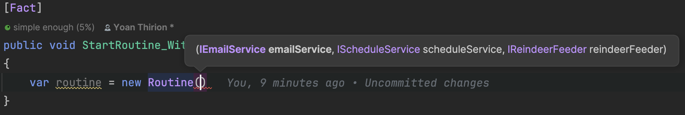

## Day 4: A routine with Fakes and Mocks.
We need to add tests in the `RoutineTests` class for Santa:

```csharp
public class RoutineTests
{
    [Fact]
    public void StartRoutine_With_FakeItEasy()
    {
        // Write a test using FakeItEasy library
    }

    [Fact]
    public void StartRoutine_With_Manual_Fakes()
    {
        // Write a test using your own Fake(s)
    }
}
```

### Use existing mocks
We use [`FakeItEasy`](https://fakeiteasy.github.io/) library in which we can declare `Test Doubles` by simply using:

```csharp
var aDouble = A.Fake<ATypeToDouble>();
```

Like with many libraries, the doubles instantiated by `FakeItEasy` have the characteristics of a:
- `Mock`: emulate out-coming interactions
- `Stub`: emulate in-coming interactions
- `Spy`: record and ensure number of calls and args

We start by instantiating our `SUT` (`Routine` here) to identify the dependencies



Then, we use `test doubles` for the dependencies:

```csharp
[Fact]
public void StartRoutine_With_FakeItEasy()
{
    var routine = new Routine(A.Fake<IEmailService>(), A.Fake<IScheduleService>(), A.Fake<IReindeerFeeder>());
    routine.Start();
    
    // Assert?
}
```

> What do we want to assert?

We may want to ensure that the routine is made in the right order with the right parameters (only one here).
We extract the test doubles in variable to be able to make assertions on their calls:

```csharp
[Fact]
public void StartRoutine_With_FakeItEasy()
{
    var emailServiceDouble = A.Fake<IEmailService>();
    var scheduleServiceDouble = A.Fake<IScheduleService>();
    var reindeerFeederDouble = A.Fake<IReindeerFeeder>();

    var routine = new Routine(emailServiceDouble, scheduleServiceDouble, reindeerFeederDouble);
    routine.Start();

    // We specify that we expect the call at the TodaySchedule should occur only one
    A.CallTo(() => scheduleServiceDouble.TodaySchedule()).MustHaveHappenedOnceExactly();
    // We ignore the parameter of type Schedule
    A.CallTo(() => scheduleServiceDouble.OrganizeMyDay(A<Schedule>.Ignored)).MustHaveHappenedOnceExactly();
    A.CallTo(() => reindeerFeederDouble.FeedReindeers()).MustHaveHappenedOnceExactly();
    A.CallTo(() => emailServiceDouble.ReadNewEmails()).MustHaveHappenedOnceExactly();
    A.CallTo(() => scheduleServiceDouble.Continue()).MustHaveHappenedOnceExactly();
}
```

🔵 What can be improved here?

Well:
- calls can be made in any orders and our tests will still pass...
- we do not verify here that the call to `OrganizeMyDay` is made with the result of the call to `TodaySchedule`
  - do we want to check that? 🤔

```csharp
[Fact]
public void StartRoutine_With_FakeItEasy()
{
    var schedule = new Schedule();
    var emailServiceDouble = A.Fake<IEmailService>();
    var scheduleServiceDouble = A.Fake<IScheduleService>();
    var reindeerFeederDouble = A.Fake<IReindeerFeeder>();

    // Stub the method: emulate in-coming interactions
    A.CallTo(() => scheduleServiceDouble.TodaySchedule()).Returns(schedule);

    var routine = new Routine(emailServiceDouble, scheduleServiceDouble, reindeerFeederDouble);
    routine.Start();

    // We check that OrganizeMyDay is called with the result of the ScheduleService Stub
    // Mock: examine out-coming interactions are made in order and exactly Once 
    A.CallTo(() => scheduleServiceDouble.OrganizeMyDay(schedule)).MustHaveHappenedOnceExactly()
        .Then(A.CallTo(() => reindeerFeederDouble.FeedReindeers()).MustHaveHappenedOnceExactly())
        .Then(A.CallTo(() => emailServiceDouble.ReadNewEmails()).MustHaveHappenedOnceExactly())
        .Then(A.CallTo(() => scheduleServiceDouble.Continue()).MustHaveHappenedOnceExactly());
}
```

> We strongly encourage you to assess your tests are working as expected by temporarily introduce defects in production code.

Here is an example:

```csharp
public void Start()
{
    scheduleService.OrganizeMyDay(
        scheduleService.TodaySchedule()
    );

    emailService.ReadNewEmails();
    // Call it twice
    scheduleService.Continue();
    scheduleService.Continue();

    // Moved this call
    reindeerFeeder.FeedReindeers();
}
```

> Do not forget to revert the production code after that 😉

### Use manual fakes
We will create our own fakes for this test.

We start by generating fakes from their usages:


We end-up with this code:

```csharp
[Fact]
public void StartRoutine_With_Manual_Fakes()
{
    var routine = new Routine(new EmailService(), new ScheduleService(), new ReindeerFeeder());
    routine.Start();
}

public class ReindeerFeeder : IReindeerFeeder
{
    public void FeedReindeers()
    {
        throw new NotImplementedException();
    }
}

public class EmailService : IEmailService
{
    public void ReadNewEmails()
    {
        throw new NotImplementedException();
    }
}

public class ScheduleService : IScheduleService
{
    public Schedule TodaySchedule()
    {
        throw new NotImplementedException();
    }

    public void OrganizeMyDay(Schedule schedule)
    {
        throw new NotImplementedException();
    }

    public void Continue()
    {
        throw new NotImplementedException();
    }
}
```

We express what we would like to assert on our fakes:


Then, we work on our fakes to end-up with:

```csharp
[Fact]
public void StartRoutine_With_Manual_Fakes()
{
    var schedule = new Schedule();
    var emailServiceFake = new EmailService();
    var scheduleServiceFake = new ScheduleService(schedule);
    var reindeerFeederFake = new ReindeerFeeder();

    var routine = new Routine(emailServiceFake, scheduleServiceFake, reindeerFeederFake);
    routine.Start();

    scheduleServiceFake.HasBeenOrganized(schedule);
    emailServiceFake.HasBeenRead();
    reindeerFeederFake.HasBeenFed();
    scheduleServiceFake.HasBeenContinued();
}

public class EmailService : IEmailService
{
    private bool _emailRead;
    public void ReadNewEmails() => _emailRead = true;

    public void HasBeenRead() => _emailRead.Should().BeTrue();
}

public class ReindeerFeeder : IReindeerFeeder
{
    private bool _hasBeenFed;
    public void FeedReindeers() => _hasBeenFed = true;
    
    public void HasBeenFed() => _hasBeenFed.Should().BeTrue();
}

public class ScheduleService(Schedule schedule) : IScheduleService
{
    private Schedule? _calledToOrganize;
    private bool _continue;

    public Schedule TodaySchedule() => schedule;
    public void OrganizeMyDay(Schedule s) => _calledToOrganize = s;
    public void Continue() => _continue = true;

    public void HasBeenOrganized(Schedule s) => _calledToOrganize.Should().Be(s);
    public void HasBeenContinued() => _continue.Should().BeTrue();
}
```

### Reflect
- What do you consider as a `Unit` in your Unit Tests?
- What is the impact of using `mocking libraries in our tests`?
- What is the impact of using our `own fake objects`?
- Which test seem mor readable for you? 