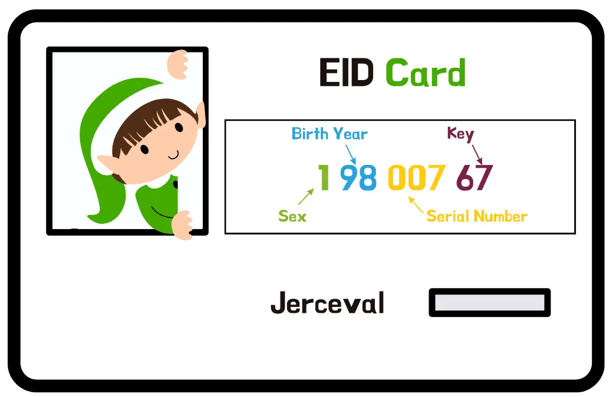
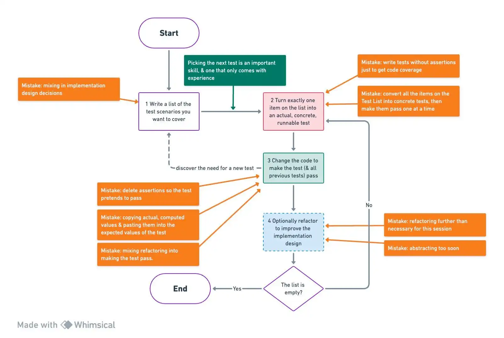

## Day 5: Validate Elf Ids (EID)
To prepare for his tour, Santa needs to do it with his elves.
He uses a unique identifier called `EID` to recognize who's who.

> Design a system that can handle `EID`

### EID rules
`EID` stands for "Elf Identifier" it is a unique id representing an elf composed by X characters.
Elves are magically created each year but limited to 999 birth maximum.

Here are the requirements:

| Positions | Meaning                                                                                        | Possible values                     |
|-----------|------------------------------------------------------------------------------------------------|-------------------------------------|
| 1         | Sex : 1 for `Sloubi`, 2 for `Gagna`, 3 for `Catact`                                            | 1, 2 or 3                           |
| 2, 3      | Last two digits of the year of birth (which gives the year to the nearest century)             | From 00 to 99                       |
| 4, 5, 6   | "Serial number": birth order                                                                   | From 001 to 999                     |
| 7, 8      | control key = complement to 97 of the number formed by the first 6 digits of the EID modulo 97 | From 01 to 97                       |

Here is an example of such id:

Use `Canon TDD` to implement the validation logic for `Santa`.

### Canon TDD

More explanations by Kent Beck [here](https://tidyfirst.substack.com/p/canon-tdd).

### Proposed Solution

