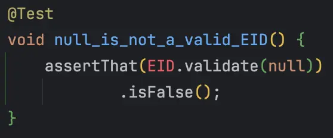
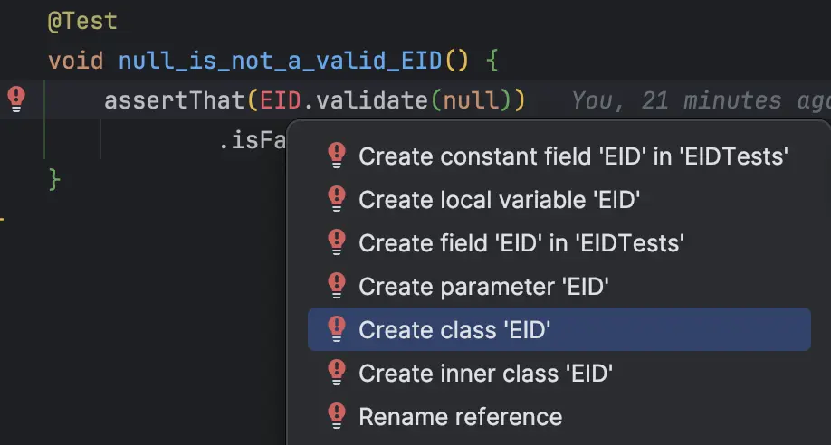
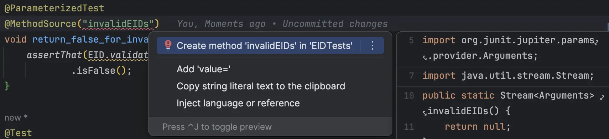
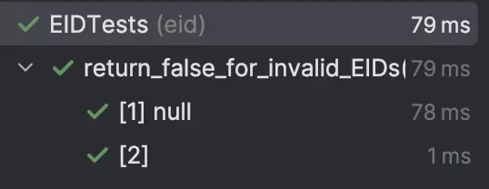
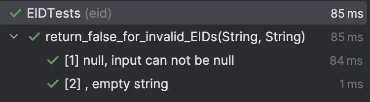
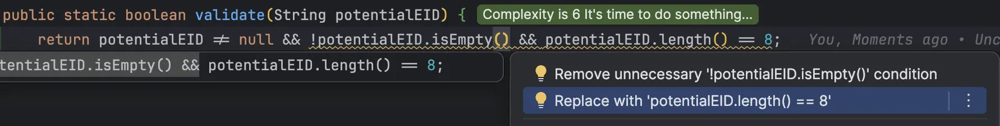
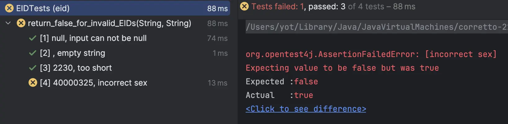
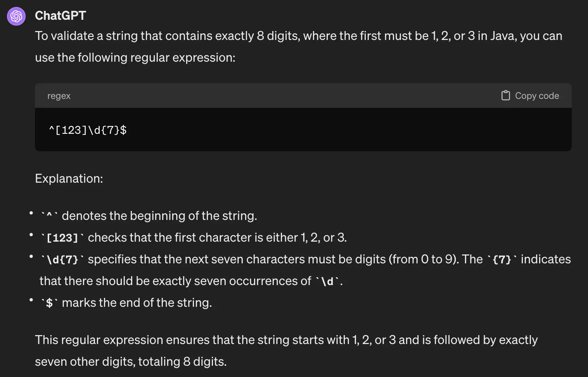

## Day 5: Validate Elf Ids (EID)
To prepare for his tour, santa needs to do it with his elves.
He uses a unique identifier called `EID` to recognize who's who.

> Design a system that can handle `EID`

### EID rules
`EID` stands for "Elf Identifier" it is a unique id representing an elf composed by X characters.
Elves are magically created each year but limited to 999 birth maximum.

Here are the requirements:

| Positions | Meaning                                                                                        | Possible values                     |
|-----------|------------------------------------------------------------------------------------------------|-------------------------------------|
| 1         | Sex : 1 for `Sloubi`, 2 for `Gagna`, 3 for `Catact`                                            | 1, 2 or 3                           |
| 2, 3      | Last two digits of the year of birth (which gives the year to the nearest century)             | From 00 to 99                       |
| 4, 5, 6   | "Serial number": birth order                                                                   | From 001 to 999                     |
| 7, 8      | control key = complement to 97 of the number formed by the first 6 digits of the EID modulo 97 | From 01 to 97                       |

Here is an example of such id:


Use `Canon TDD` to implement the validation logic for `Santa`.

### Canon TDD


More explanations by Kent Beck [here](https://tidyfirst.substack.com/p/canon-tdd).

### Make a Test List
To make the test list we need to clarify how is calculated the key...
If we take the example above:
- `1` it is a `Sloubi`
- `98` born in 1998
- `07` the 7th birth of the year
- `67` is the result of
  - 198007 % 97 = 30
  - 97 - 30 = 67

We "imagine" `invalid` EIDs based on the requirements:
```text
- null // String may be null
- "" // empty string
- 2230 // too short
- 40000325 // incorrect sex
- 1ab14599 // incorrect birth year
- 19814x08 // incorrect serial number
- 19912378 // incorrect control key
```

Here are some valid EIDs:
```text
- 19845606
- 30600233
- 29999922
- 11111151
- 19800767
```

### Write our first tests
🔴 Let's start by a failing test (as usual in T.D.D).

`What happens if the client pass a null String?`

```java
@Test
void null_is_not_a_valid_EID() {
    assertThat(EID.validate(null))
            .isFalse();
}
```

Our code is not compiling.


🟢 Make it `green` as fast as possible by [generating production code from usage](https://xtrem-tdd.netlify.app/Flavours/Design/generate-code-from-usage).



```java
public class EID {
  public static boolean validate(String potentialEID) {
    return false;
  }
}
```

🔵 Refactor the code to introduce a null `String` rule.

```java
public static boolean validate(String potentialEID) {
  return potentialEID != null;
}
```

🔴 Empty `String`

```java
@Test
void empty_is_not_a_valid_EID() {
    assertThat(EID.validate(""))
            .isFalse();
}
```

🟢 make it green

```java
public static boolean validate(String potentialEID) {
    return potentialEID != null && !potentialEID.isEmpty();
}
```

🔵 what could be refactored here?

We know that we will have other non passing test cases and already have defined 2 tests for that...
It may be smart to use a `parameterized` test instead of duplicating the logic.

- We start by adapting a test
  - We add the correct annotations
  - We use a `MethodSource` to pass our args

```java
@ParameterizedTest
@MethodSource("invalidEIDs")
void return_false_for_invalid_EIDs() {
  ...
}
```

- We generate the `MethodSource`



- We add the parameter in the test and declare the parameters

```java
public static Stream<Arguments> invalidEIDs() {
    return Stream.of(
            Arguments.of((Object) null),
            Arguments.of("")
    );
}

@ParameterizedTest
@MethodSource("invalidEIDs")
void return_false_for_invalid_EIDs(String invalidEID) {
    assertThat(EID.validate(invalidEID))
            .isFalse();
}
```



- We may improve the test by adding a reason for failure to make it more explicit

```java
class EIDTests {
    public static Stream<Arguments> invalidEIDs() {
        return Stream.of(
                Arguments.of(null, "input can not be null"),
                Arguments.of("", "empty string")
        );
    }

    @ParameterizedTest
    @MethodSource("invalidEIDs")
    void return_false_for_invalid_EIDs(String invalidEID, String reason) {
        assertThat(EID.validate(invalidEID))
                .as(reason)
                .isFalse();
    }
}
```



🔴 Too short input

```java
public static Stream<Arguments> invalidEIDs() {
    return Stream.of(
            Arguments.of(null, "input can not be null"),
            Arguments.of("", "empty string"),
            Arguments.of("2230", "too short")
    );
}
```

🟢 We add a length rule
```java
public static boolean validate(String potentialEID) {
    return potentialEID != null && !potentialEID.isEmpty() && potentialEID.length() == 8;
}
```

🔵 Let's simplify the expression and remove magic number `8`



```java
public class EID {
    private static final int VALID_LENGTH = 8;

    public static boolean validate(String potentialEID) {
        return potentialEID != null && potentialEID.length() == VALID_LENGTH;
    }
}
```

Let's update our `tests list`

```text
✅ null // String may be null
✅ "" // empty string
✅ 2230 // too short
- 40000325 // incorrect sex
- 1ab14599 // incorrect birth year
- 19814x08 // incorrect serial number
- 19912378 // incorrect control key
```

### Incorrect Sex
🔴 Let's add a new expectation from our tests.

```java
Arguments.of("40000325", "incorrect sex")
```



🟢 Express sex validation

```java
public static boolean validate(String potentialEID) {
    return potentialEID != null && potentialEID.length() == VALID_LENGTH
            && (potentialEID.charAt(0) == '1' || potentialEID.charAt(0) == '2' || potentialEID.charAt(0) == '3');
}
```

🔵 Let's change our code to make it more business expressive.

```java
public static boolean validate(String potentialEID) {
  return validLength(potentialEID)
          && validateSex(potentialEID);
}

private static boolean validLength(String potentialEID) {
  return potentialEID != null && potentialEID.length() == VALID_LENGTH;
}

private static boolean validateSex(String potentialEID) {
  return potentialEID.charAt(0) == '1' || potentialEID.charAt(0) == '2' || potentialEID.charAt(0) == '3';
}
```

- We can still improve our `validateSex` method by using names for magic chars
  - We instantiate a collection to check if the first character is valid

```java
private static boolean validateSex(String potentialEID) {
    return Stream.of('1', '2', '3')
            .collect(toCollection(HashSet::new))
            .contains(potentialEID.charAt(0));
}
```

- We can now replace this collection by using an `enum` with named values
  - We create an enum in its own file

```java
public enum Sex {
    Sloubi('1'),
    Gagna('2'),
    Catact('3');

    public final char value;

    Sex(char value) {
        this.value = value;
    }
}
```

- Then we plug the `valideSex` method on it

```java
private static boolean validateSex(String potentialEID) {
    return Arrays.stream(Sex.values())
            .anyMatch(s -> s.value == potentialEID.charAt(0));
}
```

### Incorrect Year
🔴 We continue to add feature from our tests list.

```java
public static Stream<Arguments> invalidEIDs() {
    return Stream.of(
            ...
            Arguments.of("1ab14599", "incorrect birth year")
    );
}
```

> Be careful when using Parameterized tests to move 1 test case at a time.

🟢 Make it pass by hard-coding year validation.

```java
private static boolean validateYear(String potentialEID) {
    return false;
}
```

🔵 Implement year validation as expressed in specification.

We can use `Regex` to check whether Year is a valid number or not.

```java
private static boolean validateYear(String potentialEID) {
    return potentialEID.substring(1, 3)
            .matches("[0-9.]+");
}
```

Let's move on our `tests list`

```text
✅ null // String may be null
✅ "" // empty string
✅ 2230 // too short
✅ 40000325 // incorrect sex
✅ 1ab14599 // incorrect birth year
- 19814x08 // incorrect serial number
- 19912378 // incorrect control key
```

### Fast-forward invalid EIDs
We finish the implementation of the different incorrect EIDs and end up with this:

```text
✅ null // String may be null
✅ "" // empty string
✅ 2230 // too short
✅ 40000325 // incorrect sex
✅ 1ab14599 // incorrect birth year
✅ 19814x08 // incorrect serial number
✅ 19912378 // incorrect control key
```

```java
public class EID {
    private static final int VALID_LENGTH = 8;

    public static boolean validate(String potentialEID) {
        return validLength(potentialEID)
                && validateSex(potentialEID)
                && validateYear(potentialEID)
                && validateSerialNumber(potentialEID)
                && validateKey(potentialEID);
    }

    private static boolean validLength(String potentialEID) {
        return potentialEID != null && potentialEID.length() == VALID_LENGTH;
    }

    private static boolean validateSex(String potentialEID) {
        return Arrays.stream(Sex.values())
                .anyMatch(s -> s.value == potentialEID.charAt(0));
    }

    private static boolean validateYear(String potentialEID) {
        return isANumber(potentialEID.substring(1, 3));
    }

    private static boolean validateSerialNumber(String potentialEID) {
        return isANumber(potentialEID.substring(3, 6));
    }

    private static boolean isANumber(String str) {
        return str.matches("[0-9.]+");
    }

    private static boolean validateKey(String potentialEID) {
        var key = potentialEID.substring(6, 8);

        if (isANumber(key)) {
            var intKey = Integer.parseInt(key);
            var validKey = calculateKeyFor(toInt(potentialEID));

            return intKey == validKey;
        }
        return false;
    }

    private static int calculateKeyFor(int number) {
        return 97 - (number % 97);
    }

    private static int toInt(String potentialEID) {
        return Integer.parseInt(potentialEID.substring(0, 6));
    }
}
```

🔵 How could it be even simpler? 🤔

We may use a `regex` to validate the format: length and sex and avoid to have severa validation methods

> We may have chosen to this way from the beginning 🤗

- If you are not familiar with `regex` syntax, you may use `ChatGPT` to help you 😉



- Let's refactor our code to use it

```java
public static boolean validate(String potentialEID) {
    return validateFormat(potentialEID)
            && validateSex(potentialEID)
            && validateYear(potentialEID)
            && validateSerialNumber(potentialEID)
            && validateKey(potentialEID);
}

// Use it to validate the format of the String
private static boolean validateFormat(String potentialEID) {
    return potentialEID != null
            && potentialEID.matches("^[123]\\d{7}$")
            && potentialEID.length() == VALID_LENGTH;
}
```

- We can now clean our code by deleting useless methods and even our `Sex` enum

```java
public class EID {
    public static final String VALID_EID_REGEX = "^[123]\\d{7}$";

    public static boolean validate(String potentialEID) {
        return validateFormat(potentialEID)
                && validateKey(potentialEID);
    }

    private static boolean validateFormat(String potentialEID) {
        return potentialEID != null && potentialEID.matches(VALID_EID_REGEX);
    }

    private static boolean validateKey(String potentialEID) {
        return extractKey(potentialEID) == calculateKeyFor(toInt(potentialEID));
    }

    private static int extractKey(String potentialEID) {
        return parseInt(potentialEID.substring(6, 8));
    }

    private static int calculateKeyFor(int number) {
        return 97 - (number % 97);
    }

    private static int toInt(String potentialEID) {
        return parseInt(potentialEID.substring(0, 6));
    }
}
```

### Passing Test Cases
Because we have used `Triangulation` on invalid EIDs we already have created a general implementation.

> The more specific tests you write, the more the code will become generic.

All our valid EIDs are already well validated, we do not have to modify anything in our production code.

```java
public static Stream<Arguments> validEIDs() {
    return Stream.of(
            Arguments.of("19845606"),
            Arguments.of("30600233"),
            Arguments.of("29999922"),
            Arguments.of("11111151"),
            Arguments.of("19800767")
    );
}

...

@ParameterizedTest
@MethodSource("validEIDs")
void return_true_for_valid_EIDs(String validEID) {
    assertThat(EID.validate(validEID))
            .isTrue();
}
```

Let's update our tests list:

```text
✅ null // String may be null
✅ "" // empty string
✅ 2230 // too short
✅ 40000325 // incorrect sex
✅ 1ab14599 // incorrect birth year
✅ 19814x08 // incorrect serial number
✅ 19912378 // incorrect control key
✅ 19845606
✅ 30600233
✅ 29999922
✅ 11111151
✅ 19800767
```

### Reflect
- How many times did you `debug` during this exercise?
- What could `still be improved`?