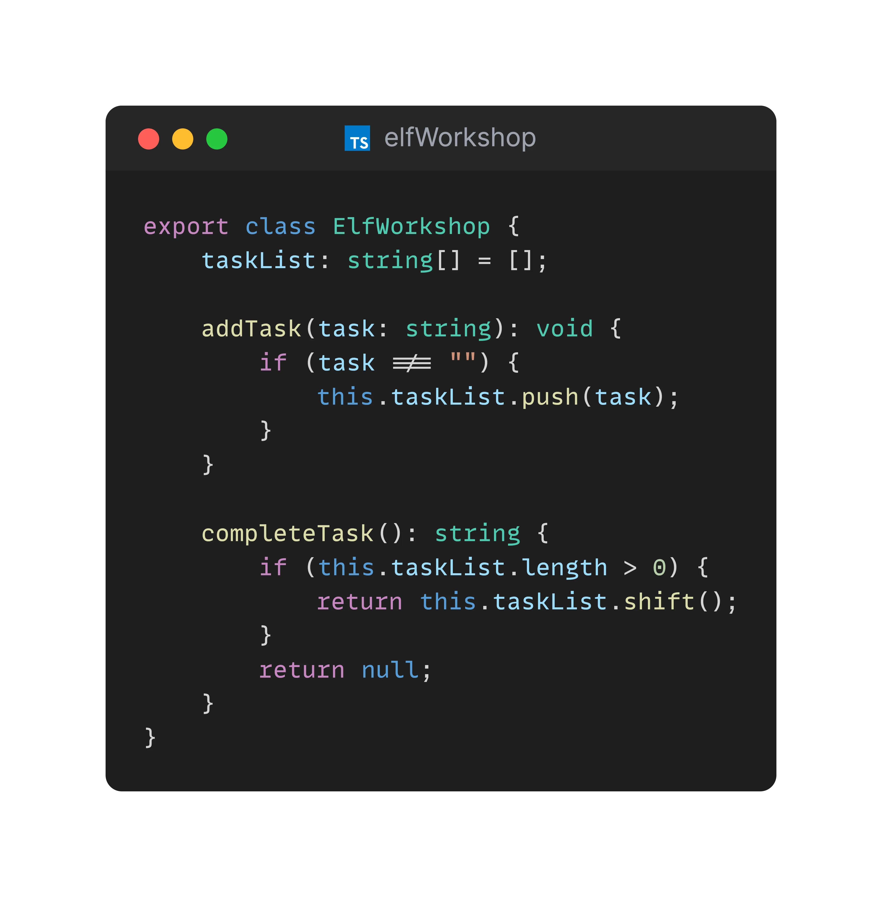

## Day 6: Review some code.
Teo and the elves are working on the system to `track` tasks to prepare `Christmas`.

They seem to trust you as you did a good job on the previous tasks.
They feel happy with their code but would like to be challenged by an external dev.

So they ask you to review it, it is composed of:
- `ElfWorkshop`
- And the related file test

We propose to simulate a `code review` by adding comments in the code.

> Have a good review 🎅

✅🚀 **Challenge: Review the code.** 🚀✅

- <u>💡HINT:</u> View the elves as your colleagues to address the comments.

### Proposed Solution
