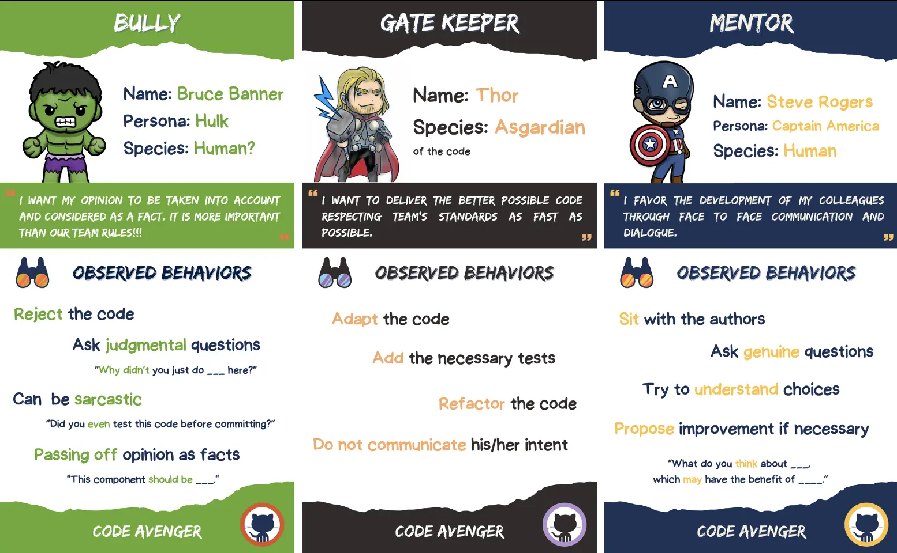
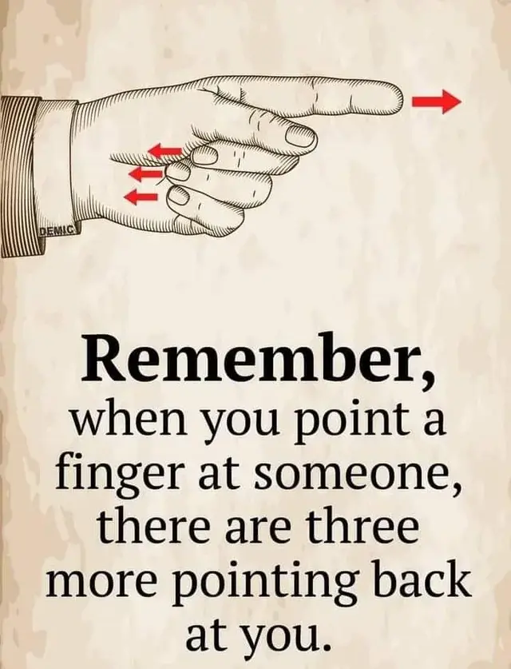
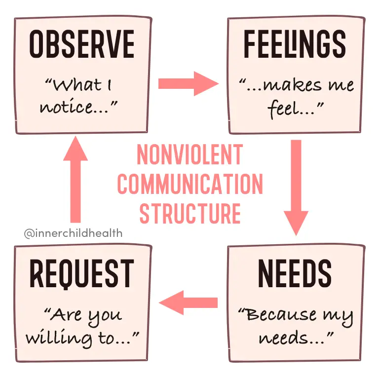
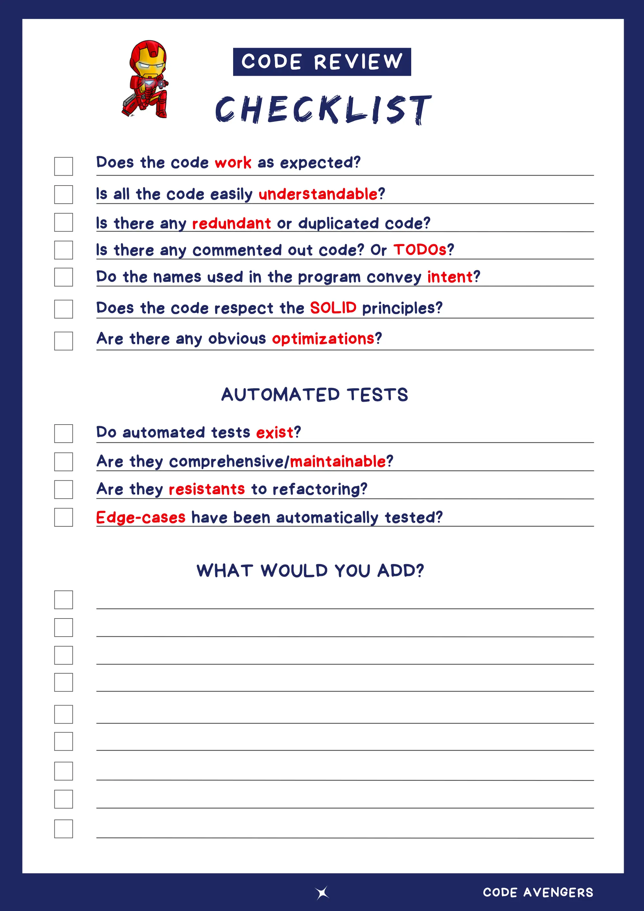
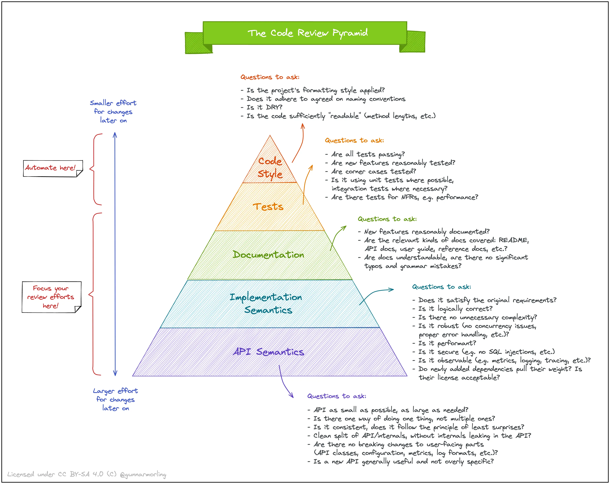

## Day 6: Review some code.
### A first person review

```typescript
// "Let me get this straight, you just pushed a class with a couple of methods and called it a day? 
// Ever heard of SOLID principles? This is child's play. Come back when you've written something worth reviewing."
export class ElfWorkshop {
	 // A task is really just a string for you... never heard about primitive obsessions? 😬
    taskList: string[] = [];
    
	// Regarding addTask method:
	// "Oh, great, a method to add tasks. Groundbreaking! Did it take all day to come up with this? 
	// What's next? A method to breathe?"
    addTask(task: string) {
        if (task !== "") {
            this.taskList.push(task);
        }
    }
    
    // "And this? You call this logic? This wouldn't challenge a first-grader. 
    // Maybe try adding some real functionality next time."
    completeTask() {
        if (this.taskList.length > 0) {
            return this.taskList.shift();
        }
        // Never heard about null pointer issues?
        return null;
    }
}

// elfWorkshop.spec.ts
import { ElfWorkshop } from './ElfWorkshop';

describe('ElfWorkshop Tasks', () => {
    // "Who taught you to name tests? This is the opposite of helpful. 
	// It's like you're trying to sabotage your own code. A+ for effort in confusion."
    test('removeTask should add a task', () => {
        const workshop = new ElfWorkshop();
        workshop.addTask("Build toy train");
        expect(workshop.taskList).toContain("Build toy train");
    });

	// "Ah yes, 'test2', the pinnacle of descriptive naming. 
	// Did you just smash your keyboard and hope for the best? Try describing what the test actually does."
    test('test2 checks for task addition', () => {
        const workshop = new ElfWorkshop();
        workshop.addTask("Craft dollhouse");
        expect(workshop.taskList.includes("Craft dollhouse")).toBeTruthy();
    });

    // "Copy-paste much? This is why we can't have nice things. 
	// Laziness in test writing leads to bloated, unreadable test suites. Congrats on setting a new low."
    test('test2 checks for task addition', () => {
        const workshop = new ElfWorkshop();
        workshop.addTask("Paint bicycle");
        expect(workshop.taskList.includes("Paint bicycle")).toBeTruthy();
    });

    // "Vague test names strike again. 'Should handle empty tasks correctly'—wow, how enlightening! 
    // Maybe spend a few more seconds thinking of a name that doesn't make people guess what it's about."
    test('Should handle empty tasks correctly', () => { 
        const workshop = new ElfWorkshop();
        workshop.addTask("");
        expect(workshop.taskList.length).toBe(0);
    });

    // "This test is as ambiguous as your commitment to quality code. 
    // 'Task removal functionality' could mean anything. Next time, spare us the mystery."
    test('Task removal functionality', () => { 
        const workshop = new ElfWorkshop();
        workshop.addTask("Wrap gifts");
        const removedTask = workshop.completeTask();
        expect(removedTask).toBe("Wrap gifts");
        expect(workshop.taskList.length).toBe(0);
    });
});
```

> What do you think about it?  
> How would you feel if someone did a code review of your code in this way?

#### The problem
People can adopt different behaviors when making a code review. Here are some examples:



- `Bully`: a person full of ego
- `Gate Keeper`: wants to deliver fast and does not care about the impact of his/her behavior on the rest of the team
- `Mentor`: aims to assist others in their personal development because it is beneficial for everyone (people, team, organization, product, ...)

In this `code review` the words used are really judgemental. Its is ego-driven (Bully)... 



> They focus on belittling the work and the person, rather than providing constructive feedback aimed at improvement.

This kind of comment have a really negative impact on developers motivation and the overall team dynamics.

### The Ten Commandments of [Egoless Programming](https://blog.codinghorror.com/the-ten-commandments-of-egoless-programming/)
1. Understand and accept that you will make mistakes 
2. You are not your code
3. No matter how much "karate" you know, someone else will always know more 
4. Don't rewrite code without consultation 
5. Treat people who know less than you with respect, deference, and patience 
6. The only constant in the world is change 
7. The only true authority stems from knowledge, not from position 
8. Fight for what you believe, but gracefully accept defeat 
9. Don't be "the guy in the room."
10. `Critique code instead of people – be kind to the coder, not to the code`

> Those Ten Commandments of underpin software craftsmanship by promoting humility, continuous learning, and collaboration, essential for crafting high-quality, maintainable software. 

### An `Egoless` Code review
Here is the code review adopting an `egoless` approach:

```typescript
export class ElfWorkshop {
    taskList: string[] = [];

    // Adding tasks to the workshop is crucial for our workflow.
    // To enhance robustness, might we consider also checking for strings that are only whitespace?
    // This small check can ensure all tasks added hold meaningful content.
    addTask(task: string) {
        // It's great to see validation for non-empty tasks. Perhaps, extending this to ignore tasks that only contain spaces (e.g., using task.trim() !== "") could help maintain the task list's meaningfulness.
        if (task.trim() !== "") {
            this.taskList.push(task);
        }
    }

    // The approach to complete tasks is straightforward and effective.
    // I'm curious if returning a specific message or throwing an error when there are no tasks left could provide clearer feedback to the elves or the system managing tasks.
    completeTask() {
        // I appreciate the simplicity here. For enhancing clarity for empty task lists, might we consider an alternative return value or a specific message indicating no tasks are available? It could enrich the method's communicative value.
        if (this.taskList.length > 0) {
            return this.taskList.shift();
        }
        return null;
    }
}

import { ElfWorkshop } from './ElfWorkshop';

describe('ElfWorkshop Tasks', () => {
    let system: ElfWorkshop;

    beforeEach(() => {
        system = new ElfWorkshop();
    });

    // It seems like there might have been a little mix-up in naming this test.
    // Could we consider a name that mirrors the action being tested, such as 'addTask should include a new task in the taskList'?
    // This could help future maintainers understand the test's purpose at first glance.
    test('removeTask should add a task', () => {
        const workshop = new ElfWorkshop();
        workshop.addTask("Build toy train");
        expect(workshop.taskList).toContain("Build toy train");
    });

    // This test name feels a bit generic. What do you think about giving it a more descriptive title?
    // Something like 'addTask successfully adds a craft dollhouse task to the taskList' might capture its essence more clearly.
    test('test2 checks for task addition', () => {
        const workshop = new ElfWorkshop();
        workshop.addTask("Craft dollhouse");
        expect(workshop.taskList.includes("Craft dollhouse")).toBeTruthy();
    });

    // I noticed this test seems to be a duplicate with a non-descriptive name.
    // Might it be beneficial to either remove the duplication or clarify the unique aspect this test covers?
    // Clear, descriptive test names are like a beacon for understanding and maintaining our test suites.
    test('test2 checks for task addition', () => {
        const workshop = new ElfWorkshop();
        workshop.addTask("Paint bicycle");
        expect(workshop.taskList.includes("Paint bicycle")).toBeTruthy();
    });

    // This test does a good job of covering a crucial validation case. 
    // How about renaming it to something like 'addTask does not add empty tasks to the taskList' for more clarity?
    test('Should handle empty tasks correctly', () => {
        const workshop = new ElfWorkshop();
        workshop.addTask("");
        expect(workshop.taskList.length).toBe(0);
    });

    // The functionality tested here is important, and the test itself is well-constructed.
    // To make its purpose even clearer, might we consider a name that directly states the expected outcome,
    // such as 'completeTask removes the first task and returns it'?
    test('Task removal functionality', () => {
        const workshop = new ElfWorkshop();
        workshop.addTask("Wrap gifts");
        const removedTask = workshop.completeTask();
        expect(removedTask).toBe("Wrap gifts");
        expect(workshop.taskList.length).toBe(0);
    });
});
```

> The goal of code review is not to demonstrate superiority but to collaboratively improve code quality and share knowledge within the team. 

Using `NonViolent Communication` can really help us to provide feedback with respect and kindness to foster a positive and productive work environment.



### Checklists
Use checklists can make you to make better code review by being aligned as a team on what to review.

Here is an example:



> We recommend you to bootstrap one in team.

You can follow the guidelines below (`Code Review Pyramid`) to create one:



## Reflect
- `How` do you usually `review code`?
- What could you do in the `next 10 days that could help you make `better code reviews` in your team?
- What would be the impact of working in `pair/mob instead of having asynchronous code review`?

## Resources
- [Egoless Programming](https://blog.codinghorror.com/the-ten-commandments-of-egoless-programming/)
- [Code Review Pyramid](https://www.morling.dev/blog/the-code-review-pyramid/)
- [Egoless Crafting](https://egolesscrafting.org/)
- [Code Avengers - Be Better At Reviewing Code](https://github.com/ythirion/code-review)
