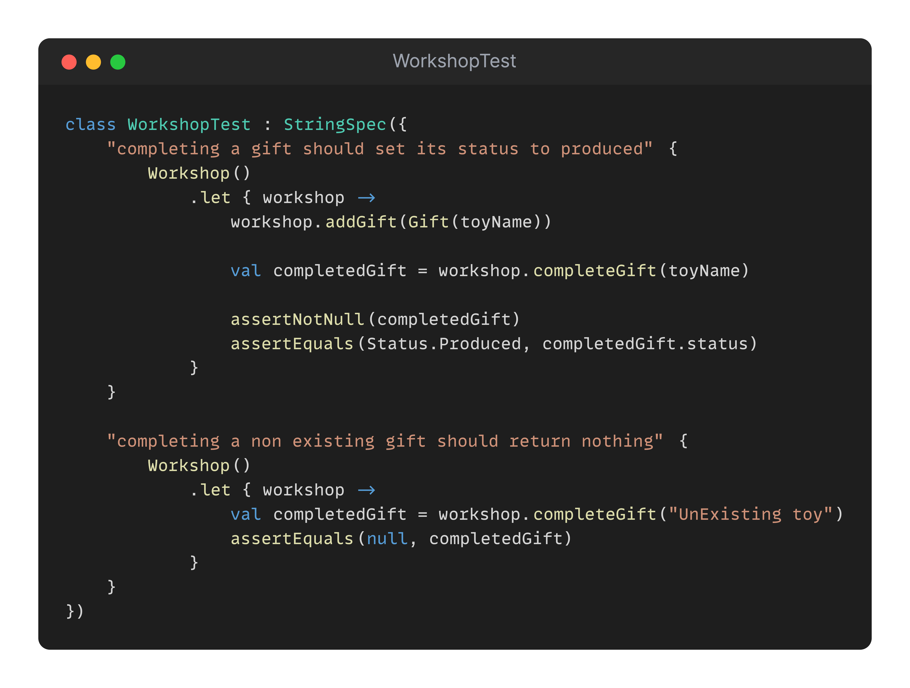

## Day 7: Can you read and understand the tests well?

After the great code review from yesterday, Teo ran by you this morning to tell you to focus on a simple task he pulled from the backlog.

He said some elves were complaining because some tests were hard to understand.
But they never had time to work on it since the code is working...

He's asking what you would do with this test code.

> How our tests could be more business oriented and more human-readable? 

✅🚀 **Challenge: Improve the assertions to be more business-oriented.** 🚀✅

### Proposed Solution
