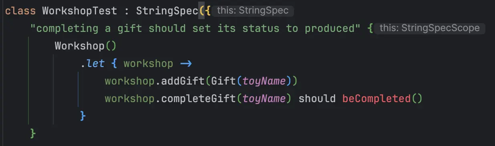
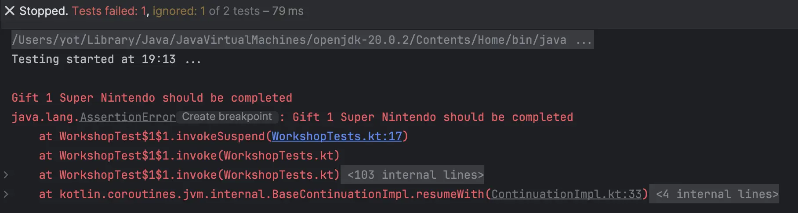

## Day 7: Read the tests and test your reading...
What can be improved in the current tests?

```kotlin
class WorkshopTest : StringSpec({
    "completing a gift should set its status to produced" {
        // Workshop is instantiated in both tests
        Workshop()
            .let { workshop ->
                workshop.addGift(Gift(toyName))

                val completedGift = workshop.completeGift(toyName)

                // assertions are really technical
                assertNotNull(completedGift)
                assertEquals(Status.Produced, completedGift.status)
            }
    }

    "completing a non existing gift should return nothing" {
        Workshop()
            .let { workshop ->
                val completedGift = workshop.completeGift("UnExisting toy")
                
                // null is a technical concept
                assertEquals(null, completedGift)
            }
    }
})
```

### Use Fluent assertions
We can use [Fluent Assertions](https://xtrem-tdd.netlify.app/flavours/testing/fluent-assertions/) to make it more readable.

In `kotlin` our test library helps us by using its `matchers`:

```kotlin
"completing a gift should set its status to produced" {
    Workshop()
        .let { workshop ->
            workshop.addGift(Gift(toyName))

            val completedGift = workshop.completeGift(toyName)

            // more human-readable 
            completedGift shouldNotBe null
            completedGift?.status shouldBe Produced
        }
}
```

- Could we go further?
  - We may use the value equality of `data class` to simplify our test

```kotlin
"completing a gift should set its status to produced" {
    Workshop()
        .let { workshop ->
            workshop.addGift(Gift(toyName))
            // we do not know what is really expected as outcome from the assertion
            workshop.completeGift(toyName) shouldBe Gift(toyName, Produced)
        }
}
```

### Use Custom Business Assertions
We can define our own [`matchers`](https://kotest.io/docs/assertions/custom-matchers.html) to create more business oriented assertions.

🔴 define assertions as we would like it



🟢 we generate the `function` and hard-code the `Matcher`

```kotlin
"completing a gift should set its status to produced" {
  Workshop()
    .let { workshop ->
      workshop.addGift(Gift(toyName))
      workshop.completeGift(toyName)!! should beCompleted()
    }
}

fun beCompleted() = Matcher<Gift> { value ->
    MatcherResult(
        true,
        { "Should message" },
        { "Should not message" }
    )
}
```

🔵 we implement the matcher

```kotlin
fun beCompleted() = Matcher<Gift> { value ->
    MatcherResult(
        value.status == Produced,
        { "Gift ${value.name} should be completed" },
        { "Gift ${value.name} should not be completed" },
    )
}
```

we can change the production code to check if the message is explicit enough when failing:



It is pretty clean, if our test fails we will be able to quickly understand its intent.

We apply the same concept for the other assertion and end up with our tests like this:

```kotlin
class WorkshopTest : StringSpec({
  // we extracted the Workshop to simplify tests as well
  val workshop = Workshop()

  "completing a gift should set its status to produced" {
    workshop.addGift(Gift(toyName))
    workshop.completeGift(toyName)!! should beCompleted()
  }

  "completing a non existing gift should return nothing" {
    workshop.completeGift("UnExisting toy") should beEmpty()
  }
})
```

Here are our 2 `Matcher`:

```kotlin
fun beCompleted() = Matcher<Gift> { value ->
    MatcherResult(
        value.status == Produced,
        { "Gift ${value.name} should be completed" },
        { "Gift ${value.name} should not be completed" },
    )
}

fun beEmpty() = Matcher<Gift?> { value ->
    MatcherResult(
        value == null,
        { "Gift should be empty" },
        { "Gift should should not be filled" },
    )
}
```

Of course, we do not recommend to use this pattern for everything 😉 you need to find the right balance between classic assertions and custom ones based on your needs.

## Reflect
- What would be the `impact` if you defined `custom assertions` for your automated tests?
- `How could you start` using this concept?