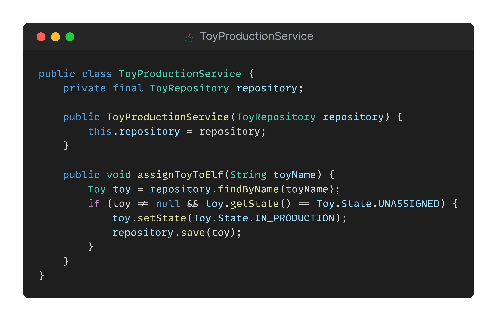

## Day 8: Ask me what to do.

Santa, Teo and his elves are still preparing toys, they use their own system to manage toys production.

They would like some help to improve the design of their code.

They heard about a concept called ["Tell Don't Ask"](https://xtrem-tdd.netlify.app/Flavours/Design/tell-dont-ask) but have no ideas where to start and how to apply it...

> Could you help them?

✅🚀 **Challenge: Refactor the code using the Tell Don't Ask principle.** 🚀✅

### Proposed Solution
