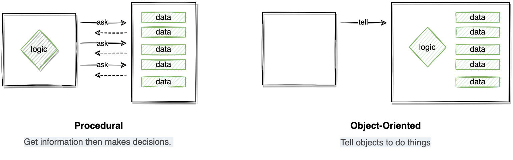
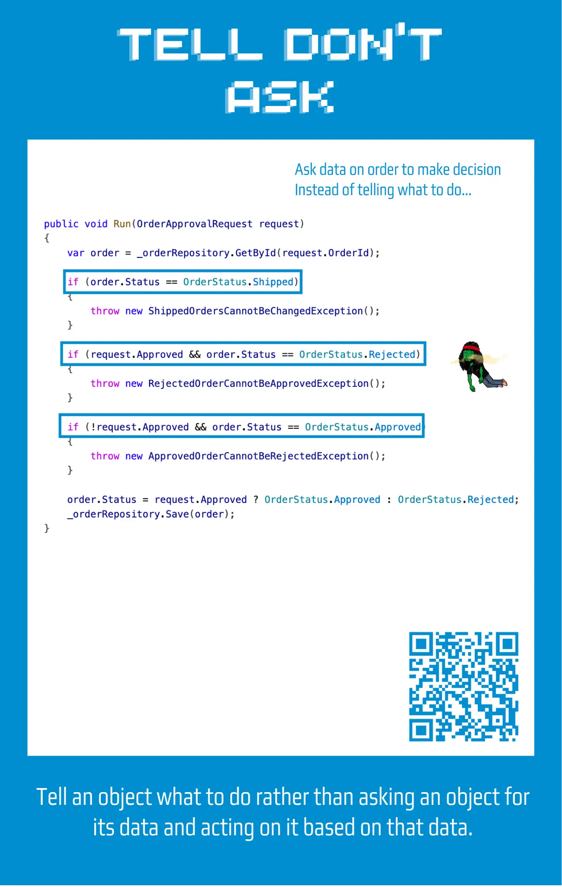
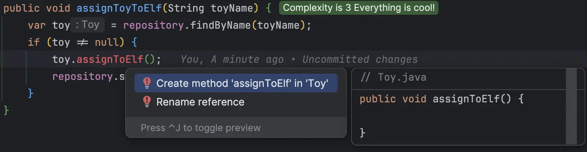
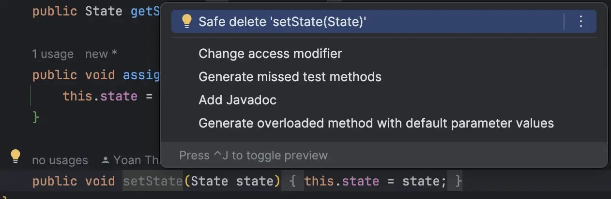
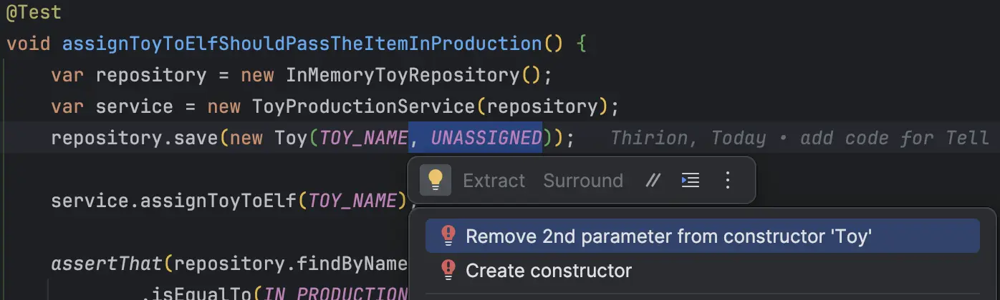

## Day 8: Tell me what to do.

The ["Tell Don't Ask"](https://xtrem-tdd.netlify.app/Flavours/Design/tell-dont-ask) principle is stating that we should `Tell` an object what to do rather than asking an object for its data and acting on it based on that data.



Here is an example:


### Where is this principle violated?
There is not that much code, and we can quickly identify that the `ToyProductionService` is clearly doing what is described in the definition above:

```java
public class ToyProductionService {
    private final ToyRepository repository;

    public ToyProductionService(ToyRepository repository) {
        this.repository = repository;
    }

    public void assignToyToElf(String toyName) {
        Toy toy = repository.findByName(toyName);
        // Ask for data from the object (from the domain)
        if (toy != null && toy.getState() == Toy.State.UNASSIGNED) {
            // Then take a decision based on that data
            // Poor encapsulation... making possible to represent Toys in invalid states...
            toy.setState(Toy.State.IN_PRODUCTION);
            repository.save(toy);
        }
    }
}
```

To fix this problem in which business logic is leaking outside from our business objects we could:
- Encapsulate state transitions inside our Domain objects
- Refactor the service to tell the Domain what to do 

### Let's refactor
🔴 We start by describing what we want from the `ToyProductionService`

```java
public void assignToyToElf(String toyName) {
    var toy = repository.findByName(toyName);
    if (toy != null) {
        toy.assignToElf();
        repository.save(toy);
    }
}
```

Of course, it does not build yet...

🟢 we implement the state transition by generating method from the service



We then, implement the content by simply making the transition:

```java
public void assignToElf() {
    if(state == State.UNASSIGNED)
        this.state = State.IN_PRODUCTION;
}
```

🔵 We can clean the code by better encapsulating the `Toy`



We end-up with a `Toy` class looking like this:

```java
public class Toy {
    public enum State {
        UNASSIGNED, IN_PRODUCTION, COMPLETED
    }

    private final String name;
    private State state;

    public Toy(String name, State state) {
        this.name = name;
        this.state = state;
    }

    public String getName() {
        return name;
    }

    public State getState() {
        return state;
    }

    public void assignToElf() {
    	if(state == State.UNASSIGNED)
        	this.state = State.IN_PRODUCTION;
    }
}
```

We may still improve it...
Indeed, we pass the `State` object as a constructor argument.

To better encapsulate this object, all the state transition should be managed internally. 

🔵 Meaning that we could set the state directly from the constructor itself.

- We can dot it from its caller (the test)



- We adapt the constructor

```java
public class Toy {
    ...
    public Toy(String name) {
        this.name = name;
        this.state = State.UNASSIGNED;
    }
    ...
}
```

We could improve the code of the `ToyProductionService` as well by returning an `Optional`to avoid `null` checking everywhere:

```java
public interface ToyRepository {
    Optional<Toy> findByName(String name);
    void save(Toy toy);
}

public class ToyProductionService {
    ...

    public void assignToyToElf(String toyName) {
        repository.findByName(toyName)
                .ifPresent(toy -> {
                    toy.assignToElf();
                    repository.save(toy);
                });
    }
}
```

### Reflect
- Where could you identify `code that "violates" this principle`?
- What could be the impact to `apply this principle everywhere`?