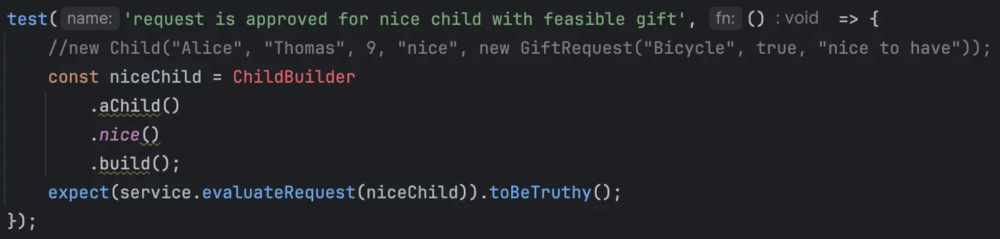
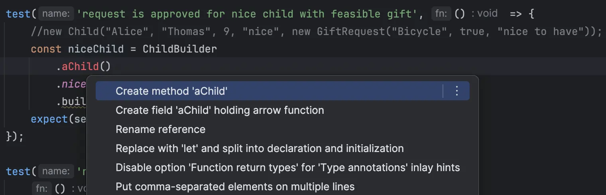
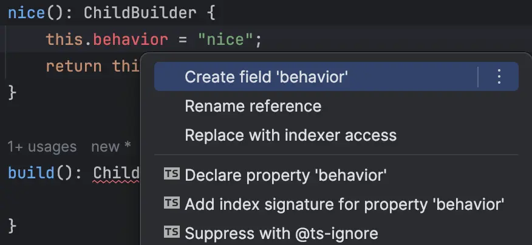
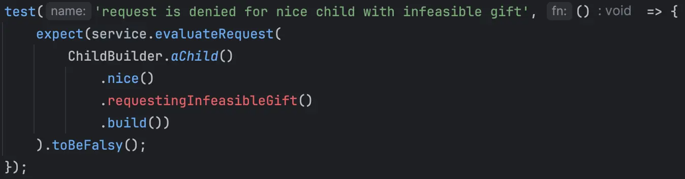

## Day 9: Improve tests readability.
We can use [`Test Data Builder`](https://xtrem-tdd.netlify.app/Flavours/Testing/test-data-builders) pattern to improve tests readability.

It will:

- `Facilitate writing` tests by allowing easy creation of inputs or expected data.
- `Improve test maintainability` by decoupling the creation of objects in tests, and isolating it in a single location (Single Responsibility Principle)
- Disseminate `functional understanding` in the team through the use of business terms
- `Facilitate the readability of the tests by explaining only the data implied in the use case

> It eliminates the irrelevant, and amplifies the essentials of the test.

We need to identify what is irrelevant and what is essentials in those tests:

```typescript
describe('santa analyzing child requests', () => {
    const service = new SantaService();
    
    test('request is approved for nice child with feasible gift', () => {
        const niceChild = new Child("Alice", "Thomas", 9, "nice", new GiftRequest("Bicycle", true, "nice to have"));
        // Which data influence the request evaluation?
        expect(service.evaluateRequest(niceChild)).toBeTruthy();
    });

    test('request is denied for naughty child', () => {
        const naughtyChild = new Child("Noa", "Thierry", 6, "naughty", new GiftRequest("SomeToy", true, "dream"));
        expect(service.evaluateRequest(naughtyChild)).toBeFalsy();
    });

    test('request is denied for nice child with infeasible gift', () => {
        const niceChildWithInfeasibleGift = new Child("Charlie", "Joie", 3, "nice", new GiftRequest("AnotherToy", false, "dream"));
        expect(service.evaluateRequest(niceChildWithInfeasibleGift)).toBeFalsy();
    });
});

export class SantaService {
    public evaluateRequest(child: Child): boolean {
        // There are only 2 relevant informations: child behavior and request feasibility
        return child.behavior === "nice" && child.giftRequest.isFeasible;
    }
}
```

### Create the `Test Data Builder`
🔴 Let's start creating a `test data builder` for a first test:
- We want to make it clear which is relevant for the test
  - Fof the first one, only one info can be considered like this: her `behavior`



- We generate code from usage


- And end up with a `ChildBuilder` that looks like this:

```typescript
export class ChildBuilder {

    static aChild(): ChildBuilder {

    }

    nice(): ChildBuilder {

    }

    build(): Child {

    }
}
```

🟢 We implement the `ChildBuilder` by instantiating the `ChildBuilder` from the `aChild()` function:

```typescript
export class ChildBuilder {
    static aChild(): ChildBuilder {
        return new ChildBuilder();
    }
    ...
}
```

- Then, we need to implement the `nice()` function
  - When using this pattern, we:
    - assign values in `private` fields (using them in the `build` function)
    - return the instance itself from each assignment function: to make a `Fluent API`



```typescript
nice(): ChildBuilder {
    this.behavior = "nice";
    return this;
}
```

- We implement the `build()` function now
  - We return hard-coded values for irrelevant data like `firstName`, `age`, ...

```typescript
build(): Child {
  return new Child("Jane",
          "Doe",
          9,
          this.behavior,
          new GiftRequest("Any gift", true, "nice to have")
  );
}
```

🔵 What could be improved?
Maybe we can "simplify" the test by `inlining` the usage of the `niceChild`:

```typescript
describe('santa analyzing child requests', () => {
  const service = new SantaService();

  test('request is approved for nice child with feasible gift', () => {
    expect(service.evaluateRequest(
            ChildBuilder
                    .aChild()
                    .nice()
                    .build())
    ).toBeTruthy();
  });
  ...
```

### Use it in all the tests
- We use it in the second test and add `naughty` function in the `ChildBuilder`:

```typescript
describe('santa analyzing child requests', () => {
  ...
  test('request is denied for naughty child', () => {
    expect(service.evaluateRequest(
            ChildBuilder.aChild()
                    .naughty()
                    .build())
    ).toBeFalsy();
  });
  ...

  export class ChildBuilder {
  ...
      naughty() {
          this.behavior = "naughty";
          return this;
      }
  ...
  }
```

🔴 Let's use it, in the last one.

- We need to add a new `function` for infeasible gift



🟢 We implement the new function and our test is now green

```typescript
export class ChildBuilder {
  private behavior: Behavior;
  private isFeasible: boolean = true;
  
  ...

  requestingInfeasibleGift(): ChildBuilder {
    this.isFeasible = false;
    return this;
  }

  build(): Child {
    return new Child("Jane",
            "Doe",
            9,
            this.behavior,
            new GiftRequest("Any gift", this.isFeasible, "nice to have")
    );
  }
}
```

🔵 We could refactor the tests to remove duplication

```typescript
describe('santa analyzing child requests', () => {
  const service = new SantaService();

  test('request is approved for nice child with feasible gift', () => {
      // We call the evaluate request function 3 times
      expect(service.evaluateRequest(
            ChildBuilder
                    // We instantiate the builder in each test
                    .aChild()
                    .nice()
                    // We call the build functions each time
                    .build())
    ).toBeTruthy();
  });

  test('request is denied for naughty child', () => {
    expect(service.evaluateRequest(
            ChildBuilder.aChild()
                    .naughty()
                    .build())
    ).toBeFalsy();
  });

  test('request is denied for nice child with infeasible gift', () => {
    expect(service.evaluateRequest(
            ChildBuilder.aChild()
                    .nice()
                    .requestingInfeasibleGift()
                    .build())
    ).toBeFalsy();
  });
});
```

- We refactor by inlining / extracting some code and end up with

```typescript
describe('santa analyzing child requests', () => {
  const service = new SantaService();

  test('request is approved for nice child with feasible gift', () => {
    expect(evaluateRequestFor(
            child => child.nice())
    ).toBeTruthy();
  });

  test('request is denied for naughty child', () => {
    expect(evaluateRequestFor(
            child => child.naughty())
    ).toBeFalsy();
  });

  test('request is denied for nice child with infeasible gift', () => {
    expect(evaluateRequestFor(
            child => child
                    .nice()
                    .requestingInfeasibleGift())
    ).toBeFalsy();
  });

  type ChildConfiguration = (builder: ChildBuilder) => ChildBuilder;

  function evaluateRequestFor(childConfiguration: ChildConfiguration) {
    return service.evaluateRequest(
            childConfiguration(ChildBuilder.aChild())
                    .build()
    );
  }
});
```

### Reflect
- What could be the result of `intensively` using this pattern on your code base?