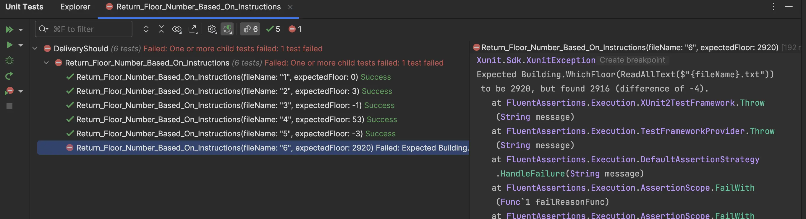
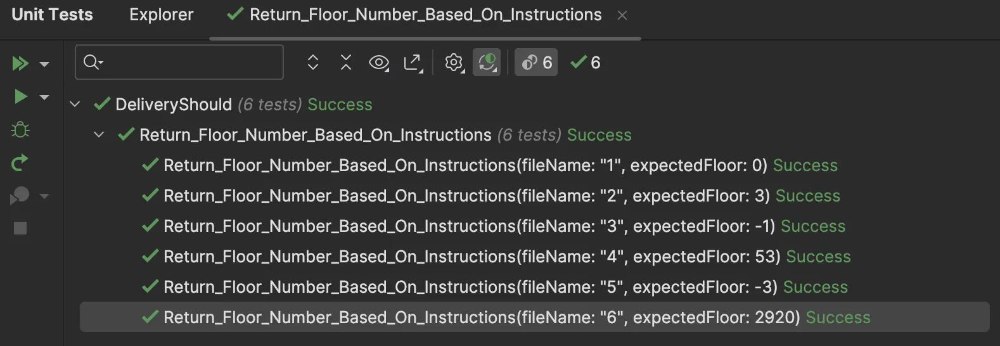
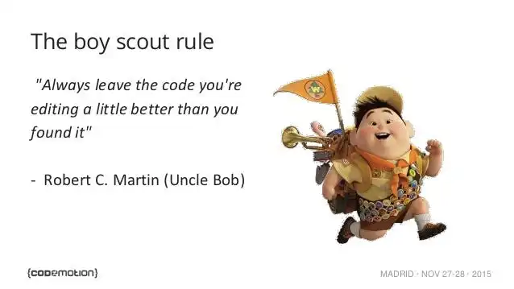
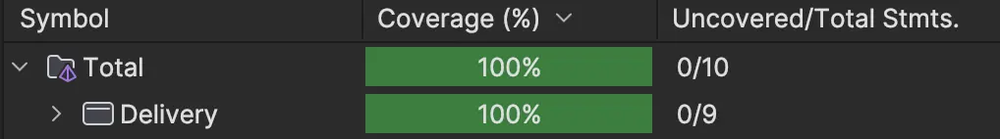
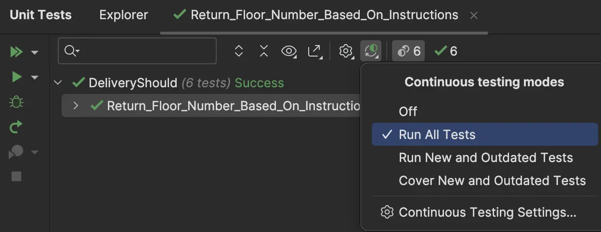
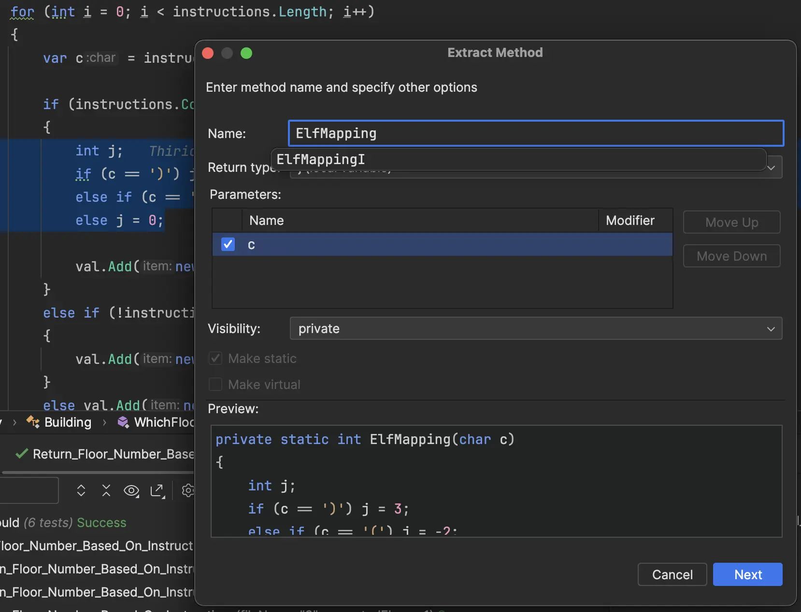
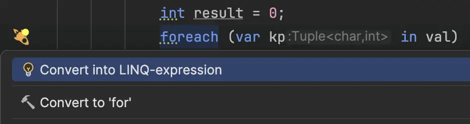

## Day 10: Fix a bug.

To identify the bug, we start by running the tests and check the output:
  - There is a difference of -4 floors
  - We take a look at the file containing the instructions as well: `6.txt`



- We then "try" to understand the production code
  - The method is defined like this: `string` -> `int`
  - It iterates on each character instruction in the `string` and matches its correspondent value

```csharp
public static int WhichFloor(string instructions)
{
    List<Tuple<char, int>> val = [];

    for (int i = 0; i < instructions.Length; i++)
    {
        var c = instructions[i];

        // It seems that the failing test is concerned by this branch
        // The instructions contain the elf symbol 
        if (instructions.Contains("🧝"))
        {
            int j;
            if (c == ')') j = 3;
            // Because there is an 🧝 symbol in the test case that fails
            // It appears that the value associated to this symbol is -2 here
            // BUT it is not the expected behavior if we trust the test...
            // It may miss a branch to express what is the mapping for the elf symbol...
            else j = -2;

            val.Add(new Tuple<char, int>(c, j));
        }
        else if (!instructions.Contains("🧝"))
        {
            val.Add(new Tuple<char, int>(c, c == '(' ? 1 : -1));
        }
        else val.Add(new Tuple<char, int>(c, c == '(' ? 42 : -2));
    }

    // Santa starts on the ground floor (floor 0) and then follows the instructions one character at a time
    int result = 0;
    foreach (var kp in val)
    {
        result += kp.Item2;
    }

    return result;
}
```

### Let's adapt the code
- We try to fix the code

```csharp
public static int WhichFloor(string instructions)
{
    ...
    if (instructions.Contains("🧝"))
    {
        int j;
        if (c == ')') j = 3;
        // we add this branch
        else if (c == '(') j = -2;
        // add the 0 value for 🧝
        else j = 0;

        val.Add(new Tuple<char, int>(c, j));
    }
    else if (!instructions.Contains("🧝"))
    {
        val.Add(new Tuple<char, int>(c, c == '(' ? 1 : -1));
    }
    else val.Add(new Tuple<char, int>(c, c == '(' ? 42 : -2));

    ...
    return result;
}
```

The bug is quickly fixed 💪 


> Are we done yet?

### Boy Scout Rule
If we want to avoid technical debt creation, we need to apply the `boy scout rule` that allows us to tackle it continuously.



> When we need to change a piece of code, the invitation is to wonder how could we leave the code cleaner than when we found it.

Of course, we need to check if code coverage makes us confident enough to make this kind of changes...

Here we are lucky, the code is pretty well covered and it is a pure function (no side effects).



We can identify a lot of opportunity to make it cleaner (more readable):

```csharp
public static int WhichFloor(string instructions)
{
    // We don't need to store the mapping between chars and int but only ints (to sum them)
    // Bad naming: val
    List<Tuple<char, int>> val = [];

    // Why do we iterate twice?
    for (int i = 0; i < instructions.Length; i++)
    {
        // A lot of assignations and mutations
        var c = instructions[i];

        // Magic strings
        if (instructions.Contains("🧝"))
        {
            // Bad naming
            int j;
            // We may use pattern matching here
            if (c == ')') j = 3;
            else if (c == '(') j = -2;
            else j = 0;

            // Tuples may be hard to understand...
            val.Add(new Tuple<char, int>(c, j));
        }
        else if (!instructions.Contains("🧝"))
        {
            val.Add(new Tuple<char, int>(c, c == '(' ? 1 : -1));
        }
        // 3 branches for nothing...
        // We can reduce cyclomatic complexity 
        else val.Add(new Tuple<char, int>(c, c == '(' ? 42 : -2));
    }

    int result = 0;
    // May be simplified by using the Sum method
    foreach (var kp in val)
    {
        result += kp.Item2;
    }

    return result;
}
```

Of course, we need to be continuously confident that we do not break the actual behaviour.
To do so, we can activate `continuous testing` mode that run the tests for us continuously.



- We extract a first method for the bug we have fixed
  - We use `inline` and a `switch expression`



```csharp
public static int WhichFloor(string instructions)
{
    List<Tuple<char, int>> val = [];

    for (int i = 0; i < instructions.Length; i++)
    {
        var c = instructions[i];

        if (instructions.Contains("🧝"))
        {
            val.Add(new Tuple<char, int>(c, ElfMapping(c)));
        }
        
    ...

private static int ElfMapping(char c) 
    => c switch
    {
        ')' => 3,
        '(' => -2,
        _ => 0
    };
```

- We simplify the branches by deleting the `dead` code

```csharp
for (int i = 0; i < instructions.Length; i++)
{
    var c = instructions[i];

    val.Add(instructions.Contains("🧝")
        ? new Tuple<char, int>(c, ElfMapping(c))
        : new Tuple<char, int>(c, c == '(' ? 1 : -1));
}
```

- We use our `IDE` to refactor the second loop and use `LinQ`



```csharp
public static int WhichFloor(string instructions)
{
    List<Tuple<char, int>> val = [];

    for (int i = 0; i < instructions.Length; i++)
    {
        var c = instructions[i];

        val.Add(instructions.Contains("🧝")
            ? new Tuple<char, int>(c, ElfMapping(c))
            : new Tuple<char, int>(c, c == '(' ? 1 : -1));
    }
    return val.Sum(kp => kp.Item2);
}
```

- We extract the magic strings to give business meanings to constants

```csharp
public static class Building
{
    private const char Up = '(';
    private const char Down = ')';
    private const string Elf = "🧝";

    public static int WhichFloor(string instructions)
    {
        List<Tuple<char, int>> val = [];

        for (int i = 0; i < instructions.Length; i++)
        {
            var c = instructions[i];

            val.Add(instructions.Contains(Elf)
                ? new Tuple<char, int>(c, ElfMapping(c))
                : new Tuple<char, int>(c, NormalMapping(c)));
        }

        return val.Sum(kp => kp.Item2);
    }

    private static int ElfMapping(char c)
        => c switch
        {
            Down => 3,
            Up => -2,
            _ => 0
        };

    private static int NormalMapping(char c) => c == Up ? 1 : -1;
}
```

- What can be still improved?
  - We can make it immutable to make the code more explicit
  - We need to remove `List<Tuple<char, int>> val = [];`

- Using automated refactorings, we end up with

```csharp
public static int WhichFloor(string instructions)
{
    List<Tuple<char, int>> val = [];
    val.AddRange(instructions.Select(c => instructions.Contains(Elf)
        ? new Tuple<char, int>(c, ElfMapping(c))
        : new Tuple<char, int>(c, NormalMapping(c))));

    return val.Sum(kp => kp.Item2);
}
```

- We extract the expression inside the `AddRange` call and refactor the method to plug the call to `Sum`

```csharp
public static int WhichFloor(string instructions)
    => instructions.Select(c => instructions.Contains(Elf)
            ? new Tuple<char, int>(c, ElfMapping(c))
            : new Tuple<char, int>(c, NormalMapping(c)))
        .Sum(kp => kp.Item2);
```

- We remove the `Tuple` usage

```csharp
public static int WhichFloor(string instructions)
    => instructions.Select(c => instructions.Contains(Elf)
            ? ElfMapping(c)
            : NormalMapping(c))
        .Sum();
```

- We add a `type alias` on the `char` to express its meaning

```csharp
using Instruction = char;
```

After a few iterations, we end-up with the code below:

```csharp
using Instruction = char;
using FloorStrategy = Func<char, int>;

public static class Building
{
    private const Instruction Up = '(';
    private const Instruction Down = ')';
    private const string ElfSymbol = "🧝";

    private static readonly FloorStrategy Standard = c => c == Up ? 1 : -1;
    private static readonly FloorStrategy Elf = c => c switch
    {
        Down => 3,
        Up => -2,
        _ => 0
    };

    public static int WhichFloor(string instructions)
        => WhichFloor(
            instructions,
            instructions.Contains(ElfSymbol) ? Elf : Standard
        );

    private static int WhichFloor(string instructions, FloorStrategy strategy)
        => instructions
            .Select(strategy)
            .Sum();
}
```

### Reflect
- What do you `think about this rule`?
- What would be `different if every developers use this rule continuously`?