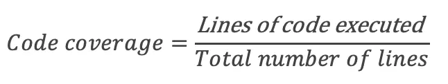
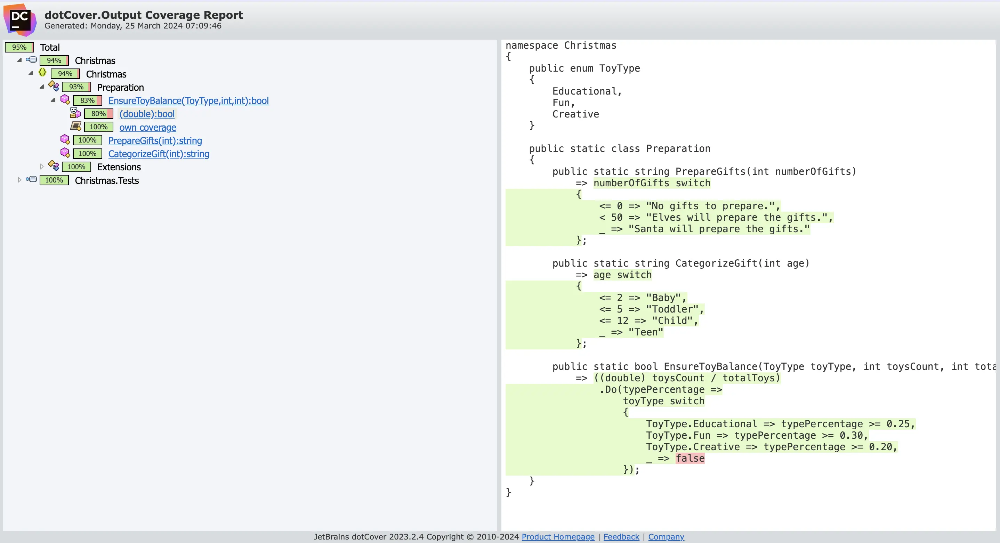
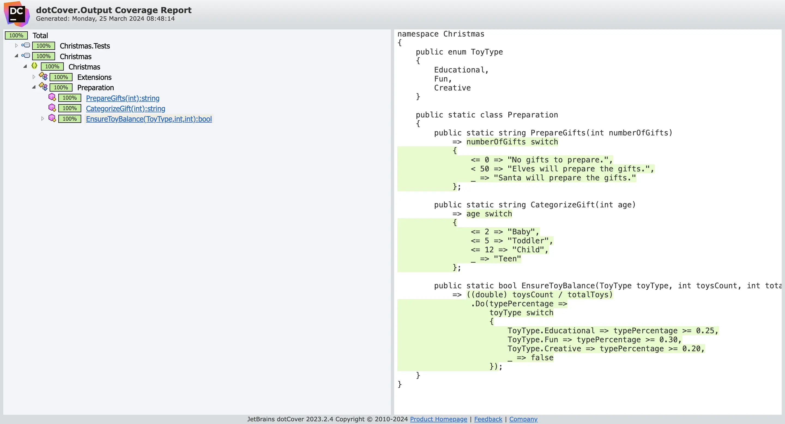
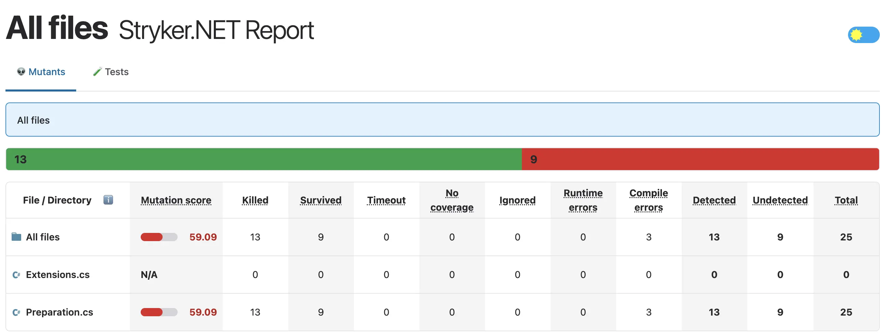
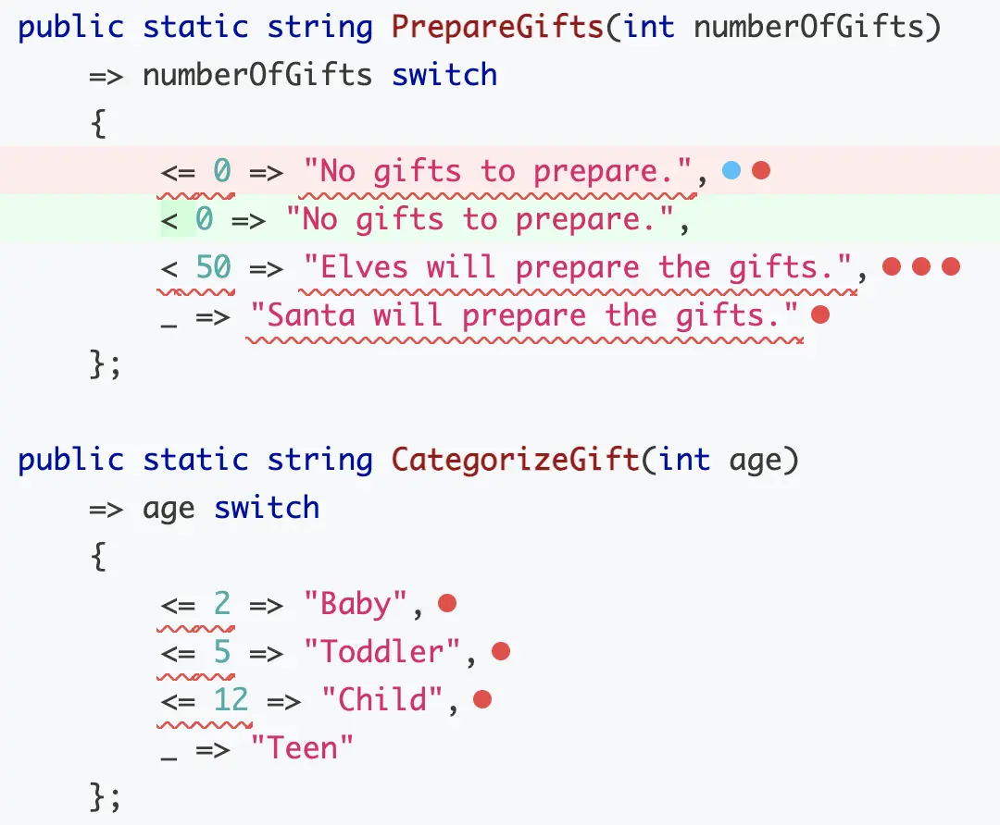
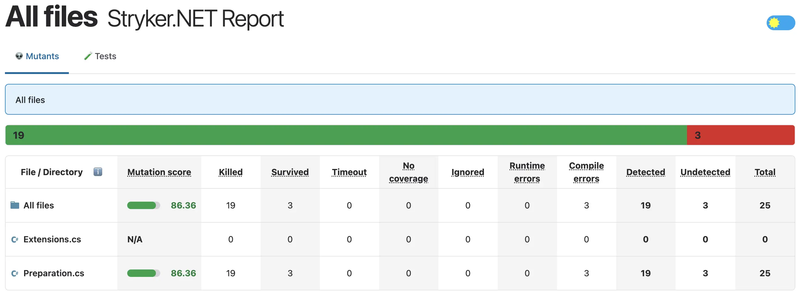
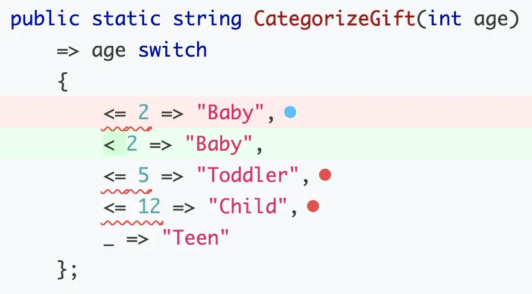
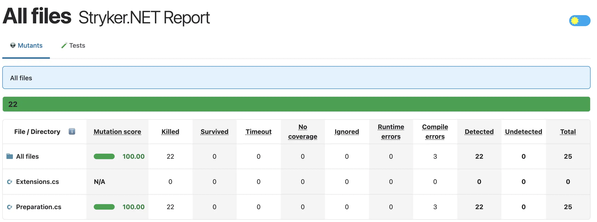

## Day 11: Secure the program.
To ensure that the program is secured to any bugs, we can start by checking code coverage.

### Code coverage
> A coverage metric showing how much source code a test suite executes, from none to 100%.



To run a `code coverage` analysis we may use [dotCover](https://www.jetbrains.com/dotcover/):

```shell
dotnet tool install --global JetBrains.dotCover.GlobalTool
dotnet dotcover test --dcReportType=HTML
```

Here is the generated report:


There is a coverage of `94%`, not that much to do to reach `100%` 🥳
We need to cover a branch in the `EnsureToyBalance` method.

#### Reach 100% of code coverage
We cover the missing branch, how could we do this?

```csharp
public static bool EnsureToyBalance(ToyType toyType, int toysCount, int totalToys)
    => ((double) toysCount / totalToys)
        .Do(typePercentage =>
            toyType switch
            {
                ToyType.Educational => typePercentage >= 0.25,
                ToyType.Fun => typePercentage >= 0.30,
                ToyType.Creative => typePercentage >= 0.20,
                _ => false
            });
```

In `C#` we can cast an `int` to an `enum` value meaning that we may use and call this method like this:

```csharp
// We may imagine that this value could come from a data store for example...
Preparation.EnsureToyBalance((ToyType) 4, 0, 0)
```

Let's cover it:

```csharp
[Fact]
public void ToyBalanceIsFalseForForUnExistingToyType()
    => Preparation.EnsureToyBalance((ToyType) 4, 0, 0)
        .Should()
        .BeFalse();
```

Congratulations, we now have `100%` code coverage 🥳



🔵 We can event improve the new test by using random data here.

- We can use `Faker.Net` for that

```shell
dotnet add package Faker.Net --version 2.0.163
```

- Then, we use `Faker` to generate random `ToyType` and `ints`
  - The only constraint is to generate unExisting `ToyTypes` (>3)

```csharp
[Fact]
public void ToyBalanceIsFalseForForUnExistingToyType()
    => Preparation.EnsureToyBalance(UnExistingToyType(), RandomInt(), RandomInt())
        .Should()
        .BeFalse();

private static ToyType UnExistingToyType() => (ToyType) Faker.RandomNumber.Next(4, int.MaxValue);
private static int RandomInt() => Faker.RandomNumber.Next();
```

> Are we done yet? What about the quality of those tests? 🤔

Look at this test and identify what is the problem with it:

```csharp
[Theory]
[InlineData(-1, "No gifts to prepare.")]
[InlineData(0, "No gifts to prepare.")]
[InlineData(1, "Elves will prepare the gifts.")]
[InlineData(49, "Elves will prepare the gifts.")]
[InlineData(50, "Santa will prepare the gifts.")]
public void PrepareGifts(int numberOfGifts, string expected)
    => Preparation.PrepareGifts(numberOfGifts);
    // Assertion part is missing 😬
```

> BUT we have `100%` code coverage... how is it possible?

#### The problem with Code Coverage
Coverage metrics are a `good negative indicator` but a `bad positive one`:
- Too little coverage in your code base -> 10%
  - Demonstrates you are not testing enough
- The reverse isn’t true
  - Even 100% coverage isn’t a guarantee that you have a good-quality test suite as demonstrated above
  - It measures that from the tests we pass by branches in the production code
    - We can do it without asserting anything...

> What could we do about that?

### Mutation testing
We can use the concept of [`Mutation Testing`](https://xtrem-tdd.netlify.app/flavours/testing/mutation-testing/) to quantify our tests quality:

- Test our tests by introducing MUTANTS (fault) into our production code during the test execution:
  - To check that the test is failing
  - If the test pass, there is an issue
- We can introduce mutants manually
  - When working on legacy code for example
  - When using `TDD`


#### Let's identify mutants
- You must install `stryker` for dotnet first

```shell
dotnet tool install -g dotnet-stryker
```

- Then run the command below
  - `-o` will automatically open the report at then of the analysis

```shell
dotnet stryker -o
```

- The report looks like this:
  - The result is red...
  - It is never good
  - The mutation score is `59.09%`



- The score is calculated like this:


- We then open the details and visualize the mutations: 



- 2 kind of mutations have been introduced in the production code without being detected
  - [String mutator](https://stryker-mutator.io/docs/mutation-testing-elements/supported-mutators/#string-literal)
  - [Equality mutator](https://stryker-mutator.io/docs/mutation-testing-elements/supported-mutators/#equality-operator)

#### Fix `String mutations`
Those mutations should be covered in the `PrepareGifts` tests.

- We fix the assertion part of the test

```csharp
[Theory]
[InlineData(-1, "No gifts to prepare.")]
[InlineData(0, "No gifts to prepare.")]
[InlineData(1, "Elves will prepare the gifts.")]
[InlineData(49, "Elves will prepare the gifts.")]
[InlineData(50, "Santa will prepare the gifts.")]
public void PrepareGifts(int numberOfGifts, string expected)
    => Preparation.PrepareGifts(numberOfGifts)
        .Should()
        .Be(expected);
```

- We highly increase the mutation score here: `86.36%`



#### Fix `Equality mutations`
Here, the mutation tool reminds us to test edge cases...



Let's add new test cases in our tests to cover them:

```csharp
[Theory]
[InlineData(1, "Baby")]
// Baby limit
[InlineData(2, "Baby")]
[InlineData(3, "Toddler")]
// Toddler limit
[InlineData(5, "Toddler")]
[InlineData(6, "Child")]
// Child limit
[InlineData(12, "Child")]
[InlineData(13, "Teen")]
public void CategorizeGift(int age, string expectedCategory)
    => Preparation.CategorizeGift(age)
        .Should()
        .Be(expectedCategory);
```

- We run `stryker` again



> Congratulations we have killed all the mutants and secured the program 🥳

### Reflect
- What is the `most important` thing you `learnt` today about this topic?
- What would you like to `experiment` with it?