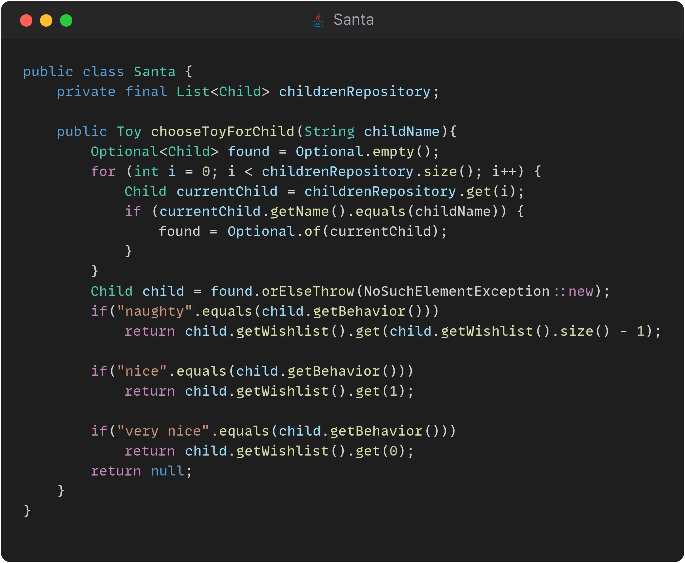

## Day 12: Collect or not collect?
This exercise is brought to you by:
<table>
    <tr>
        <td align="center" style="word-wrap: break-word; width: 150.0; height: 150.0">
            <a href=https://github.com/mengdaming>
            
             
            <b>Damien Menanteau</b>
            </a>
        </td>
        <td align="center" style="word-wrap: break-word; width: 150.0; height: 150.0">
             <a href=https://github.com/rabahkahil>
                
                 
                <b>Rabah KAHIL</b>
            </a>
        </td>
    </tr>
</table>

Christmas is getting to a close, and Santa is now distributing gifts to children based on their behavior throughout the year.

For this, he uses criterias as follow:

> Children who have been 'very nice' during the year will receive their first choice from their wish list
> The ones who have been 'nice' (occasionally naughty) will receive their second choice
> The other children who have been 'naughty' will receive their third choice.

Teo and the elves have come across an interesting article about object calisthenics.
They wanted you to see if there was something that could be implemented in this system.

✅🚀 **Challenge: Simplify the usage of collections.** 🚀✅

### Proposed Solution

