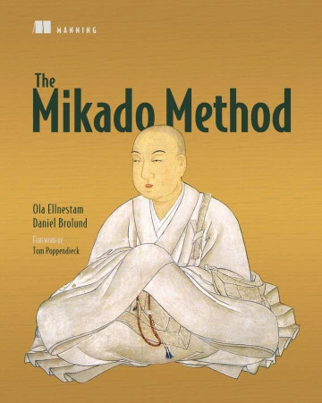
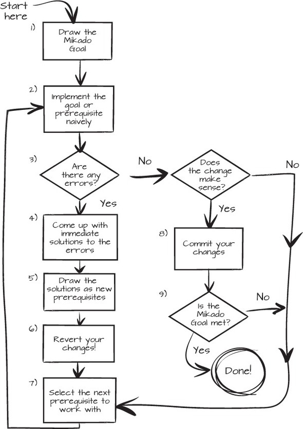

## Day 13: Refactor your code with the Mikado method.
This exercise is brought to you by:
<table>
  <tr>
    <td align="center" style="word-wrap: break-word; width: 150.0; height: 150.0">
	    <a href=https://github.com/mengdaming>
          
          <br />
          <sub style="font-size:14px"><b>Damien Menanteau</b></sub>
        </a>
    </td>
    <td align="center" style="word-wrap: break-word; width: 150.0; height: 150.0">
        <a href=https://github.com/Mirna-Mfd>
          
          <br />
          <sub style="font-size:14px"><b>Mirna Mahfoud</b></sub>
        </a>
    </td>
  </tr>
</table>

The main objective of this exercise is to practice `baby-step` refactoring while using the technique of the `Mikado graph`.

## What is the Mikado method?
The following explanations are taken from "[The Mikado Book](https://www.manning.com/books/the-mikado-method)" by `Ola Ellnestam` and `Daniel Brolund` :

[](https://www.manning.com/books/the-mikado-method)

A short summary can be found [here](https://www.methodsandtools.com/archive/mikado.php).

To sum up, the `Mikado method` helps you build a graph of your refactoring steps and apply them without ever breaking your codebase.

To build your Mikado graph, you need to:

- Set actionable goals.
- Experiment them
  - By changing the code implementing the goal in the most naive and straightforward way, to see which part of the system breaks. 
  - This gives you the prerequisites needed before you can achieve the goal.
- Write down the goal and its prerequisites. You can break down your goal into sub-goals.
- Undo your breaking changes.

You can do this process iteratively:



> When your Mikado graph is finished, you can start refactoring starting from the leaves at the bottom to the main goal at the top.

## Main benefits of the Mikado method
- It lets you get an idea of how big a change is. A picture is worth a thousand words, and a Mikado Graph is worth more
  than a thousand to-dos.
- It helps you keep track of your work.
- It helps you communicate about your code.
- You can then decide where to put the development focus.

Now, let's see how this method can help you refactor your code.

## Note about Mikado Graph format
There are many ways to build a Mikado Graph, each of them coming with its pros & cons:

- Using a **text file** as in here is a simple and cheap way to do it, with the advantage that it can easily be shared remotely and stored in source control along with the code being refactored
- Another solution is to use **post-it on a board** when all contributors are in the same location
- Another nice-looking solution is to use a **mind-mapping tool**, as long as everyone in the team is able to access it

## Challenge
Santa is shopping for gifts and Christmas items during that time. Not everything is made in the factory.

He loads them into a shopping sleigh and hands them to a Christmas Elf, who processes the purchases using special holiday offers like `Three for One`, `Five for a Set Price` and `Ten Percent Off`.

After checking out, the Elf provides Santa with a receipt detailing the total cost, the price and quantity of each item, along with their discounts.

The Christmas Elf is also considering adding a new discount option: `Two for One`.

Teo explains to you that the relevant code is in the ShoppingSleigh class and even for the elves, this code is a mess! 💥
in [ShoppingSleigh.java](../../exercise/java/day13/src/main/java/santamarket/model/ShoppingSleigh.java)

```java
void handleOffers(Receipt receipt, Map<Product, Offer> offers, SantamarketCatalog catalog) {
        for (Product p: productQuantities().keySet()) {
            double quantity = productQuantities.get(p);
            if (offers.containsKey(p)) {
                Offer offer = offers.get(p);
                double unitPrice = catalog.getUnitPrice(p);
                int quantityAsInt = (int) quantity;
                Discount discount = null;
                int x = 1;
                if (offer.offerType == SpecialOfferType.THREE_FOR_TWO) {
                    x = 3;

                } else if (offer.offerType == SpecialOfferType.TWO_FOR_AMOUNT) {
                    x = 2;
                    if (quantityAsInt >= 2) {
                        double total = offer.argument * (quantityAsInt / x) + quantityAsInt % 2 * unitPrice;
                        double discountN = unitPrice * quantity - total;
                        discount = new Discount(p, "2 for " + offer.argument, -discountN);
                    }

                } if (offer.offerType == SpecialOfferType.FIVE_FOR_AMOUNT) {
                    x = 5;
                }
                int numberOfXs = quantityAsInt / x;
                if (offer.offerType == SpecialOfferType.THREE_FOR_TWO && quantityAsInt > 2) {
                    double discountAmount = quantity * unitPrice - ((numberOfXs * 2 * unitPrice) + quantityAsInt % 3 * unitPrice);
                    discount = new Discount(p, "3 for 2", -discountAmount);
                }
                if (offer.offerType == SpecialOfferType.TEN_PERCENT_DISCOUNT) {
                    discount = new Discount(p, offer.argument + "% off", -quantity * unitPrice * offer.argument / 100.0);
                }
                if (offer.offerType == SpecialOfferType.FIVE_FOR_AMOUNT && quantityAsInt >= 5) {
                    double discountTotal = unitPrice * quantity - (offer.argument * numberOfXs + quantityAsInt % 5 * unitPrice);
                    discount = new Discount(p, x + " for " + offer.argument, -discountTotal);
                }
                if (discount != null)
                    receipt.addDiscount(discount);
            }
        }
    }
```

He thought about it with the team and suggested an approach:
Your objective is to deploy a generic method to compute the `X for Y` discount offers, covering the existing `Three for two` discount, as well as the new `Two for one` discount.

Your starting point is `santamarket.model.ShoppingSleigh.handleOff`X for Y`ers()` method.

Start with the below Mikado graph and complete it:

- [ ] 👍Deploy a generic method to compute the `X for Y` discount offers, covering `Three for two` and `Two for one` offers
  - [ ] 👍Prepare the code for an easy addition of the `X for Y` discount type family
    - [ ] ...
      - [ ] ...
  - [ ] 👍Implement the `Two for one` discount computation
    - [ ] ...
  - [ ] 👍Refactor the existing code to use the `X for Y` discount computation method with the `Three for two` discount
- [ ] Parking-Lot (any change with no direct impact on the main goal)
  - [ ] ...

## Bonus
Add the new discount type `Two for one` on top of your refactored code.

## Note
This exercise was inspired from Emily Bache's [SupermarketReceipt refactoring kata](https://github.com/emilybache/SupermarketReceipt-Refactoring-Kata).

### Proposed Solution
[](solution/step-by-step.md)