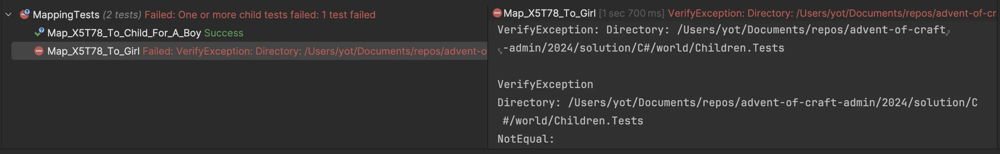
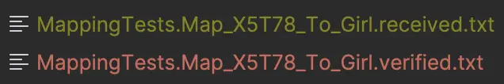
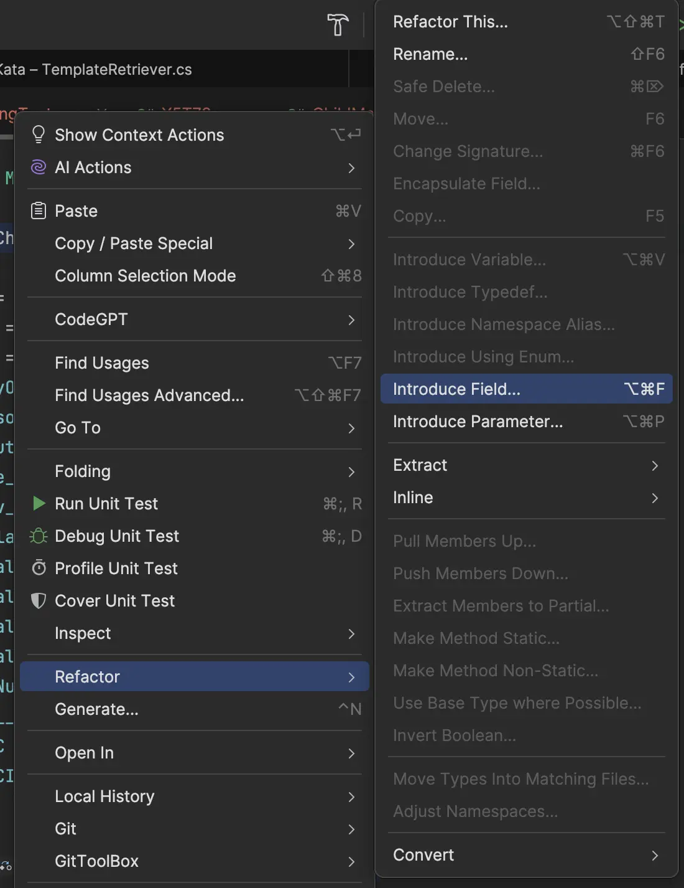
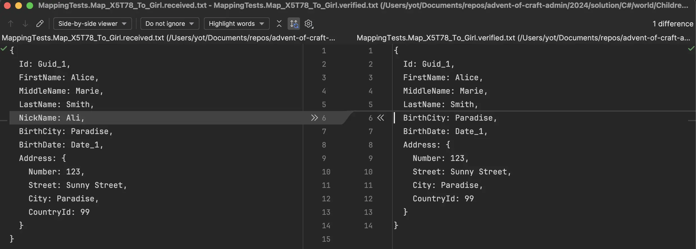

## Day 14: Find a more efficient way to test object mappings.
#### What happens if we add a new property to map?
Imagine we want to map the property `LegalDocumentName1__c` from `X5T78` class to a property `NickName` in `Child`.

We would adapt the `ChildMapper` like this:
```csharp
[Mapper]
public partial class ChildMapper
{
    ...
    [MapProperty(nameof(X5T78.LegalDocumentName1__c), nameof(Child.NickName))]
    ...
    public partial Child ToDto(X5T78 child);
}
```

By running our tests everything is green because we have not changed any behavior.


Still I could have made a mistake in the declaration and not map the right value in the `NickName` property...
If I am not driving my changes with TDD for example 😁

In case of `object to object` mappings we may ensure that any changes in mapping of entities are detected.
Those tests and those kind of assertions in multiple test may be a nightmare to maintain:

```csharp
child.Id.Should().Be(Guid.Parse(db2Child.Id));
child.FirstName.Should().Be(db2Child.N_1);
child.MiddleName.Should().Be(db2Child.N_2);
child.LastName.Should().Be(db2Child.N_3);
child.BirthCity.Should().Be(db2Child.CityOfBirth__pc);
child.BirthDate.Should().Be(new DateOnly(2017, 3, 19));
child.Gender.Should().Be(Girl);
child.Address.Should().NotBeNull();
child.Address?.Number.Should().Be(db2Child.ST_Num);
child.Address?.Street.Should().Be(db2Child.ST____Name);
child.Address?.City.Should().Be(db2Child.ST_C);
child.Address?.CountryId.Should().Be(99);
```

To do so we may use the `Approval Testing` approach. 

### Use Approval Testing approach
Learn more about it [here](https://understandlegacycode.com/approval-tests/).

`Approval tests` simplify testing by taking a snapshot of the results / confirming that they have not changed at each run.

In .NET we can use [`Verify`](https://github.com/VerifyTests/Verify).

```shell
dotnet add package Verify.Xunit --version 23.5.2
```

- We need to adapt an existing test to simply use `Verify`:

```csharp
[Fact]
public void Map_X5T78_To_Girl()
{
    // Arrange
    var db2Child = new X5T78
    {
        Id = Guid.NewGuid().ToString(),
        N_1 = "Alice",
        N_2 = "Marie",
        N_3 = "Smith",
        CityOfBirth__pc = "Paradise",
        Person_BD = "19/03/2017",
        Salutation = "Girl",
        Type_pc = "PPMPX_09/1",
        Serv__Gender__TYPE_pc = "X",
        DeclaredMonthlySalary__c = "0",
        LegalDocumentExpirationDate1__c = "01/09/2030",
        LegalDocumentIssuingCountry1__c = "Paradise",
        LegalDocumentName1__c = "ID",
        LegalDocumentNumber1__c = "9892389098",
        ST_Num = "123",
        ST____Name = "Sunny Street",
        ST_C = "Paradise",
        ST_CID = "99"
    };

    // Act
    var child = _mapper.ToDto(db2Child);

    // Assert
    // All those lines will be replaced by the Verify call
    child.Id.Should().Be(Guid.Parse(db2Child.Id));
    child.FirstName.Should().Be(db2Child.N_1);
    child.MiddleName.Should().Be(db2Child.N_2);
    child.LastName.Should().Be(db2Child.N_3);
    child.BirthCity.Should().Be(db2Child.CityOfBirth__pc);
    child.BirthDate.Should().Be(new DateOnly(2017, 3, 19));
    child.Gender.Should().Be(Girl);
    child.Address.Should().NotBeNull();
    child.Address?.Number.Should().Be(db2Child.ST_Num);
    child.Address?.Street.Should().Be(db2Child.ST____Name);
    child.Address?.City.Should().Be(db2Child.ST_C);
    child.Address?.CountryId.Should().Be(99);
}
```

🔵 We refactor it and return a `Task`

```csharp
[Fact]
public Task Map_X5T78_To_Girl()
{
    var db2Child = new X5T78
    {
        Id = Guid.NewGuid().ToString(),
        N_1 = "Alice",
        N_2 = "Marie",
        N_3 = "Smith",
        CityOfBirth__pc = "Paradise",
        Person_BD = "19/03/2017",
        Salutation = "Girl",
        Type_pc = "PPMPX_09/1",
        Serv__Gender__TYPE_pc = "X",
        DeclaredMonthlySalary__c = "0",
        LegalDocumentExpirationDate1__c = "01/09/2030",
        LegalDocumentIssuingCountry1__c = "Paradise",
        LegalDocumentName1__c = "ID",
        LegalDocumentNumber1__c = "9892389098",
        ST_Num = "123",
        ST____Name = "Sunny Street",
        ST_C = "Paradise",
        ST_CID = "99"
    };
    
    return Verify(_mapper.ToDto(db2Child));
}
```

🔴 It fails when we run it:


- On the first run, 2 files are created:
  - `MappingTests.Map_X5T78_To_Girl.received.txt`: the result of the call of the method under test 
  - `MappingTests.Map_X5T78_To_Girl.verified.txt`: the verified version of the result (approved manually)



- The library simply compare the 2 serialized as `json` `Child` object result.
  - It compares the actual result and an empty file...


🟢 We need to verify / approve the received file to make the test passes

> Meaning we create the approved one with the result of the current production code.

```shell
 cp Children.Tests/MappingTests.Map_X5T78_To_Girl.received.txt Children.Tests/MappingTests.Map_X5T78_To_Girl.verified.txt 
```

- Our test is now green because our `verified` file contains this:

```json
{
  Id: Guid_1, // This line is interesting
  FirstName: Alice,
  MiddleName: Marie,
  LastName: Smith,
  BirthCity: Paradise,
  BirthDate: Date_1,
  Address: {
    Number: 123,
    Street: Sunny Street,
    City: Paradise,
    CountryId: 99
  }
}
```

#### Scrubbing
Scrubbers are functions applied to the outcome `string` before verification.
They are mostly used to replace non deterministic data in the result `string` (Guid, Dates, ...) otherwise every time we run our tests the `Guid` would change and the test as well.

Know more about Scrubbing [here](https://github.com/VerifyTests/Verify/blob/main/docs/scrubbers.md).

### Let's refactor our tests

> What can still be improved in those tests?

```csharp
public class MappingTests
{
    private readonly ChildMapper _mapper = new();

    [Fact]
    public Task Map_X5T78_To_Girl()
    {
        // We may declare those data outside from this class
        var db2Child = new X5T78
        {
            Id = Guid.NewGuid().ToString(),
            N_1 = "Alice",
            N_2 = "Marie",
            N_3 = "Smith",
            CityOfBirth__pc = "Paradise",
            Person_BD = "19/03/2017",
            Salutation = "Girl",
            Type_pc = "PPMPX_09/1",
            Serv__Gender__TYPE_pc = "X",
            DeclaredMonthlySalary__c = "0",
            LegalDocumentExpirationDate1__c = "01/09/2030",
            LegalDocumentIssuingCountry1__c = "Paradise",
            LegalDocumentName1__c = "ID",
            LegalDocumentNumber1__c = "9892389098",
            ST_Num = "123",
            ST____Name = "Sunny Street",
            ST_C = "Paradise",
            ST_CID = "99"
        };

        return Verify(_mapper.ToDto(db2Child));
    }

    [Fact]
    public Task Map_X5T78_To_Child_For_A_Boy()
    {
        var db2Child = new X5T78
        {
            Id = Guid.NewGuid().ToString(),
            N_1 = "Bob",
            N_3 = "Brown",
            CityOfBirth__pc = "Paradise",
            Person_BD = "01/09/2021",
            Salutation = "Boy",
            Type_pc = "PP0PLX_09/1",
            Serv__Gender__TYPE_pc = "VJX",
            DeclaredMonthlySalary__c = "0",
            LegalDocumentExpirationDate1__c = "12/09/2078",
            LegalDocumentIssuingCountry1__c = "Paradise",
            LegalDocumentName1__c = "ID",
            LegalDocumentNumber1__c = "9U129731873191JK",
            ST_Num = "9",
            ST____Name = "Oak Street",
            ST_C = "Paradise",
            ST_CID = "98988"
        };

        return Verify(_mapper.ToDto(db2Child));
    }
}
```

Let's define an [Object Mother](http://www.natpryce.com/articles/000714.html).

- We extract the data in fields and move them in a dedicated `X5T78Mother` class



- Our tests are now looking like this and we can understand in 1 sec what's going on:

```csharp
public class MappingTests
{
    private readonly ChildMapper _mapper = new();

    [Fact]
    public Task Map_X5T78_To_Girl()
        => Verify(
            _mapper.ToDto(Alice)
        );

    [Fact]
    public Task Map_X5T78_To_Child_For_A_Boy()
        => Verify(
            _mapper.ToDto(Bob)
        );
}
```

### Check the robustness
We add the new `NickName` property to the `Mapper` and check what happens:



The file check identifies there is a new line that has not been verified and the test fails.

> Any update in the mapping will now be detected.

### Reflect
- How could it be `useful to you?
- Which `kind of problems it may help you to solve`?
