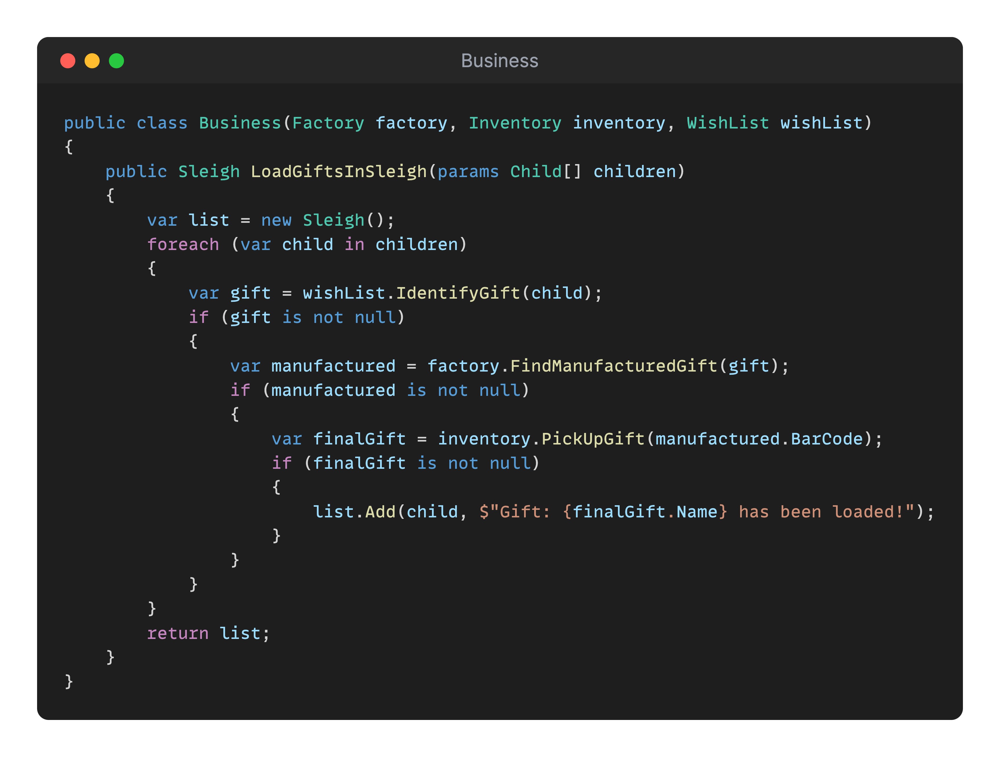

## Day 15: Reason to fail?
This exercise is brought to you by:
<table>
    <tr>
        <td align="center" style="word-wrap: break-word; width: 150.0; height: 150.0">
            <a href=https://github.com/tr00d>
                
                 
                <b>Guillaume Faas</b>
            </a>
        </td>
    </tr>
</table>

Christmas is compromised! 🎅🎄

A program handles the whole process of loading gifts into Santa's sleigh.
The program identifies what gifts children should receive and loads them into the sleigh.
But sometimes, gifts are missing, and nobody knows why...

These issues could have catastrophic consequences for Christmas!
Santa may be late, children may be disappointed, and Santa may blame the elves for something they didn't do...

After a thorough investigation, elves reported a couple of reasons why gifts could be missing:

* The child is not on the list of "good" children
* Something happened at the factory, and the gift was not manufactured
* An elf probably misplaced the gift in the inventory

The problem is that the program isn't descriptive enough about why a gift wasn't loaded into the sleigh.
If any of the steps fail, the loading process is aborted for the given child, and Santa is not aware of the associated
reason...

Your role in this process is crucial.

✅🚀 **Challenge: Improve this program to make failures more explicit, using the following matrix...** 🚀✅

| Scenario                                 | Information when loading the sleigh                              |
|------------------------------------------|------------------------------------------------------------------|
| Gift loaded in the sleigh                | Gift: {name} has been loaded!                                    |
| Child not in the list of "good" children | Missing gift: Child wasn't nice this year!                       |
| Gift not manufactured                    | Missing gift: Gift wasn't manufactured!                          |
| Gift misplaced by the elves              | Missing gift: The gift has probably been misplaced by the elves! |

 ❓ Question: How could we make failure explicit without using exceptions?

### Proposed Solution

