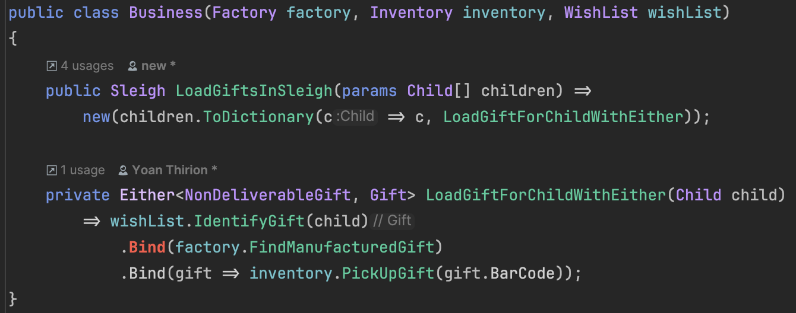

## Day 15: Reason to fail?

> How could we improve this program to make failures more explicit?

Here's the matrix we want to achieve - taken from the challenge:

| Status | Scenario                                 | Information when loading the sleigh                              |
|--------|------------------------------------------|------------------------------------------------------------------|
| ✅      | Gift loaded in the sleigh                | Gift: {name} has been loaded!                                    |
|        | Child not in the list of "good" children | Missing gift: Child wasn't nice this year!                       |
|        | Gift not manufactured                    | Missing gift: Gift wasn't manufactured!                          |
|        | Gift misplaced by the elves              | Missing gift: The gift has probably been misplaced by the elves! |

Let's tackle the first missing scenario: The output should be "Missing gift: Child wasn't nice this year!" when the
child is not on the list of "good" children.

🔴 A passing test already exists, but we must change its behaviour to comply with our new requirement.
Our test will then fail.

```csharp
[Fact]
public void Gift_ShouldNotBeLoaded_GivenChildIsNotOnWishList()
{
    var sut = new Business(_factory, _inventory, _wishList);
    var sleigh = sut.LoadGiftsInSleigh(_john);

    sleigh[_john].Should().Be("Missing gift: Child wasn't nice this year!");
}
```

🟢 We must now adapt the implementation to make the test pass.
We're taking the short route here and decided to express the failure directly in the `Sleigh` object by adding a new
branch to our process.

```csharp
public Sleigh LoadGiftsInSleigh(params Child[] children)
{
    var list = new Sleigh();
    foreach (var child in children)
    {
        var gift = wishList.IdentifyGift(child);
        if (gift is not null)
        {
            var manufactured = factory.FindManufacturedGift(gift);
            if (manufactured is not null)
            {
                var finalGift = inventory.PickUpGift(manufactured.BarCode);
                if (finalGift is not null)
                {
                    list.Add(child, $"Gift: {finalGift.Name} has been loaded!");
                }
            }
        }
        // Add new branch
        else
        {
            list.Add(child, "Missing gift: Child wasn't nice this year!");
        }
    }

    return list;
}
```

We implemented our first scenario. Here's how matrix now:

| Status | Scenario                                 | Information when loading the sleigh                              |
|--------|------------------------------------------|------------------------------------------------------------------|
| ✅      | Gift loaded in the sleigh                | Gift: {name} has been loaded!                                    |
| ✅      | Child not in the list of "good" children | Missing gift: Child wasn't nice this year!                       |
|        | Gift not manufactured                    | Missing gift: Gift wasn't manufactured!                          |
|        | Gift misplaced by the elves              | Missing gift: The gift has probably been misplaced by the elves! |

The two remaining ones follow the same treatment - adding an `else` branch to a condition to add an output containing
the reason it failed.

Fast-forward - we implemented the two remaining scenarios.
After a few iterations, this is our code:

```csharp
public Sleigh LoadGiftsInSleigh(params Child[] children)
{
    var list = new Sleigh();
    foreach (var child in children)
    {
        var gift = wishList.IdentifyGift(child);
        if (gift is not null)
        {
            var manufactured = factory.FindManufacturedGift(gift);
            if (manufactured is not null)
            {
                var finalGift = inventory.PickUpGift(manufactured.BarCode);
                if (finalGift is not null)
                {
                    list.Add(child, $"Gift: {finalGift.Name} has been loaded!");
                }
                else
                {
                    list.Add(child, "Missing gift: The gift has probably been misplaced by the elves!");
                }
            }
            else
            {
                list.Add(child, "Missing gift: Gift wasn't manufactured!");
            }
        }
        else
        {
            list.Add(child, "Missing gift: Child wasn't nice this year!");
        }
    }

    return list;
}
```

We tick all the boxes in our matrix:

| Status | Scenario                                 | Information when loading the sleigh                              |
|--------|------------------------------------------|------------------------------------------------------------------|
| ✅      | Gift loaded in the sleigh                | Gift: {name} has been loaded!                                    |
| ✅      | Child not in the list of "good" children | Missing gift: Child wasn't nice this year!                       |
| ✅      | Gift not manufactured                    | Missing gift: Gift wasn't manufactured!                          |
| ✅      | Gift misplaced by the elves              | Missing gift: The gift has probably been misplaced by the elves! |

Is it a time to celebrate, though?
No, not really. Our code behaves as expected, but we turned it into a mess - well, it was already a mess.
Right?

Remember: **Just because it works doesn't mean it's done**.

🔵 Without going into deep changes, we could apply the `Boy Scout Rule` to this code ('leave the campfire in a better
state than it was when you found it'):

Here are our easy-targets:

- Remove duplication
- Reduce nesting / cyclomatic complexity

```csharp
public Sleigh LoadGiftsInSleigh(params Child[] children)
{
    var sleigh = new Sleigh();
    foreach (var child in children)
    {
        var message = LoadGiftForChild(child);
        sleigh.Add(child, message);
    }
    return sleigh;
}

// Extract the logic to a method
// The input is an instance of child, and it returns an outcome
// The ouctome can either be:
// - The gift has been loaded
// - The gift is missing, and why
private string LoadGiftForChild(Child child)
{
    var gift = wishList.IdentifyGift(child);
    // Invert all if-statements to reduce nesting
    if (gift is null)
    {
        return "Missing gift: Child wasn't nice this year!";
    }

    var manufactured = factory.FindManufacturedGift(gift);
    if (manufactured is null)
    {
        return "Missing gift: Gift wasn't manufactured!";
    }

    var finalGift = inventory.PickUpGift(manufactured.BarCode);
    return finalGift is null
        ? "Missing gift: The gift has probably been misplaced by the elves!"
        : $"Gift: {finalGift.Name} has been loaded!";
}
```

### Additional needs...

It's not over yet.
Santa wanted more than that, remember?

> How could make it explicit that it fails without using exceptions?

First off, we did not use any `Exception` here.
Yet, nothing tells us that the loading process can fail. We are just returning a `string` message, which indicates
whether it was a success or not...

But it's just a string.

> Why do we want to avoid Exceptions?

#### Exceptions vs Errors

> "Exception handling is the process of responding to the occurrence of exceptions – anomalous or exceptional conditions
> requiring special processing – during the execution of a program." - Wikipedia

Exceptions and errors are not the same thing:

- Exceptions: dedicated for **unexpected** and **exceptional** situations, which by definition can not be many
    - Should not leave the system boundaries in their original form
    - If our application processes the thrown exception, `should we rely on exceptions?`
- Errors (as a result) explicitly declare the possibility of an error and allow `linear` processing

#### Use an explicit "Error" type

We could transform the `Sleigh` class to be more expressive `Dictionary<Child, NonDeliverableGift or Gift>>` with
`NonDeliverableGift` being a class that holds the reason why the gift is not deliverable.

> How could we do that in `C#`?

The good news is that we can do it by using an existing mechanism: monadic container `Either<L, R>`.
More explanations on this concept [here](https://xtrem-tdd.netlify.app/Flavours/Design/monads).

It is already defined for us in [
`LanguageExt`](https://github.com/louthy/language-ext?tab=readme-ov-file#optional-and-alternative-value-monads).

```shell
dotnet add package LanguageExt.Core --version 4.4.9
# To use the FluentAssertions extension
dotnet add package FluentAssertions.LanguageExt --version 0.5.0
```

Using `LanguageExt`, our `Sleigh` class becomes a `Dictionary<Child, Either<NonDeliverableGift, Gift>>`.

Barbaric? Not really.

Our dictionary now contains a `Child` as a key and an `Either<NonDeliverableGift, Gift>` as a value.
It means the value can be either a `NonDeliverableGift` (failure | left) or a `Gift` (success | right) - one of them,
not both (it's not a tuple).

🔴 Back to code. Shall we?

We must change our tests to adapt to this new structure.

> The simplest one: exiting quickly...

```csharp
[Fact]
public void Gift_ShouldNotBeLoaded_GivenChildIsNotOnWishList()
{
    var sut = new Business(_factory, _inventory, _wishList);
    // We declare a new method from our test, that returns an Either
    var sleigh = sut.LoadGiftsInSleighWithEither(_john);

    // We adapt the assertion to use the Either monad
    sleigh[_john]
        .Should()
        // Left being the error case
        .BeLeft(
            error => error.Should().Be(new Business.NonDeliverableGift("Child wasn't nice this year!"))
        );
```

🟢 We create the `LoadGiftsInSleighWithEither` method and the related classes:

```csharp
public SleighWithEither LoadGiftsInSleighWithEither(Child child)
    => new() {{child, new NonDeliverableGift("Child wasn't nice this year!")}};

public class SleighWithEither : Dictionary<Child, Either<NonDeliverableGift, Gift>>
{
}

public record NonDeliverableGift(string Reason);
```

🔵 Anything to improve here?

There isn't much at the code level.
We can still move our classes in `Models` for example.

🔴 Let's continue with a new test case:

```csharp
[Fact]
public void Gift_ShouldNotBeLoaded_GivenToyWasNotManufactured()
{
    _wishList.Add(_john, _toy);
    var sut = new Business(_factory, _inventory, _wishList);
    var sleigh = sut.LoadGiftsInSleighWithEither(_john);

    sleigh[_john]
        .Should()
        .BeLeft(
            error => error.Should().Be(new NonDeliverableGift("Gift wasn't manufactured!"))
        );
}
```

🟢 We add the check on the gift to move on:

```csharp
public SleighWithEither LoadGiftsInSleighWithEither(Child child)
{
    var sleigh = new SleighWithEither();
    var gift = wishList.IdentifyGift(child);

    sleigh.Add(child,
        gift is null
            ? new NonDeliverableGift("Child wasn't nice this year!")
            : new NonDeliverableGift("Gift wasn't manufactured!"));

    return sleigh;
}
```

After a few iterations, the code looks like this:

```csharp
public class Business(Factory factory, Inventory inventory, WishList wishList)
{
    public SleighWithEither LoadGiftsInSleighWithEither(params Child[] children)
    {
        var sleigh = new SleighWithEither();
        foreach (var child in children)
        {
            sleigh.Add(child, LoadGiftForChildWithEither(child));
        }

        return sleigh;
    }

    private Either<NonDeliverableGift, Gift> LoadGiftForChildWithEither(Child child)
    {
        var gift = wishList.IdentifyGift(child);
        if (gift is null)
        {
            return new NonDeliverableGift("Child wasn't nice this year!");
        }

        var manufactured = factory.FindManufacturedGift(gift);
        if (manufactured is null)
        {
            return new NonDeliverableGift("Gift wasn't manufactured!");
        }

        var giftFromFactory = inventory.PickUpGift(manufactured.BarCode);
        return giftFromFactory is null
            ? new NonDeliverableGift("The gift has probably been misplaced by the elves!")
            : giftFromFactory;
    }
}


[Fact]
public void Gift_ShouldBeLoadedIntoSleigh()
{
    _wishList.Add(_john, _toy);
    _factory.Add(_toy, _manufacturedGift);
    _inventory.Add(BarCode, _toy);

    var sut = new Business(_factory, _inventory, _wishList);
    var sleigh = sut.LoadGiftsInSleighWithEither(_john);

    sleigh[_john].Should()
        .BeRight(
            gift => gift.Should().Be(_toy)
        );
}

[Fact]
public void Gift_ShouldNotBeLoaded_GivenChildIsNotOnWishList()
{
    var sut = new Business(_factory, _inventory, _wishList);
    var sleigh = sut.LoadGiftsInSleighWithEither(_john);

    sleigh[_john]
        .Should()
        .BeLeft(
            error => error.Should().Be(new NonDeliverableGift("Child wasn't nice this year!"))
        );
}

[Fact]
public void Gift_ShouldNotBeLoaded_GivenToyWasNotManufactured()
{
    _wishList.Add(_john, _toy);
    var sut = new Business(_factory, _inventory, _wishList);
    var sleigh = sut.LoadGiftsInSleighWithEither(_john);

    sleigh[_john]
        .Should()
        .BeLeft(
            error => error.Should().Be(new NonDeliverableGift("Gift wasn't manufactured!"))
        );
}

[Fact]
public void Gift_ShouldNotBeLoaded_GivenToyWasMisplaced()
{
    _wishList.Add(_john, _toy);
    _factory.Add(_toy, _manufacturedGift);
    var sut = new Business(_factory, _inventory, _wishList);
    var sleigh = sut.LoadGiftsInSleighWithEither(_john);

    sleigh[_john]
        .Should()
        .BeLeft(
            error => error.Should().Be(
                new NonDeliverableGift("The gift has probably been misplaced by the elves!"))
        );
}
```

🔵 We can now remove the previous methods and classes (without `Either`) and rename our new classes and methods.

> Let's pause for a second

What did you think of this approach?

Our new method `Either<NonDeliverableGift, Gift> LoadGiftForChildWithEither(Child child)` makes it clear that the
process can fail.
It is fully transparent on the possible outcomes.

This is a big win for code clarity!

> What can still be improved?

How about expressing `LoadGiftsInSleigh` like a pipeline?  
After all, our code is already a sequence of steps, and each step must succeed before proceeding to the next one.

It might not be obvious yet, but there's a tremendous benefit to removing all the `if` statements and making the code
more readable.
That's the beauty of using data structures like `Either`!

Here's our theoretical pipeline:

```shell
IdentifyGift -> FindManufacturedGift -> PickUpGift
```

Let's give it a go and see what we can do here.



One consequence of doing so is that we must also adapt our dependencies (WishList, Factory, Inventory) to return
`NonDeliverableGift`.

Is it a bad thing? Absolutely not - you'll see why in a minute.

```csharp
public class Factory : Dictionary<Gift, ManufacturedGift>
{
    public Either<NonDeliverableGift, ManufacturedGift> FindManufacturedGift(Gift gift)
        => ContainsKey(gift) ? this[gift] : new NonDeliverableGift("Gift wasn't manufactured!");
}

public class Inventory : Dictionary<string, Gift>
{
    public Either<NonDeliverableGift, Gift> PickUpGift(string barCode)
        => ContainsKey(barCode)
            ? this[barCode]
            : new NonDeliverableGift("The gift has probably been misplaced by the elves!");
}

public class WishList : Dictionary<Child, Gift>
{
    public Either<NonDeliverableGift, Gift> IdentifyGift(Child child)
        => ContainsKey(child) ? this[child] : new NonDeliverableGift("Child wasn't nice this year!");
}
```

This remains in our `Business` class - orchestration and no decision logic.

```csharp
public class Business(Factory factory, Inventory inventory, WishList wishList)
{
    public Sleigh LoadGiftsInSleigh(params Child[] children) =>
        new(children.ToDictionary(c => c, LoadGiftForChildWithEither));

    private Either<NonDeliverableGift, Gift> LoadGiftForChildWithEither(Child child)
        => wishList.IdentifyGift(child)
            // We map the result of IdentifyGift to the next step
            // Bind is the monadic binder that allows us to chain the calls
            // It is often flatmap in other languages
            .Bind(factory.FindManufacturedGift)
            .Bind(gift => inventory.PickUpGift(gift.BarCode));
}
```

When you think about it, our `Business` class was responsible to:

- Identify whether a step failed at some point
- Define 'why' such a step could have failed

Essentially, it needs to make parts of Santa's operation work together.

It was a small and easy example.
Can you picture the same scenario if you have to go through 10 dependencies instead of 3?
Yeah, that doesn't scale well - cyclomatic complexity goes through the roof, the code landscape looks like a mountain,
and your `Business` class will soon contain hundreds of lines.

When it comes to responsibilities, we can tell if something fails (and why) straight from our dependencies - we have all
the knowledge to do so.
So, we moved all that logic in there and decluttered our `Business` class in the process.
What we did here is called '[Tell, don't Ask](https://xtrem-tdd.netlify.app/Flavours/Design/tell-dont-ask)' - in simple
words, put your logic close to the data it operates on.

### Reflect

- What do you `think` of it?
- How could it be `useful`?
- What could be the `impact` on your code to use this kind of container?