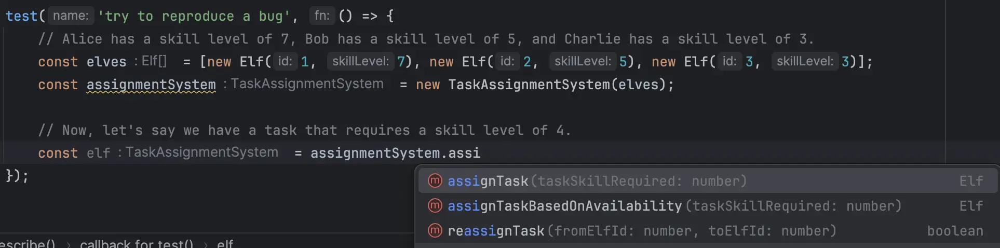
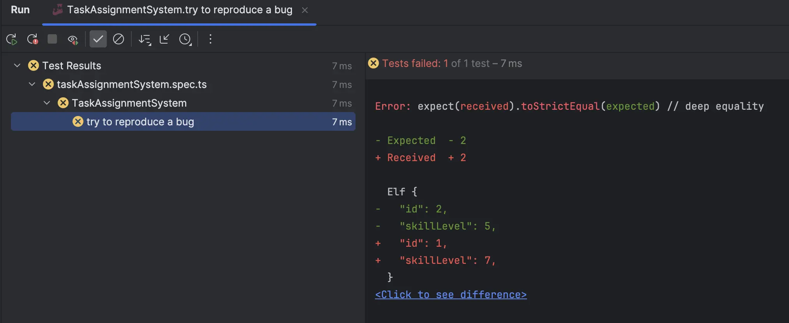
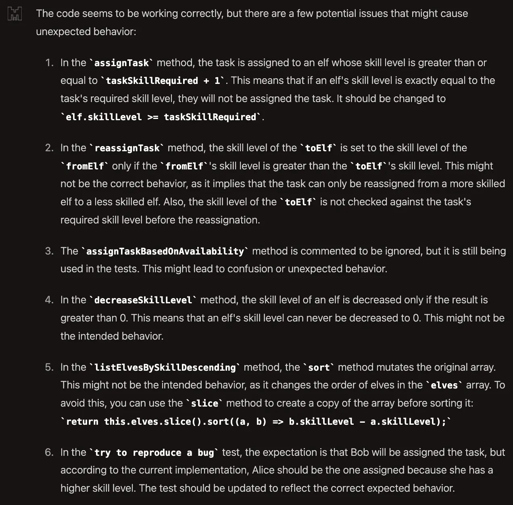

## Day 16: Bug bounty.

### Bob's explanations - 5 minutes 😱

Elf's explanations can be really hard to understand. There is a lot of details, what is relevant inside?

```text
Oh, dear! It seems our Task Assignment System has gone a bit haywire, and I, Elf Bob, am here to explain the mess we've found ourselves in. 
You see, we elves have been using this system to manage our tasks and skill levels, but something's not quite right.

Let me give you some examples of the mess we've been dealing with when it comes to task assignments and our skill levels.

Imagine we have three elves: Alice, Bob, and Charlie. 
Alice has a skill level of 7, Bob has a skill level of 5, and Charlie has a skill level of 3. 

Now, let's say we have a task that requires a skill level of 4.
You'd think that Alice and Bob would both be capable of doing this task, right? 

But sometimes, our Task Assignment System only assigns the task to Alice and completely overlooks Bob! 
It's like the system is completely ignoring our skill levels and just assigning tasks randomly.

Sometimes, when a task is reassigned from one elf to another, the second elf suddenly gains the same skill level as the first elf! 
It's like the system thinks we can magically learn new skills just by taking on a task. 
I wish it were that easy, but unfortunately, it's not.
 
As you can see, our Task Assignment System has been causing quite a bit of confusion and chaos. 
We're doing our best to work around the issues, but it's not easy. 
We could really use some help to get the system back on track and make sure we're all assigned the right tasks based on our skills. 
After all, we've got a lot of work to do before Christmas, and we can't afford any more mix-ups!
```

- We may extract interesting "stuff" to find what may be a bug from his explanations.
  - We start by isolating some "key" words: `assigned`, `tasks`, `skills`, `elves`, `reassigned`

Here it is pretty interesting: 
```text
Imagine we have three elves: Alice, Bob, and Charlie. 
Alice has a skill level of 7, Bob has a skill level of 5, and Charlie has a skill level of 3. 

Now, let's say we have a task that requires a skill level of 4.
You'd think that Alice and Bob would both be capable of doing this task, right? 

But sometimes, our Task Assignment System only assigns the task to Alice and completely overlooks Bob! 
It's like the system is completely ignoring our skill levels and just assigning tasks randomly.

Sometimes, when a task is reassigned from one elf to another, the second elf suddenly gains the same skill level as the first elf! 
```

We may identify steps-to-reproduce / scenarios based on it.

### "Reproduce" a bug?
A good starting point to fix a bug: `reproduce it`.

- Let's do it with a test
  - We translate Bob's plain text to a test



> Which method should be called from Bob's scenario?

- We look at `assignTask` and `assignTaskBasedOnAvailability`
  - Apparently the second one should not be used anymore... there is a comment explaining that...

```typescript
// Ignore this function and use assignTask instead
assignTaskBasedOnAvailability(taskSkillRequired: number): Elf | null {
    const availableElves = this.elves.filter(elf => elf.skillLevel >= taskSkillRequired);
    if (availableElves.length > 0) {
        return availableElves[Math.floor(Math.random() * availableElves.length)];
    }
    return null;
}
```

- Let's use the `assignTask` method:

```typescript
test('try to reproduce a bug', () => {
    // Alice has a skill level of 7, Bob has a skill level of 5, and Charlie has a skill level of 3.
    const alice = new Elf(1, 7);
    const bob = new Elf(2, 5);
    const charlie = new Elf(3, 3);

    const elves = [alice, bob, charlie];
    const assignmentSystem = new TaskAssignmentSystem(elves);

    // Now, let's say we have a task that requires a skill level of 4.
    const elf = assignmentSystem.assignTask(4);

    // You'd think that Alice and Bob would both be capable of doing this task, right?
    expect(elf).toStrictEqual(bob);
});
```

- Here is the result of this test



> If we expect `Bob` to be assigned on it, the system never does it...

### ⌛️ Time's up : let's use an AI Assistant
We ask to [`mistral AI`](https://chat.mistral.ai/chat) to find bugs in our code. Here is the result:



> Let's focus on those different AI findings.

#### 1) `assignTask` method
In the `assignTask` method, the task is assigned to an elf whose skill level is greater than or equal to `taskSkillRequired + 1`. 
This means that if an elf's skill level is exactly equal to the task's required skill level, they will not be assigned the task. 
It should be changed to `elf.skillLevel >= taskSkillRequired`.

```typescript
assignTask(taskSkillRequired: number): Elf | null {
  return this.elves.find(elf => elf.skillLevel >= taskSkillRequired + 1);
}
```

🔴Interesting point here, it may help to fix one of Bob's issue. Let's add a test to cover it:

```typescript
// const elves = [new Elf(1, 5), new Elf(2, 10), new Elf(3, 20)];
test('assignTask assigns an elf with exactly the required skill level', () => {
  expect(system.assignTask(10)).toStrictEqual(new Elf(2, 10));
});
```

🟢Let's fix the code as suggested by our `AI`

```typescript
assignTask(taskSkillRequired: number): Elf | null {
  return this.elves.find(elf => elf.skillLevel >= taskSkillRequired);
}
```

`try to reproduce a bug` test is still failing...

#### 2) `reassignTask` method
In the `reassignTask` method, the skill level of the `toElf` is set to the skill level of the `fromElf` only if the `fromElf`'s skill level is greater than the `toElf`'s skill level. 
This might not be the correct behavior, as it implies that the task can only be reassigned from a more skilled elf to a less skilled elf. 
Also, the skill level of the `toElf` is not checked against the task's required skill level before the reassignment.

```typescript
// the contract of the method is weird...
reassignTask(fromElfId: number, toElfId: number): boolean {
      // duplication between thos 2 lines
      const fromElf = this.elves.find(e => e.id === fromElfId);
      const toElf = this.elves.find(e => e.id === toElfId);

      if (fromElf && toElf && fromElf.skillLevel > toElf.skillLevel) {
          // assigning a task should not change the skills of someone...
          toElf.skillLevel = fromElf.skillLevel;
          return true;
      }
      return false;
  }
```

> We should have to investigate with a business expert on this one

We can at least remove the duplication in the method by extracting a `getElfById` method:

```typescript
reassignTask(fromElfId: number, toElfId: number): boolean {
    const fromElf = this.getElfById(fromElfId);
    const toElf = this.getElfById(toElfId);

    if (fromElf && toElf && fromElf.skillLevel > toElf.skillLevel) {
        toElf.skillLevel = fromElf.skillLevel;
        return true;
    }
    return false;
}

private getElfById(fromElfId: number) {
    return this.elves.find(e => e.id === fromElfId);
}
```

#### 3) `assignTaskBasedOnAvailability` method
The `assignTaskBasedOnAvailability` method is commented to be ignored, but it is still being used in the tests. 
This might lead to confusion or unexpected behavior.

```typescript
// Ignore this function and use assignTask instead
assignTaskBasedOnAvailability(taskSkillRequired: number): Elf | null {
  const availableElves = this.elves.filter(elf => elf.skillLevel >= taskSkillRequired);
  if (availableElves.length > 0) {
    return availableElves[Math.floor(Math.random() * availableElves.length)];
  }
  return null;
}
```

> Here we can remove the method and clean the code.

#### 4) `decreaseSkillLevel` method
In the `decreaseSkillLevel` method, the skill level of an elf is decreased only if the result is greater than 0. 
This means that an elf's skill level can never be decreased to 0. 

This might not be the intended behavior...

> It seems to not concern Bob's identified bugs

#### 5) `listElvesBySkillDescending` method 
In the `listElvesBySkillDescending` method, the `sort` method mutates the original array. 
This might not be the intended behavior, as it changes the order of elves in the `elves` array. 
To avoid this, you can use the `slice` method to create a copy of the array before sorting it: `return this.elves.slice().sort((a, b) => b.skillLevel - a.skillLevel);`

> Here it could explain the bug observed by Bob

```typescript
listElvesBySkillDescending(): Elf[] {
  return this.elves.sort((a, b) => b.skillLevel - a.skillLevel);
}
```

This method is a really `shitty`... if you take a look at it from the outside: `void` -> `Elf[]`.
It should be a `query` without any side effect but mutate the internal `elves` collection.

If a call is made to this method, it changes the result of the call to `assignTask` method...

- Let's adapt this method to avoid that:

```typescript
listElvesBySkillDescending(): Elf[] {
  return this.elves.slice().sort((a, b) => b.skillLevel - a.skillLevel);
}
```

- Let's adapt the `constructor` as well to be sure that the `assignTask` method will select the first elf matching the `taskSkillRequired`:

```typescript
constructor(elves: Elf[]) {
  this.elves = elves.sort((a, b) => a.skillLevel - b.skillLevel);
}
```

🟢 By fixing the constructor the test to reproduce the bug disappears

We can adapt it to be sure the bug won't reappear:

```typescript
test('assign task to the first elf having the lowest matching skill level', () => {
  const notOrderedElves = [new Elf(1, 7), new Elf(2, 5), new Elf(3, 3)];
  const assignmentSystem = new TaskAssignmentSystem(notOrderedElves);

  assignmentSystem.listElvesBySkillDescending();
  const elf = assignmentSystem.assignTask(4);

  expect(elf).toStrictEqual(new Elf(2, 5));
});
```

🔵 We refactor a little bit the code and end up with:
- There would be much more to do to improve this system like fighting `primitive obsession`

```typescript
import {Elf} from "./elf";

export class TaskAssignmentSystem {
    private readonly elves: Elf[] = [];
    private tasksCompleted: number = 0;

    constructor(elves: Elf[]) {
        this.elves = elves.sort((a, b) => a.skillLevel - b.skillLevel);
    }

    assignTask(taskSkillRequired: number): Elf | null {
        return this.elves.find(elf => elf.skillLevel >= taskSkillRequired);
    }

    reassignTask(fromElfId: number, toElfId: number): boolean {
        const fromElf = this.getElfById(fromElfId);
        const toElf = this.getElfById(toElfId);

        if (fromElf && toElf && fromElf.skillLevel > toElf.skillLevel) {
            toElf.skillLevel = fromElf.skillLevel;
            return true;
        }
        return false;
    }

    reportTaskCompletion(elfId: number): boolean {
        if (this.getElfById(elfId)) {
            this.tasksCompleted++;
            return true;
        }
        return false;
    }

    getTotalTasksCompleted(): number {
        return this.tasksCompleted;
    }

    getElfWithHighestSkill(): Elf | null {
        return this.elves.reduce((prev, current) => (prev.skillLevel > current.skillLevel) ? prev : current, this.elves[0]);
    }

    increaseSkillLevel(elfId: number, increment: number): void {
        const elf = this.getElfById(elfId);
        if (elf) {
            elf.skillLevel += increment;
        }
    }

    decreaseSkillLevel(elfId: number, decrement: number): void {
        const elf = this.elves.find(e => e.id === elfId);
        if (elf && elf.skillLevel - decrement > 0) {
            elf.skillLevel -= decrement;
        }
    }

    private getElfById(fromElfId: number) {
        return this.elves.find(e => e.id === fromElfId);
    }

    listElvesBySkillDescending(): Elf[] {
        return this.elves
            .slice()
            .sort((a, b) => b.skillLevel - a.skillLevel);
    }

    resetAllSkillsToBaseline(baseline: number): void {
        this.elves.forEach(elf => {
            elf.skillLevel = baseline;
        });
    }
}
```

### Reflect
- How do you identify `bugs and fix them`?
- What advantages do you see when using `AI` in your day-to-day?
- What are `its impact` in your `day-to-day` job?