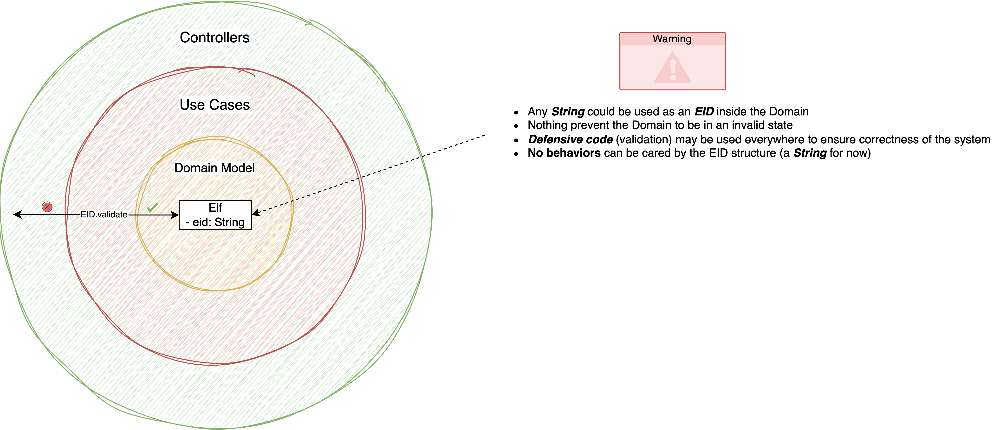
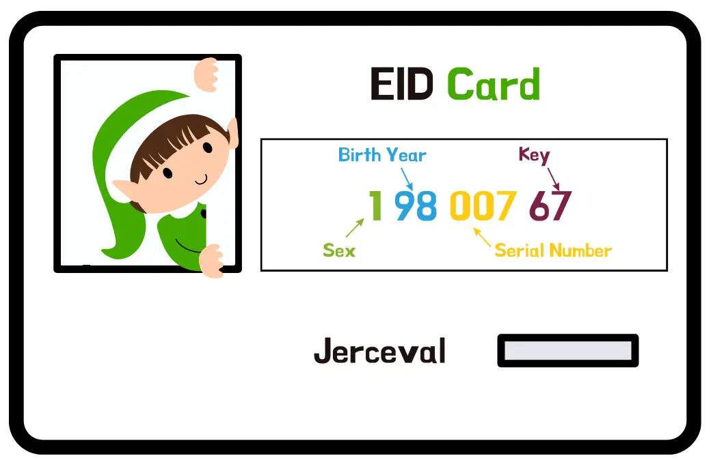

## Day 17: Parse Elf Ids (EID)

Teo and the elves are happy about your previous iteration of the EID program.
They are submitting you a new system to implement with new rules.

> Writing a system that parses `EID`

We have already worked on it to design a program validating `EID`s using `T.D.D`.
This time we will use a different approach.

### Primitive Obsession : limit of the approach


[`Primitive obsession`](https://xtrem-tdd.netlify.app/flavours/design/no-primitive-types/) is a code smell in which primitive data types are used excessively to represent data models.

By excessively using primitive types:
- it is really hard to represent business concepts
- they can not contain any business logic
  - this will disperse business logic throughout the system

### Parse Don't Validate
During this new challenge you have to:
- Apply ["Parse Don't Validate"](https://xtrem-tdd.netlify.app/Flavours/Design/parse-dont-validate) principle.
- Use ["Property-Based Testing"](https://xtrem-tdd.netlify.app/flavours/testing/pbt/) to drive the implementation.
- Use `Types` to represent `EID`: `Type-Driven Development` 

Your `parsing function` should ensure the below property:

```text
for all (eid)
parseEID(eid.toString) == eid
```

With `parse don't validate` we want to make it impossible to represent an invalid `EID` in our system.

Your parser may look like this: `String -> Either[ParsingError, EID]`

#### EID rules
The rules seen earlier still apply:

| Positions | Meaning                                                                                        | Possible values                     |
|-----------|------------------------------------------------------------------------------------------------|-------------------------------------|
| 1         | Sex : 1 for `Sloubi`, 2 for `Gagna`, 3 for `Catact`                                            | 1, 2 or 3                           |
| 2, 3      | Last two digits of the year of birth (which gives the year to the nearest century)             | From 00 to 99                       |
| 4, 5, 6   | "Serial number": birth order                                                                   | From 001 to 999                     |
| 7, 8      | control key = complement to 97 of the number formed by the first 6 digits of the EID modulo 97 | From 01 to 97                       |

Here is an example of such id:


### Proposed Solution
[](solution/step-by-step.md)
