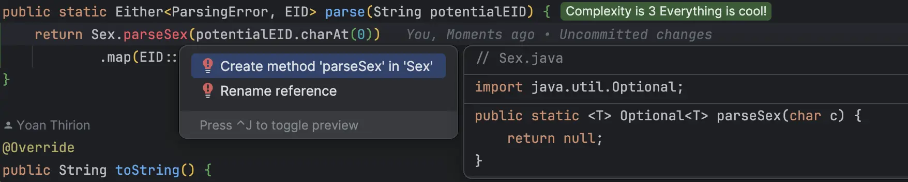

## Day 17: Parse Elf Ids (EID)
> Write a system that parses `EID`

We have already worked on it to design a program validating `EID`s using `T.D.D`.
This time we will use a different approach.

#### EID rules
The rules seen earlier still apply:

| Positions | Meaning                                                                                        | Possible values                     |
|-----------|------------------------------------------------------------------------------------------------|-------------------------------------|
| 1         | Sex : 1 for `Sloubi`, 2 for `Gagna`, 3 for `Catact`                                            | 1, 2 or 3                           |
| 2, 3      | Last two digits of the year of birth (which gives the year to the nearest century)             | From 00 to 99                       |
| 4, 5, 6   | "Serial number": birth order                                                                   | From 001 to 999                     |
| 7, 8      | control key = complement to 97 of the number formed by the first 6 digits of the EID modulo 97 | From 01 to 97                       |

Here is an example of such id:


### Create the `Round-trip` property
We start by adding a property that checks round-tripping for `EID` is working well: `from(to(x)) = x`
Your parser may look like this: `String -> Either[ParsingError, EID]`

```text
for all (eid)
parseEID(eid.toString) == eid
```

Add `vavr-test` to do so:

```xml
<dependency>
    <groupId>io.vavr</groupId>
    <artifactId>vavr</artifactId>
    <version>0.10.4</version>
</dependency>
<dependency>
    <groupId>io.vavr</groupId>
    <artifactId>vavr-test</artifactId>
    <version>0.10.4</version>
    <scope>test</scope>
</dependency>
```

🔴 Specify the property

```java
class EIDTests {
    private Arbitrary<EID> validEID = null;

    @Test
    void roundTrip() {
        Property.def("parseEID(eid.toString) == eid")
                .forAll(validEID)
                .suchThat(eid -> EID.parse(eid.toString()).contains(eid))
                .check()
                .assertIsSatisfied();
    }
}
```

🟢Make it pass.
- Generate the `EID` class


- Then we generate the `parse` method:

```java
public class EID {
    public static Either<ParsingError, EID> parse(String potentialEID) {
        return null;
    }
}
```

- We now create a `ParsingError` record to be able to compile

```java
public record ParsingError() {
}
```

- Then, we implement the `parse` method by hard-coding the result

```java
public static Either<ParsingError, EID> parse(String potentialEID) {
    return Either.right(new EID());
}
```

- We define how to generate valid EIDs in the test class

```java
private final Arbitrary<EID> validEID = Arbitrary.of(new EID());
```

- We need to work on value equality for `EID`
  - We will use [`lombok`](https://projectlombok.org/) for that purpose

```xml
<dependency>
    <groupId>org.projectlombok</groupId>
    <artifactId>lombok</artifactId>
    <version>1.18.32</version>
    <scope>provided</scope>
</dependency>
```

- We use the feature called [`EqualsAndHashCode`](https://projectlombok.org/features/EqualsAndHashCode)

```java
@EqualsAndHashCode
public class EID {
    public static Either<ParsingError, EID> parse(String potentialEID) {
        return Either.right(new EID());
    }

    @Override
    public String toString() {
        return "";
    }
}
```

Our property is now 🟢.

🔵 Anything to refactor?

### Type-Driven Development
Let's use this property to work on types
> Let's create the `Sex` type

- We may use an `enum` for that
  - It is immutable by design
  - We need to work on the `String` representation of it 
  - Each data structure may contain its own parsing method

🔴 We add the `Sex` generator in our property

`sexGenerator` will randomly get a value from the `Sex` value.


We design our `EID` class to be instantiated with a `Sex` value.

🟢 We generate the `Sex` enum

```java
public enum Sex { }
```

- We iterate on this type:

```java
public enum Sex {
  Sloubi('1'),
  Gagna('2'),
  Catact('3');

  public final char value;

  Sex(char value) {
    this.value = value;
  }
}
```

- We iterate on the type `EID` now to pass the `Sex` in constructor and use ot for the parsing part:



- We create the `parseSex` method:

```java
// parsing method return an Either as well
public static Either<ParsingError, Sex> parseSex(char potentialSex) {
    // we use vavr Pattern matching
    return Match(potentialSex).of(
            Case($('1'), right(Sloubi)),
            Case($('2'), right(Gagna)),
            Case($('3'), right(Catact)),
            Case($(), left((new ParsingError("Not a valid sex"))))
    );
}

// we add a reason in the ParsingError
public record ParsingError(String reason) {
}
```

- Then, we work on the `toString` methods

```java
public enum Sex {
    Sloubi('1'),
    Gagna('2'),
    Catact('3');

    public final char value;

    Sex(char value) {
        this.value = value;
    }

    public static Either<ParsingError, Sex> parseSex(char potentialSex) {
        // vavr Pattern matching
        return Match(potentialSex).of(
                Case($('1'), right(Sloubi)),
                Case($('2'), right(Gagna)),
                Case($('3'), right(Catact)),
                Case($(), left((new ParsingError("Not a valid sex"))))
        );
    }

    @Override
    public String toString() {
        return "" + value;
    }
}

@EqualsAndHashCode
public class EID {
  private final Sex sex;

  public EID(Sex sex) {
    this.sex = sex;
  }

  public static Either<ParsingError, EID> parse(String potentialEID) {
    return Sex.parseSex(potentialEID.charAt(0))
            .map(EID::new);
  }

  @Override
  public String toString() {
    return sex.toString();
  }
}
```

Here is an example of values generated by the `sexGenerator`: 1, 2, 1, 1, 2, 3, ...

### Design the `Year` type
Like for the `Sex` type, we design the new type with its generator.

🔴 We start by creating a new valid year generator

```java
private final Gen<Year> yearGenerator = Gen.choose(0, 99).map(Year::fromInt); // have a private constructor
    private final Gen<Sex> sexGenerator = Gen.choose(Sex.values());
    private final Arbitrary<EID> validEID =
            sexGenerator.map(EID::new)
                    // We need to use the yearGenerator here
                    .arbitrary();
```

🟢 To be able to use the `yearGenerator`, we need to have a context to be able to map into it. 

It is a mutable data structure that we enrich with the result of each generator. We create a Builder class for it:

```java
// lombok annotations to simplify code
@With
@Getter
@AllArgsConstructor
public class EIDBuilder {
    private final Sex sex;
    private Year year;

    public EIDBuilder(Sex sex) {
        this.sex = sex;
    }
}
```

- We now adapt the property to use this Builder

```java
class EIDTests {
    private final Gen<Year> yearGenerator = Gen.choose(0, 99).map(Year::fromInt); // have a private constructor
    private final Gen<Sex> sexGenerator = Gen.choose(Sex.values());
    private Random random;
    private final Arbitrary<EID> validEID =
            sexGenerator.map(EIDBuilder::new)
                    .map(eidBuilder -> eidBuilder.withYear(yearGenerator.apply(random)))
                    .map(eidBuilder -> new EID(eidBuilder.getSex(), eidBuilder.getYear()))
                    .arbitrary();

    @Test
    void roundTrip() {
        Property.def("parseEID(eid.toString) == eid")
                .forAll(validEID)
                .suchThat(eid -> EID.parse(eid.toString()).contains(eid))
                .check()
                .assertIsSatisfied();
    }
}
```

- We have to adapt the `EID` class to handle the `Year` in its construct
  - We will use the same Builder construct

```java
@EqualsAndHashCode
public class EID {
    private final Sex sex;
    private final Year year;

    public EID(Sex sex, Year year) {
        this.sex = sex;
        this.year = year;
    }

    public static Either<ParsingError, EID> parse(String potentialEID) {
        return parseSex(potentialEID.charAt(0))
                .map(EIDBuilder::new)
                // we hard-code the year to be able to move on
                .flatMap(eidBuilder -> right(eidBuilder.withYear(new Year(1))))
                .map(eidBuilder -> new EID(eidBuilder.getSex(), eidBuilder.getYear()));
    }
  
```

- we iterate on the code, and at the end of this stage it looks like this:

```java
class EIDTests {
    private final Random random = new Random();
    private final Gen<Year> yearGenerator = Gen.choose(0, 99).map(Year::fromInt);
    private final Gen<Sex> sexGenerator = Gen.choose(Sex.values());
    private final Arbitrary<EID> validEID =
            sexGenerator.map(EIDBuilder::new)
                    .map(eidBuilder -> eidBuilder.withYear(yearGenerator.apply(random)))
                    .map(eidBuilder -> new EID(eidBuilder.getSex(), eidBuilder.getYear()))
                    .arbitrary();

    @Test
    void roundTrip() {
        Property.def("parseEID(eid.toString) == eid")
                .forAll(validEID)
                .suchThat(eid -> EID.parse(eid.toString()).contains(eid))
                .check()
                .assertIsSatisfied();
    }
}

@EqualsAndHashCode
public class EID {
  private final Sex sex;
  private final Year year;

  public EID(Sex sex, Year year) {
    this.sex = sex;
    this.year = year;
  }

  public static Either<ParsingError, EID> parse(String potentialEID) {
    return parseSex(potentialEID.charAt(0))
            .map(EIDBuilder::new)
            .flatMap(eidBuilder -> parseYear(potentialEID.substring(1, 3), eidBuilder))
            .map(eidBuilder -> new EID(eidBuilder.getSex(), eidBuilder.getYear()));
  }

  private static Either<ParsingError, EIDBuilder> parseYear(String potentialYear, EIDBuilder builder) {
    return Year.parseYear(potentialYear)
            .map(builder::withYear);

  }

  @Override
  public String toString() {
    return sex.toString() + year;
  }
}

@UtilityClass
public class StringExtensions {
  // Extension methods are static methods with at least 1 parameter
  // The first parameter type is the one we extend
  public static Option<Integer> toInt(String potentialNumber) {
    return isANumber(potentialNumber) // Use Option<Integer> -> equivalent to Optional since java 8
            ? some(Integer.parseInt(potentialNumber))
            : none();
  }

  private static boolean isANumber(String str) {
    return str != null && str.matches("[0-9.]+");
  }
}

@ExtensionMethod(StringExtensions.class)
@EqualsAndHashCode
public class Year {
  private final int value;

  public Year(int value) {
    this.value = value;
  }

  public static Year fromInt(int potentialYear) {
    return parseYear(String.valueOf(potentialYear))
            .getOrElseThrow(err -> new IllegalArgumentException(err.reason()));
  }

  public static Either<ParsingError, Year> parseYear(String potentialYear) {
    return potentialYear
            .toInt()
            .filter(x -> x >= 0 && x <= 99)
            .map(Year::new)
            .toEither(new ParsingError("year should be between 0 and 99"));
  }

  @Override
  public String toString() {
    // years should be on 2 characters no matter what
    return String.format("%02d", value);
  }
}
```

### Fast Forward the design `Serial Number`

We do exactly the same for the `Serial Number` and end up with this code:

```java
@ExtensionMethod(StringExtensions.class)
@EqualsAndHashCode
public class SerialNumber {
    private final int value;

    public SerialNumber(int value) {
        this.value = value;
    }

    public static SerialNumber fromInt(int potentialSerialNumber) {
      return parseSerialNumber(String.valueOf(potentialSerialNumber))
              .getOrElseThrow(err -> new IllegalArgumentException(err.reason()));
    }

    public static Either<ParsingError, SerialNumber> parseSerialNumber(String potentialSerialNumber) {
        return potentialSerialNumber
                .toInt()
                .filter(x -> x >= 1 && x <= 999)
                .map(SerialNumber::new)
                .toEither(new ParsingError("serial number should be between 1 and 999"));
    }

    @Override
    public String toString() {
        return String.format("%03d", value);
    }
}

class EIDTests {
  private final Random random = new Random();
  private final Gen<Year> yearGenerator = Gen.choose(0, 99).map(Year::fromInt);
  private final Gen<Sex> sexGenerator = Gen.choose(Sex.values());
  private final Gen<SerialNumber> serialNumberGenerator = Gen.choose(1, 999).map(SerialNumber::fromInt);
  private final Arbitrary<EID> validEID =
          sexGenerator.map(EIDBuilder::new)
                  .map(eidBuilder -> eidBuilder.withYear(yearGenerator.apply(random)))
                  .map(eidBuilder -> eidBuilder.withSerialNumber(serialNumberGenerator.apply(random)))
                  .map(EIDBuilder::toEID)
                  .arbitrary();

  @Test
  void roundTrip() {
    Property.def("parseEID(eid.toString) == eid")
            .forAll(validEID)
            .suchThat(eid -> EID.parse(eid.toString()).contains(eid))
            .check()
            .assertIsSatisfied();
  }
}
```

🔵 Let's improve encapsulation by making constructors privates
- We force to instantiate objects only by using `parsing` methods

```java
@AllArgsConstructor
@EqualsAndHashCode
public class EID {
    private final Sex sex;
    private final Year year;
    private final SerialNumber serialNumber;

    public static Either<ParsingError, EID> parse(String potentialEID) {
        return parseSex(potentialEID.charAt(0))
                .map(EIDBuilder::new)
                .flatMap(eidBuilder -> parseYear(potentialEID.substring(1, 3), eidBuilder))
                .flatMap(eidBuilder -> parseSerialNumber(potentialEID.substring(3, 6), eidBuilder))
                .map(eidBuilder -> new EID(eidBuilder.getSex(), eidBuilder.getYear(), eidBuilder.getSerialNumber()));
    }

    private static Either<ParsingError, EIDBuilder> parseYear(String potentialYear, EIDBuilder builder) {
        return Year.parseYear(potentialYear)
                .map(builder::withYear);
    }

    private static Either<ParsingError, EIDBuilder> parseSerialNumber(String potentialSerialNumber, EIDBuilder eidBuilder) {
        return SerialNumber.parseSerialNumber(potentialSerialNumber)
                .map(eidBuilder::withSerialNumber);
    }

    @Override
    public String toString() {
        return sex.toString() + year + serialNumber;
    }
}

@ExtensionMethod(StringExtensions.class)
@EqualsAndHashCode
public class SerialNumber {
  private final int value;

  private SerialNumber(int value) {
    this.value = value;
  }

  public static SerialNumber fromInt(int potentialSerialNumber) {
    return parseSerialNumber(String.valueOf(potentialSerialNumber))
            .getOrElseThrow(err -> new IllegalArgumentException(err.reason()));
  }
  ...
}

@ExtensionMethod(StringExtensions.class)
@EqualsAndHashCode
public class Year {
  private final int value;

  private Year(int value) {
    this.value = value;
  }

  public static Year fromInt(int potentialYear) {
    return parseYear(String.valueOf(potentialYear))
            .getOrElseThrow(err -> new IllegalArgumentException(err.reason()));
  }

  public static Either<ParsingError, Year> parseYear(String potentialYear) {
    return potentialYear
            .toInt()
            .filter(x -> x >= 0 && x <= 99)
            .map(Year::new)
            .toEither(new ParsingError("year should be between 0 and 99"));
  }
  ...
}
```

Generated valid `EID` looks like this now: 346951, 298179, 232373, 211404, 247064, ...

### Let's add the key part

We add the validation of the key at the end of the parsing process:
```java
public static Either<ParsingError, EID> parse(String potentialEID) {
    return parseSex(potentialEID.charAt(0))
            .map(EIDBuilder::new)
            .flatMap(eidBuilder -> parseYear(potentialEID.substring(1, 3), eidBuilder))
            .flatMap(eidBuilder -> parseSerialNumber(potentialEID.substring(3, 6), eidBuilder))
            .map(eidBuilder -> new EID(eidBuilder.getSex(), eidBuilder.getYear(), eidBuilder.getSerialNumber()))
            .flatMap(eid -> checkKey(potentialEID.substring(6), eid));
}

private static Either<ParsingError, EID> checkKey(String potentialKey, EID eid) {
  return StringExtensions.toInt(potentialKey)
          .filter(parsedKey -> Objects.equals(eid.key(), parsedKey))
          .map(x -> eid)
          .toEither(new ParsingError("invalid key"));
}
```

- we create the `key` generator and add it to the `toString` method

```java
@Override
public String toString() {
    return stringWithoutKey() + format("%02d", key());
}

private String stringWithoutKey() {
    return sex.toString() + year + serialNumber;
}

private Integer key() {
    return stringWithoutKey()
            .toInt()
            .map(x -> (97 - (x % 97)))
            .get();
}
```

### Result
> We now have a proper `EID` generator that allows us to check out round trip property

```java
private final Arbitrary<EID> validEID =
    sexGenerator.map(EIDBuilder::new)
            .map(eidBuilder -> eidBuilder.withYear(yearGenerator.apply(random)))
            .map(eidBuilder -> eidBuilder.withSerialNumber(serialNumberGenerator.apply(random)))
            .map(EIDTests::toEID)
            .arbitrary();
```

Our production code looks like this:

```java
@AllArgsConstructor
@EqualsAndHashCode
@ExtensionMethod(StringExtensions.class)
public class EID {
    private final Sex sex;
    private final Year year;
    private final SerialNumber serialNumber;

    public static Either<ParsingError, EID> parse(String potentialEID) {
        return parseSex(potentialEID.charAt(0))
                .map(EIDBuilder::new)
                .flatMap(eidBuilder -> parseYear(potentialEID.substring(1, 3), eidBuilder))
                .flatMap(eidBuilder -> parseSerialNumber(potentialEID.substring(3, 6), eidBuilder))
                .map(eidBuilder -> new EID(eidBuilder.getSex(), eidBuilder.getYear(), eidBuilder.getSerialNumber()))
                .flatMap(eid -> checkKey(potentialEID.substring(6), eid));
    }

    private static Either<ParsingError, EIDBuilder> parseYear(String potentialYear, EIDBuilder builder) {
        return Year.parseYear(potentialYear)
                .map(builder::withYear);
    }

    private static Either<ParsingError, EIDBuilder> parseSerialNumber(String potentialSerialNumber, EIDBuilder builder) {
        return SerialNumber.parseSerialNumber(potentialSerialNumber)
                .map(builder::withSerialNumber);
    }

    private static Either<ParsingError, EID> checkKey(String potentialKey, EID eid) {
        return StringExtensions.toInt(potentialKey)
                .filter(parsedKey -> Objects.equals(eid.key(), parsedKey))
                .map(x -> eid)
                .toEither(new ParsingError("invalid key"));
    }

    @Override
    public String toString() {
        return stringWithoutKey() + format("%02d", key());
    }

    private String stringWithoutKey() {
        return sex.toString() + year + serialNumber;
    }

    private Integer key() {
        return stringWithoutKey()
                .toInt()
                .map(x -> (97 - (x % 97)))
                .get();
    }
}

public enum Sex {
  Sloubi('1'),
  Gagna('2'),
  Catact('3');

  public final char value;

  Sex(char value) {
    this.value = value;
  }

  public static Either<ParsingError, Sex> parseSex(char potentialSex) {
    // vavr Pattern matching
    return Match(potentialSex).of(
            Case($('1'), right(Sloubi)),
            Case($('2'), right(Gagna)),
            Case($('3'), right(Catact)),
            Case($(), left((new ParsingError("Not a valid sex"))))
    );
  }

  @Override
  public String toString() {
    return "" + value;
  }
}

@ExtensionMethod(StringExtensions.class)
@EqualsAndHashCode
public class Year {
  private final int value;

  private Year(int value) {
    this.value = value;
  }

  public static Year fromInt(int potentialYear) {
    return parseYear(String.valueOf(potentialYear))
            .getOrElseThrow(err -> new IllegalArgumentException(err.reason()));
  }

  public static Either<ParsingError, Year> parseYear(String potentialYear) {
    return potentialYear
            .toInt()
            .filter(x -> x >= 0 && x <= 99)
            .map(Year::new)
            .toEither(new ParsingError("year should be between 0 and 99"));
  }

  @Override
  public String toString() {
    return String.format("%02d", value);
  }
}

@ExtensionMethod(StringExtensions.class)
@EqualsAndHashCode
public class SerialNumber {
  private final int value;

  private SerialNumber(int value) {
    this.value = value;
  }

  public static SerialNumber fromInt(int potentialSerialNumber) {
    return parseSerialNumber(String.valueOf(potentialSerialNumber))
            .getOrElseThrow(err -> new IllegalArgumentException(err.reason()));
  }

  public static Either<ParsingError, SerialNumber> parseSerialNumber(String potentialSerialNumber) {
    return potentialSerialNumber
            .toInt()
            .filter(x -> x >= 1 && x <= 999)
            .map(SerialNumber::new)
            .toEither(new ParsingError("serial number should be between 1 and 999"));
  }

  @Override
  public String toString() {
    return String.format("%03d", value);
  }
}
```

For now:
- It is impossible to represent an `EID` in an invalid state
  - To construct one we need to inject `Sex`, `Year`, `SerialNumber`
  - Those structures can be instantiated only through `parsing` method
- We have a semantic that expresses the concepts behind `EID`

We now have a safe `Domain Model` meaning if an `EID` is successfully instantiated it is valid by design:


> Is it enough to design good types like this?

## Reflect
- How does the `Type-Driven Development` approach used in this exercise help in `ensuring the correctness and robustness` of the EID parsing system?
- How `could you apply the principles` of Type-Driven Development to other domains or projects you are working on?
- In what other scenarios or systems might it be beneficial to `enforce encapsulation and immutability` through private constructors and parsing methods?
- How might the concept of a `round-trip property` be useful in other areas of software development or data processing?
