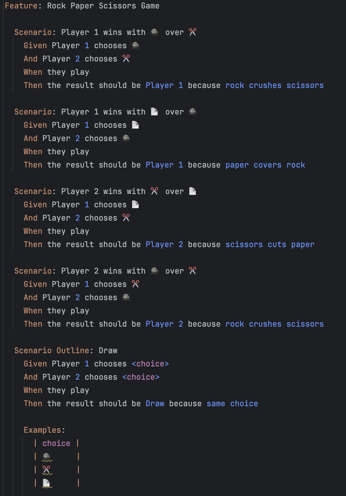

## Day 18: Add features 🦎🖖.

Santa plays a lot with the elves to "Rock, paper, scissors" but they are not necessarily fair-play, so he decided to specify who wins when by using a program on his own.

He has written the `specifications` here in a feature file that he used as an input to develop his program.

### Rock Paper Scissors Lizard Spock
He would like to extend this program by adding `Lizard` and `Spock` like explained below:

> Change the program to support Spock and Lizard for Santa 🖖

✅🚀 **Challenge: Add the new features to the existing program using BDD.** 🚀✅

### Proposed Solution
