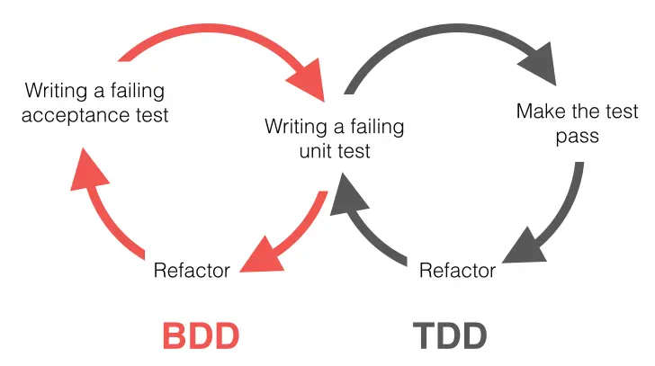
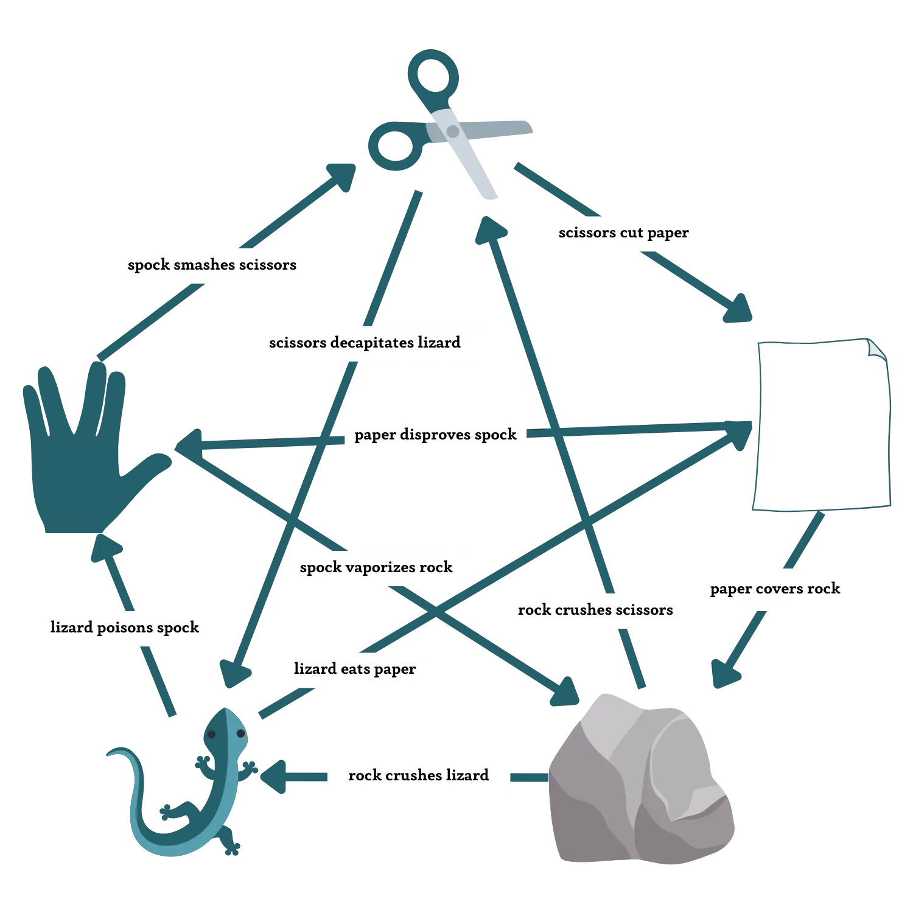
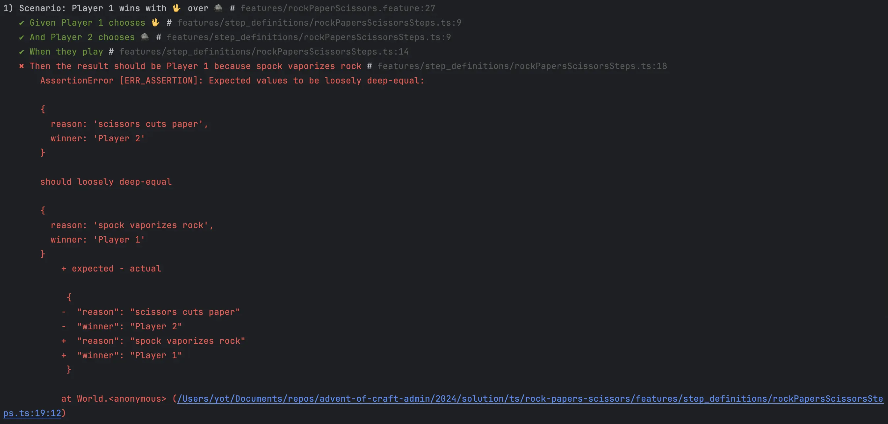

## Day 18: Add features 🦎🖖.
Features are detailed in the `rockPaperScissors.feature` feature file:

```gherkin
Feature: Rock Paper Scissors Game

  Scenario: Player 1 wins with 🪨 over ✂️
    Given Player 1 chooses 🪨
    And Player 2 chooses ✂️
    When they play
    Then the result should be Player 1 because rock crushes scissors

  Scenario: Player 1 wins with 📄 over 🪨
    Given Player 1 chooses 📄
    And Player 2 chooses 🪨
    When they play
    Then the result should be Player 1 because paper covers rock

  Scenario: Player 2 wins with ✂️ over 📄
    Given Player 1 chooses 📄
    And Player 2 chooses ✂️
    When they play
    Then the result should be Player 2 because scissors cuts paper

  Scenario: Player 2 wins with 🪨 over ✂️
    Given Player 1 chooses ✂️
    And Player 2 chooses 🪨
    When they play
    Then the result should be Player 2 because rock crushes scissors

  Scenario Outline: Draw
    Given Player 1 chooses <choice>
    And Player 2 chooses <choice>
    When they play
    Then the result should be Draw because same choice

    Examples:
      | choice |
      | 🪨     |
      | ✂️     |
      | 📄     |
```

Tests are automated with [`cucumber.js`](https://cucumber.io/docs/installation/javascript/) through `step definitions` in the `rockPapersScissorsSteps.ts`:

```typescript
import {Given, Then, When} from "@cucumber/cucumber";
import {Choice, Result, RockPaperScissors} from "../../src/rockPaperScissors";
import * as assert from "assert";

let result: Result;
let player1: Choice;
let player2: Choice;

Given(/^Player (\d+) chooses (.*)$/, function (player, choice) {
    if (player === 1) player1 = choice;
    else player2 = choice;
});

When(/^they play$/, function () {
    result = RockPaperScissors.play(player1, player2)
});

Then(/^the result should be (.*) because (.*)$/, function (expectedWinner, expectedReason) {
    assert.deepEqual(result, {winner: expectedWinner, reason: expectedReason});
});
```

We can continue using [`Behavior-Driven Development`](https://dannorth.net/introducing-bdd/) to implement the new features:
- This file speaks for itself from a business point of view
- Those scenarios have been used to align and understand features
  - AND to drive the implementation



### Refactor to facilitate implementation
Before implementing the features we prepare the code to "welcome" them.

Let's identify how to simplify it:

```typescript
export class RockPaperScissors {
    static play(player1: Choice, player2: Choice): Result {
        // Too many branches
        // High cyclomatic complexity
        if (player1 === player2) return {winner: "Draw", reason: "same choice"};
        else if (player1 === "🪨" && player2 === "✂️")
            return {winner: "Player 1", reason: "rock crushes scissors"};
        else if (player1 === "📄" && player2 === "🪨")
            // Duplication everywhere
            return {winner: "Player 1", reason: "paper covers rock"};
        else if (player1 === "✂️" && player2 === "📄")
            return {winner: "Player 1", reason: "scissors cuts paper"};
        else if (player2 === "🪨" && player1 === "✂️")
            return {winner: "Player 2", reason: "rock crushes scissors"};
        else if (player2 === "📄" && player1 === "🪨")
            return {winner: "Player 2", reason: "paper covers rock"};
        else return {winner: "Player 2", reason: "scissors cuts paper"};
    }
}
```

We may use a `map` that declares `what beats what` and use it from this `function`:

```typescript
const whatBeatsWhat = new Map<string, string>([
    [keyFor("🪨", "✂️"), "rock crushes scissors"],
    [keyFor("📄", "🪨"), "paper covers rock"],
    [keyFor("✂️", "📄"), "scissors cuts paper"]
]);

function keyFor(choice1: Choice, choice2: Choice): string {
    return `${choice1}_${choice2}`;
}

export class RockPaperScissors {
    static play(player1: Choice, player2: Choice): Result {
        if (player1 === player2) return {winner: "Draw", reason: "same choice"};
        else if (whatBeatsWhat.has(keyFor(player1, player2)))
            return {winner: "Player 1", reason: whatBeatsWhat.get(keyFor(player1, player2))};
        else return {winner: "Player 2", reason: whatBeatsWhat.get(keyFor(player2, player1))};
    }
}
```

> It will be much easier to add features now.

### Tests list
Let's identify `Lizard` and `Spock` tests:



```text
- Spock vaporizes rock
- Spock smashes scissors
- Paper disproves Spock
- Lizard poisons Spock
- Scissors decapitates lizard
- Rock crushes lizard
- Lizard eats paper
```

### Add a first scenario
🔴 We start by adding a new `Scenario`

```gherkin
  Scenario: Player 1 wins with 🖖 over 🪨
    Given Player 1 chooses 🖖
    And Player 2 chooses 🪨
    When they play
    Then the result should be Player 1 because spock vaporizes rock
```



🟢 We make it pass as fast as possible

```typescript
// Add Spock choice
export type Choice = "🪨" | "📄" | "✂️" | "🖖";
export type Winner = "Player 1" | "Player 2" | "Draw"
export type Result = {
    winner: Winner,
    reason: string
};

const whatBeatsWhat = new Map<string, string>([
    [keyFor("🪨", "✂️"), "rock crushes scissors"],
    [keyFor("📄", "🪨"), "paper covers rock"],
    [keyFor("✂️", "📄"), "scissors cuts paper"],
    // Declare Spock wins over rock
    [keyFor("🖖", "🪨"), "spock vaporizes rock"]
]);
```

- We update the tests list

```text
✅ Spock vaporizes rock
- Spock smashes scissors
- Paper disproves Spock
- Lizard poisons Spock
- Scissors decapitates lizard
- Rock crushes lizard
- Lizard eats paper
```

🔵 Because we have prepared the code to welcome the new features, we have not that much space for improvement.

We can refactor the `Scenarios` to use a single `Outline` that will use `Examples` as input:

```gherkin
Feature: Rock, Paper, Scissors, Lizard, Spock Game

  Scenario: Player 1 wins with 🪨 over ✂️
    Given Player 1 chooses 🪨
    And Player 2 chooses ✂️
    When they play
    Then the result should be Player 1 because rock crushes scissors

  Scenario: Player 1 wins with 📄 over 🪨
    Given Player 1 chooses 📄
    And Player 2 chooses 🪨
    When they play
    Then the result should be Player 1 because paper covers rock

  Scenario: Player 2 wins with ✂️ over 📄
    Given Player 1 chooses 📄
    And Player 2 chooses ✂️
    When they play
    Then the result should be Player 2 because scissors cuts paper

  Scenario: Player 2 wins with 🪨 over ✂️
    Given Player 1 chooses ✂️
    And Player 2 chooses 🪨
    When they play
    Then the result should be Player 2 because rock crushes scissors

  Scenario: Player 1 wins with 🖖 over 🪨
    Given Player 1 chooses 🖖
    And Player 2 chooses 🪨
    When they play
    Then the result should be Player 1 because spock vaporizes rock

  Scenario Outline: Draw
    Given Player 1 chooses <choice>
    And Player 2 chooses <choice>
    When they play
    Then the result should be Draw because same choice

    Examples:
      | choice |
      | 🪨     |
      | ✂️     |
      | 📄     |
```

`Feature` file looks like this now:

```gherkin
Feature: Rock, Paper, Scissors, Lizard, Spock Game

  Scenario Outline: Rock, Paper, Scissors, Lizard, Spock Winners
    Given Player 1 chooses <player1>
    And Player 2 chooses <player2>
    When they play
    Then the result should be <result> because <reason>

    Examples:
      | player1 | player2 | result   | reason                |
      | 🪨      | ✂️      | Player 1 | rock crushes scissors |
      | 📄      | 🪨      | Player 1 | paper covers rock     |
      | 📄      | ✂️      | Player 2 | scissors cuts paper   |
      | ✂️      | 🪨      | Player 2 | rock crushes scissors |
      | 🪨      | 🪨      | Draw     | same choice           |
      | ✂️      | ✂️      | Draw     | same choice           |
      | 📄      | 📄      | Draw     | same choice           |
      | 🖖      | 🪨      | Player 1 | spock vaporizes rock  |
```

### Spock `smashes scissors`

🔴 Spock smashes scissors

```gherkin
Scenario Outline: Rock, Paper, Scissors, Lizard, Spock Winners
    Given Player 1 chooses <player1>
    And Player 2 chooses <player2>
    When they play
    Then the result should be <result> because <reason>

    Examples:
      | player1 | player2 | result   | reason                 |
      ...
      | ✂️      | 🖖      | Player 2 | spock smashes scissors |
```

🟢 We add the scoring logic to the `Map`

```typescript
const whatBeatsWhat = new Map<string, string>([
    [keyFor("🪨", "✂️"), "rock crushes scissors"],
    [keyFor("📄", "🪨"), "paper covers rock"],
    [keyFor("✂️", "📄"), "scissors cuts paper"],
    [keyFor("🖖", "🪨"), "spock vaporizes rock"],
    [keyFor("🖖", "✂️"), "spock smashes scissors"]
]);
```

🔵 Anything to refactor?

### Fast-forward
We have completed our tests list:

```text
✅ Spock vaporizes rock
✅ Spock smashes scissors
✅ Paper disproves Spock
✅ Lizard poisons Spock
✅ Scissors decapitates lizard
✅ Rock crushes lizard
✅ Lizard eats paper
```

We end-up with this code:

```typescript
export type Choice = "🪨" | "📄" | "✂️" | "🖖" | "🦎";
export type Winner = "Player 1" | "Player 2" | "Draw"
export type Result = {
    winner: Winner,
    reason: string
};

const whatBeatsWhat = new Map<string, string>([
    [keyFor("🪨", "✂️"), "rock crushes scissors"],
    [keyFor("📄", "🪨"), "paper covers rock"],
    [keyFor("✂️", "📄"), "scissors cuts paper"],
    [keyFor("🖖", "🪨"), "spock vaporizes rock"],
    [keyFor("🖖", "✂️"), "spock smashes scissors"],
    [keyFor("📄", "🖖"), "paper disproves spock"],
    [keyFor("🦎", "🖖"), "lizard poisons spock"],
    [keyFor("✂️", "🦎"), "scissors decapitates lizard"],
    [keyFor("🪨", "🦎"), "rock crushes lizard"],
    [keyFor("🦎", "📄"), "lizard eats paper"]
]);

function keyFor(choice1: Choice, choice2: Choice): string {
    return `${choice1}_${choice2}`;
}

export class RockPaperScissorsLizardSpock {
    static play(player1: Choice, player2: Choice): Result {
        if (player1 === player2) return {winner: "Draw", reason: "same choice"};
        else if (whatBeatsWhat.has(keyFor(player1, player2)))
            return {winner: "Player 1", reason: whatBeatsWhat.get(keyFor(player1, player2))};
        else return {winner: "Player 2", reason: whatBeatsWhat.get(keyFor(player2, player1))};
    }
}
```

### Reflect
- How can `B.D.D` help you? 
- What would be `simpler` with this approach?
- Conversely, what would be `harder`?
