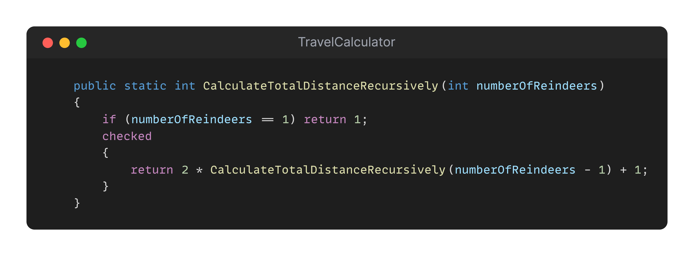

## Day 19: Performance...

Santa plans to visit his reindeers next year.
There really are a lot of them...

He would like to calculate the distance he will to travel to visit each one of them. He wrote the program below calculating the total distance to visit each reindeer.
The programs does the job by providing the correct numbers (Santa made the Maths).

Still when he runs it on his machine, it takes a lot of time from his point of view... and it is failing once number of reindeers is greater than 32 🥲.

As a bonus, he would like his program to be able to support 50 reindeers (for a distance of 1 125 899 906 842 623).

> Your task is to refactor the program to enhance its efficiency, showcase the improvements with data to Santa by altering the algorithm AND support calculation until 50 reindeers.

✅🚀 **Challenge: Change the code to improve its performance.** 🚀✅

### Proposed Solution
