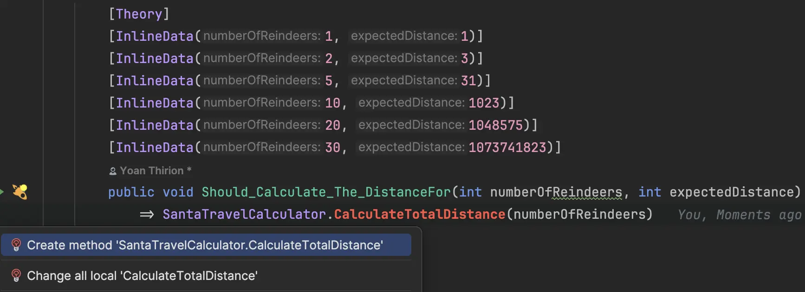

## Day 19: Performance...
### Look at the code
Before making anything, let's analyze the code:

```csharp
public static int CalculateTotalDistanceRecursively(int numberOfReindeers)
{
    // If there is only one reindeer, the distance to travel is defined as 1.
    if (numberOfReindeers == 1) return 1;
    // The checked block is used to ensure that if the calculation results in a value that exceeds the limits of an int, an OverflowException will be thrown, avoiding silent overflow errors.
    checked
    {
        // For more than one reindeer, the method calculates the distance by doubling the distance needed to visit the previous number of reindeers and then adding 1.
        return 2 * CalculateTotalDistanceRecursively(numberOfReindeers - 1) + 1;
    }
}
```

- What about its [`Time Complexity (Big O)`](https://en.wikipedia.org/wiki/Big_O_notation)?: 
  - The time complexity of this recursive method is O(n), where n is the number of reindeers
  - The method makes a single recursive call for each decrement of `numberOfReindeers` until it reaches the base case
  - If there are n reindeers, the `method will be called n times`

> More explanations about `checked` in .NET [here](https://learn.microsoft.com/en-us/dotnet/csharp/language-reference/statements/checked-and-unchecked).

### Benchmarking
Before touching the code, we need to think about how to showcase the "potential" improvements to Santa.
We can `benchmark` the current implementation and use it as a `driver` for refactoring.

### Benchmark the current algorithm
In `.NET` we can use [`BenchmarkDotNet`](https://github.com/dotnet/BenchmarkDotNet).

- We create a new project (`Console Application`) for that purpose in the solution.


- Then, we add the reference to the library:

```shell
dotnet add package BenchmarkDotNet --version 0.13.12
```

- We can add a new class `SantaTravelBenchmark`
  - We add a method that will serve our `Benchmark`
  - Such a method must be identified with a `Benchmark` attribute

```csharp
public class SantaTravelBenchmark
{
    [Benchmark]
    public void CalculateTotalDistanceRecursivelyBenchmark()
    {
        
    }
}
```

- We add the implementation of the method
  - And configure its parameters

```csharp
public class SantaTravelBenchmark
{
    // Configure paramaters to be injected
    [Params(1, 5, 10, 20, 30)] public int NumberOfReindeers;

    [Benchmark]
    public void CalculateTotalDistanceRecursivelyBenchmark()
        => CalculateTotalDistanceRecursively(NumberOfReindeers);
}
```

- Now we need to run it from the `Program` file 

```csharp
using BenchmarkDotNet.Running;
using Travel.Benchmark;

BenchmarkRunner.Run<SantaTravelBenchmark>();
```

- First time, it fails
  - It fails because the program, by default, should run in `Release` mode.


- We can run it by configuring our command in our terminal

```shell
dotnet run -c Release
```

- Here is the result of our first run


> This benchmark will be used as a driver to check if our optimization goes in the right direction.

### Refactor for better performance
🔴 We start by plugging the tests on a new implementation



🟢 Then we can duplicate the code to make it pass

```csharp
public static int CalculateTotalDistance(int numberOfReindeers)
{
    if (numberOfReindeers == 1) return 1;

    checked
    {
        return 2 * CalculateTotalDistanceRecursively(numberOfReindeers - 1) + 1;
    }
}
```

🔵 Let's refactor to a linear algorithm (without recursion)

- We start by extracting variables


```csharp
public static int CalculateTotalDistance(int numberOfReindeers)
{
    checked
    {
        if (numberOfReindeers == 1) return 1;

            var distanceToNextReindeer = 1;
            // Accumulator for distance
            var distance = 0;
            // We can use it to go to 0
            var remainingReindeersToVisit = numberOfReindeers;
            
            return 2 * CalculateTotalDistanceRecursively(numberOfReindeers - 1) + distanceToNextReindeer;
    }
}
```

- Then we refactor recursion with a `while`

```csharp
public static int CalculateTotalDistance(int numberOfReindeers)
{
    checked
    {
        var distanceToNextReindeer = 1;
        var distance = 0;
        var remainingReindeersToVisit = numberOfReindeers;

        while (remainingReindeersToVisit > 0)
        {
            // add distance
            distance += distanceToNextReindeer;
            // double the distance to the next reindeer
            distanceToNextReindeer *= 2;
            // decrement our index
            remainingReindeersToVisit--;
        }

        return distance;
    }
}
```

- We can now measure the impact of this linear approach on the `performance`
  - We add a new `Benchmark` method using the same parameters

```csharp
public class SantaTravelBenchmark
{
    [Params(1, 5, 10, 20, 30)] public int NumberOfReindeers;

    [Benchmark]
    public void CalculateTotalDistanceRecursivelyBenchmark()
        => CalculateTotalDistanceRecursively(NumberOfReindeers);

    [Benchmark]
    public void CalculateTotalDistanceBenchmark()
        => CalculateTotalDistance(NumberOfReindeers);
}
```

- Here is the result


> Congratulations, we have figures demonstrating the benefits of this refactoring 🙏 (half time for 30 reindeers calculation for example).

### Fix the problem with `50`
🔴 We add a new test for the value given by `Santa`: `1 125 899 906 842 623`

```csharp
[Theory]
...
[InlineData(50, 1_125_899_906_842_623)]
public void Should_Calculate_The_DistanceFor(int numberOfReindeers, int expectedDistance)
    => CalculateTotalDistance(numberOfReindeers)
        .Should()
        .Be(expectedDistance);
```

- It fails because `xUnit` can not pass the parameter to the method for an `ArgumentException`


Indeed here are the max values for the types

| Type         | Max Value                 |
|--------------|---------------------------|
| Int32 (int)  | 2 147 483 647             |
| Int64 (long) | 9 223 372 036 854 775 807 |

- Make it fail for a good reason
  - We change the input type of the test method


Now that our test is failing for a "good reason" we can work on the implementation.

🟢 We can fix it by using `long` everywhere

```csharp
public static long CalculateTotalDistance(int numberOfReindeers)
{
    checked
    {
        // We declare longs instead of ints
        var distanceToNextReindeer = 1L;
        var distance = 0L;
        var remainingReindeersToVisit = numberOfReindeers;

        while (remainingReindeersToVisit > 0)
        {
            distance += distanceToNextReindeer;
            distanceToNextReindeer *= 2;
            remainingReindeersToVisit--;
        }

        return distance;
    }
}
```

🔵 We can remove tests regarding `Overflow` that does not make sense anymore when using `long` values

### Using LinQ / Bit shift operation
Alternatively we could use `LinQ` aggregators

```csharp
public static long CalculateTotalDistanceWithLinQ(int numberOfReindeers)
    => Range(1, numberOfReindeers)
        // Aggregate the 2 values
        .Aggregate((totalDistance: 0L, distanceToNextReindeer: 1L),
            (acc, _) => (acc.totalDistance + acc.distanceToNextReindeer, acc.distanceToNextReindeer * 2),
            acc => acc.totalDistance);
```

Or use a bit shift operation to calculate the distance to each reindeer:

```csharp
public static ulong CalculateTotalDistanceWithBitWise(int numberOfReindeers) 
    // calculates the sum of the first numberOfReindeers powers of 2, which is equivalent to (2^{\text{numberOfReindeers}} - 1).
    => (1UL << numberOfReindeers) - 1;
```

Let's benchmark those different methods for fun 🤗


> What could we conclude with that?

```

BenchmarkDotNet v0.13.12, macOS Sonoma 14.0 (23A344) [Darwin 23.0.0]
Apple M1, 1 CPU, 8 logical and 8 physical cores
.NET SDK 9.0.100
  [Host]     : .NET 9.0.0 (9.0.24.52809), Arm64 RyuJIT AdvSIMD
  DefaultJob : .NET 9.0.0 (9.0.24.52809), Arm64 RyuJIT AdvSIMD


```
| Method    | NumberOfReindeers | Mean       | Error     | StdDev    | Median     |
|---------- |------------------ |-----------:|----------:|----------:|-----------:|
| **Recursive** | **1**                 |  **0.5385 ns** | **0.0019 ns** | **0.0017 ns** |  **0.5382 ns** |
| While     | 1                 |  0.5258 ns | 0.0031 ns | 0.0024 ns |  0.5251 ns |
| LinQ      | 1                 | 11.1026 ns | 0.0439 ns | 0.0367 ns | 11.0893 ns |
| BitWise   | 1                 |  0.3510 ns | 0.0019 ns | 0.0017 ns |  0.3510 ns |
| **Recursive** | **5**                 |  **3.8143 ns** | **0.0867 ns** | **0.1350 ns** |  **3.7689 ns** |
| While     | 5                 |  3.0582 ns | 0.0175 ns | 0.0137 ns |  3.0610 ns |
| LinQ      | 5                 | 15.7501 ns | 0.2904 ns | 0.2983 ns | 15.6316 ns |
| BitWise   | 5                 |  0.3501 ns | 0.0024 ns | 0.0021 ns |  0.3498 ns |
| **Recursive** | **10**                |  **7.6866 ns** | **0.0085 ns** | **0.0079 ns** |  **7.6868 ns** |
| While     | 10                |  4.6014 ns | 0.0055 ns | 0.0049 ns |  4.5995 ns |
| LinQ      | 10                | 18.7374 ns | 0.0293 ns | 0.0259 ns | 18.7461 ns |
| BitWise   | 10                |  0.3640 ns | 0.0250 ns | 0.0222 ns |  0.3602 ns |
| **Recursive** | **20**                | **19.1316 ns** | **0.3888 ns** | **0.3447 ns** | **19.0563 ns** |
| While     | 20                |  7.8284 ns | 0.1131 ns | 0.1003 ns |  7.8139 ns |
| LinQ      | 20                | 28.3852 ns | 0.0917 ns | 0.0716 ns | 28.3671 ns |
| BitWise   | 20                |  0.4187 ns | 0.0298 ns | 0.0769 ns |  0.3847 ns |
| **Recursive** | **30**                | **35.2873 ns** | **0.1884 ns** | **0.1670 ns** | **35.3138 ns** |
| While     | 30                | 11.6281 ns | 0.1865 ns | 0.1744 ns | 11.5576 ns |
| LinQ      | 30                | 41.0813 ns | 0.3453 ns | 0.2884 ns | 41.0988 ns |
| BitWise   | 30                |  0.3639 ns | 0.0222 ns | 0.0326 ns |  0.3558 ns |

### Performance and Green IT
A few words on `green IT` our dev responsibility:
- `Energy Efficiency`: As developers, optimizing our code and infrastructure for energy efficiency reduces the environmental footprint of IT operations, contributing to a more sustainable planet. 
- `Resource Optimization`: By using resources more judiciously, whether through efficient algorithms or cloud resource scaling, we minimize waste and energy consumption, aligning with Green IT principles.
- `Lifecycle Management`: Responsible lifecycle management of software and hardware, including considerations for recycling and minimal environmental impact, is crucial for reducing e-waste and promoting sustainability in technology.

### Reflect
- What did you learn from it?
- How could `benchmarking` certain pieces of code `improve your product quality`?
- What `first action` could you take to move toward green IT?