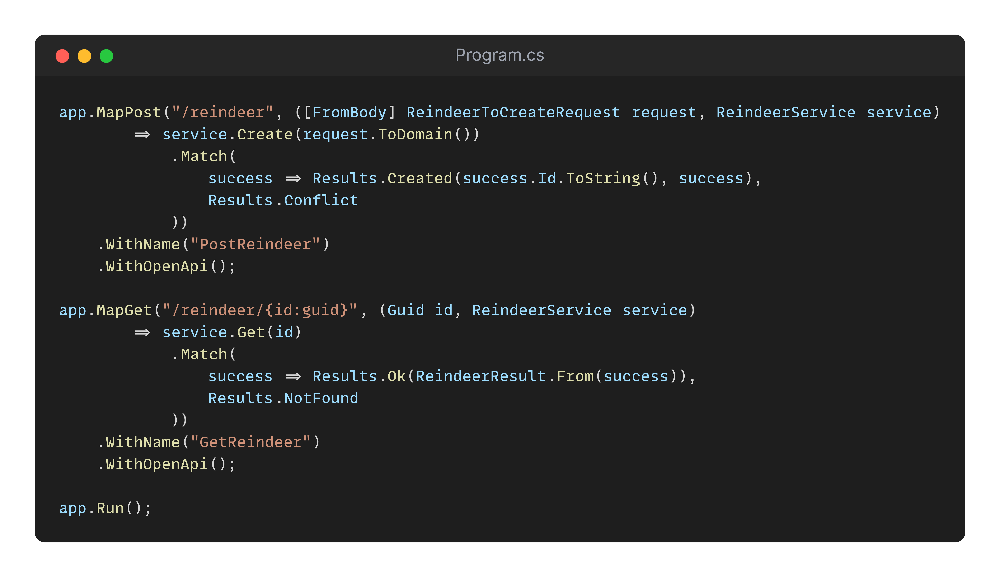

## Day 20: Contract Tests.
This exercise is brought to you by:
<table>
    <tr>
        <td align="center" style="word-wrap: break-word; width: 150.0; height: 150.0">
            <a href=https://github.com/pierrebelin>
                
                 
                <b>Pierre Belin</b>
            </a>
        </td>
    </tr>
</table>

Today, Teo has a special task for you.
You will be working on an API that manages a list of `reindeer` for Santa Claus.

This API, which has been private until now, must now be made public so that all children can access the list of reindeer to find out if their gifts will arrive on time or not.

To ensure that there are no regressions in your future developments, you need to build contract tests to guarantee this!

Before starting, here is a summary of your current API. At the moment, you have 2 routes:

- **POST** `/reindeer` which allows you to add a reindeer
- **GET** `/reindeer/{id}` which allows you to retrieve a reindeer

> Find a smart and efficient way to test it 🎅

### Preamble
To simplify instantiation and avoid using Docker, we use a `WebApplicationFactory`. 
This allows the application to start in memory and produces an `HttpClient` to send requests to it. 
If you are not familiar with how it works, I recommend reading this: [Enhance your .NET Testing #1: WebApplicationFactory](https://goatreview.com/dotnet-testing-webapplicationfactory/).

### Additional needs
Santa would like to secure this `api` using an `API_KEY` (a `UUID` for each api client).

> Make sure to check that the key is supplied.

### Proposed Solution

