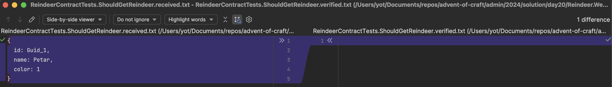
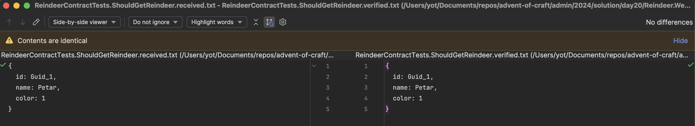

## Day 20: Contract Tests.
We may use [`Approval Testing`](https://understandlegacycode.com/approval-tests/) approach to solve this challenge (remember day 14 😉).

### Building a First Test with Verify
To build our contract tests, we can use [`Verify`](https://github.com/VerifyTests/Verify) which allows for file comparison:

```shell
dotnet add package Verify.Xunit --version 25.0.3
```

This method ensures that the returns are not affected by a serializer or other issues since we will compare the HTTP client results.
To integrate it into a test, call the method as follows:

```csharp
await Verify(CONTENT_HERE, SETTINGS);
```

🔴 Let's refactor the `ShouldGetReindeer` to use `Verifiy`:

```csharp
[Fact]
public async Task ShouldGetReindeer()
{
    var response = await _client.GetAsync("reindeer/40F9D24D-D3E0-4596-ADC5-B4936FF84B19");

    response.StatusCode.Should().Be(HttpStatusCode.OK);
    await VerifyJson(response.Content.ReadAsStringAsync());
}
```

The test will initially fail because it is the first time the test is run.
To make a comparison test, you need a comparer and a comparand. 

However, we do not yet have a comparand. The first test run generates it.



Two files are created:
- `ReindeerContractTests.ShouldGetReindeer.received.txt` which corresponds to the return 
- `ReindeerContractTests.ShouldGetReindeer.verified.txt` which corresponds to the expected

🟢 We need to verify / approve the received file to make the test passes

> Meaning we create the approved one with the result of the current production code.



### Changing the Location of Generated Files
The generated files are placed at the root of the test project, which is not practical. 
Imagine we had 100 tests; it would create a lot of noise in the file explorer...

To resolve this, we will move the files to a subfolder named `Verified` at the root of the test project.

```csharp
[Fact]
public async Task ShouldGetReindeer()
{
    var response = await _client.GetAsync("reindeer/40F9D24D-D3E0-4596-ADC5-B4936FF84B19");

    response.StatusCode.Should().Be(HttpStatusCode.OK);
    
    // We instantiate the `VerifySettings`
    var settings = new VerifySettings();
    // We configure the destination directory for the files
    settings.UseDirectory("Verified");
    await VerifyJson(response.Content.ReadAsStringAsync(), settings);
}
```

### Adding the Entire HTTP Call
One last point before going live: we want to set up an `authentication` system to only allow access to users who have an `API key` that we have provided.
To simulate this functionality, we will add an `API-KEY` parameter to the `HttpClient` header (corresponding to the one provided to the user) as follows: 

```csharp
_client.DefaultRequestHeaders.Add("API-KEY", "XXXX-XXXX");
```

If you rerun your tests, they should be good. 
However, this is no longer the case because you are now expected to provide this `API key` as a contract. 

> For this, you need to save not just the content of the response but almost the entire HTTP request, which will have the following structure:

```json
{
  "Request": {
    "Headers": [],
    "Method": "GET/POST",
    "RequestUri": "/endpoint",
    "Version": "1.1",
    "Content": ""
  },
  "Response": {
    "StatusCode": 200,
    "Content": ""
  }
}
```

Let's adapt our test:

```csharp
[Fact]
public async Task ShouldGetReindeer()
{
    var response = await _client.GetAsync("reindeer/40F9D24D-D3E0-4596-ADC5-B4936FF84B19");

    response.StatusCode.Should().Be(HttpStatusCode.OK);
    var settings = new VerifySettings();
    settings.UseDirectory("Verified");
    
    await VerifyJson(ExtractContent(response), settings);
}

private static async Task<string> ExtractContent(HttpResponseMessage response)
{
    var requestContent = response.RequestMessage?.Content is null
        ? ""
        : await response.RequestMessage.Content!.ReadAsStringAsync();
    
    var content = new
    {
        Request = new
        {
            Headers = response.RequestMessage!.Headers,
            Method = response.RequestMessage.Method,
            RequestUri = response.RequestMessage.RequestUri!.PathAndQuery,
            Version = response.RequestMessage.Version,
            Content = requestContent
        },
        Response = new
        {
            StatusCode = response.StatusCode,
            Content = await response.Content.ReadAsStringAsync()
        }
    };
    return JsonSerializer.Serialize(content,
        new JsonSerializerOptions
            {WriteIndented = true, Encoder = JavaScriptEncoder.UnsafeRelaxedJsonEscaping});
}
```

Now the file content looks like this:

```json
{
  Request: {
    Headers: [
      {
        Key: API-KEY,
        Value: [
          "XXXX-XXXX"
        ]
      }
    ],
    Method: {
      Method: GET
    },
    RequestUri: /reindeer/40F9D24D-D3E0-4596-ADC5-B4936FF84B19,
    Version: 1.1,
    Content:
  },
  Response: {
    StatusCode: 200,
    Content: {"id":"40f9d24d-d3e0-4596-adc5-b4936ff84b19","name":"Petar","color":1}
  }
}
```

### Adding a Random Element
We just noticed that we gave the same key to all users, and we want to correct this.
To achieve this, we modify the sending of the API key with a random generation: 

```csharp
_client.DefaultRequestHeaders.Add("API-KEY", Guid.NewGuid().ToString());
```

If you run the tests, they should no longer pass. 

This is normal; the API key is now random. However, we are doing string comparison.
To resolve this, it is possible to use a `scrubber` to replace strings with the methods provided by `Verify`.

The simple way to achieve this is to add the `ScrubInlineGuids()` extension to the `Verify` method.
There are a whole set of predefined scrubbers to use ([Verify Scrubbers](https://github.com/VerifyTests/Verify/blob/main/docs/scrubbers.md)).

```csharp
settings.ScrubInlineGuids();
```

And get that result:
```json
{
  "Request": {
    "Headers": [
      {
        "Key": "API-KEY",
        "Value": [
          "Guid_1"
        ]
      }
    ],
    "Method": {
      "Method": "GET"
    },
    "RequestUri": "/reindeer/Guid_2",
    "Version": "1.1",
    "Content": ""
  },
  "Response": {
    "StatusCode": 200,
    "Content": "{\"id\":\"Guid_3\",\"name\":\"Petar\",\"color\":1}"
  }
}
```

### Creating Your Own Scrubber
We want to go further, and for readability reasons (yes, our PO has really specific preferences), he does not want to see `Guid_1` and `Guid_2` in our contract but rather a replacement string like `GUID_VALUE`.
To achieve this, we need to create our own scrubber with a `regex`.

The first step is to create the regex to retrieve a GUID format corresponding to our key.
```csharp
// The Tests class must be made partial to use the following regex definition:
[GeneratedRegex(@"[a-fA-F0-9]{8}-[a-fA-F0-9]{4}-[a-fA-F0-9]{4}-[a-fA-F0-9]{4}-[a-fA-F0-9]{12}")]
private static partial Regex GuidRegex();
```

Next, we add our scrubber with the capture string (in this case, the regex) and the replacement text to the `Verify settings.
```csharp
settings.AddScrubber(builder => {
    var modifiedContent = GuidRegex().Replace(builder.ToString(), "GUID_VALUE");
    builder.Clear();
    builder.Append(modifiedContent);
});
```

To obtain:
```json
{
  "Request": {
    "Headers": [
      {
        "Key": "API-KEY",
        "Value": [
          "GUID_VALUE"
        ]
      }
    ],
    "Method": {
      "Method": "GET"
    },
    "RequestUri": "/reindeer/GUID_VALUE",
    "Version": "1.1",
    "Content": ""
  },
  "Response": {
    "StatusCode": 200,
    "Content": "{\"id\":\"GUID_VALUE\",\"name\":\"Petar\",\"color\":1}"
  }
}
```

### Building the POST Validation
Now that our contract is complete for errors, we will move on to the second route: the one to add a reindeer.
> Over to you!

```csharp
public async Task ShouldCreateReindeer()
{
    var request = new ReindeerToCreateRequest("Paolo", ReindeerColor.Black);
    var response = await _client.PostAsync("reindeer", JsonContent.Create(request));
    response.StatusCode.Should().Be(HttpStatusCode.Created);
    var contractContent = ExtractContent(response);
    
    await VerifyJson(contractContent, _settings);
}
```

To obtain:

```json
{
  "Request": {
    "Headers": [
      {
        "Key": "API-KEY",
        "Value": [
          "GUID_VALUE"
        ]
      }
    ],
    "Method": {
      "Method": "POST"
    },
    "RequestUri": "/reindeer",
    "Version": "1.1",
    "Content": ""
  },
  "Response": {
    "StatusCode": 201,
    "Content": "{\"id\":\"GUID_VALUE\",\"name\":\"Paolo\",\"color\":1}"
  }
}
```

🔵 After some refactoring, we end up with:

```csharp
public partial class ReindeerContractTests
{
    private readonly HttpClient _client;
    private readonly VerifySettings _settings;

    [GeneratedRegex(@"[a-fA-F0-9]{8}-[a-fA-F0-9]{4}-[a-fA-F0-9]{4}-[a-fA-F0-9]{4}-[a-fA-F0-9]{12}")]
    private static partial Regex GuidRegex();

    public ReindeerContractTests()
    {
        var webApplication = new ReindeerWebApplicationFactory();
        _client = webApplication.CreateClient();
        _client.DefaultRequestHeaders.Add("API-KEY", Guid.NewGuid().ToString());

        _settings = new VerifySettings();
        _settings.UseDirectory("Verified");
        _settings.AddScrubber(builder =>
        {
            var modifiedContent = GuidRegex().Replace(builder.ToString(), "GUID_VALUE");
            builder.Clear();
            builder.Append(modifiedContent);
        });
    }

    [Fact]
    public async Task ShouldGetReindeer()
    {
        var response = await _client.GetAsync("reindeer/40F9D24D-D3E0-4596-ADC5-B4936FF84B19");

        response.StatusCode.Should().Be(HttpStatusCode.OK);
        await VerifyJson(response.ExtractContent(), _settings);
    }
    
    [Fact]
    public async Task NotFoundForNotExistingReindeer()
    {
        var nonExistingReindeer = Guid.NewGuid().ToString();
        var response = await _client.GetAsync($"reindeer/{nonExistingReindeer}");

        response.StatusCode.Should().Be(HttpStatusCode.NotFound);
    }

    [Fact]
    public async Task ShouldCreateReindeer()
    {
        var request = new ReindeerToCreateRequest("Paolo", ReindeerColor.Black);
        var response = await _client.PostAsync("reindeer", JsonContent.Create(request));

        response.StatusCode.Should().Be(HttpStatusCode.Created);
        await VerifyJson(response.ExtractContent(), _settings);
    }
    
    [Fact]
    public async Task ConflictWhenTryingToCreateExistingOne()
    {
        var request = new ReindeerToCreateRequest("Petar", ReindeerColor.Purple);
        var response = await _client.PostAsync("reindeer", JsonContent.Create(request));

        response.StatusCode.Should().Be(HttpStatusCode.Conflict);
    }
}
```

## Reflect
- How does Approval Testing `help validate complex API responses` compared to `traditional asserts`?
- What `challenges` arise in Approval Testing for `dynamic or evolving API data`?