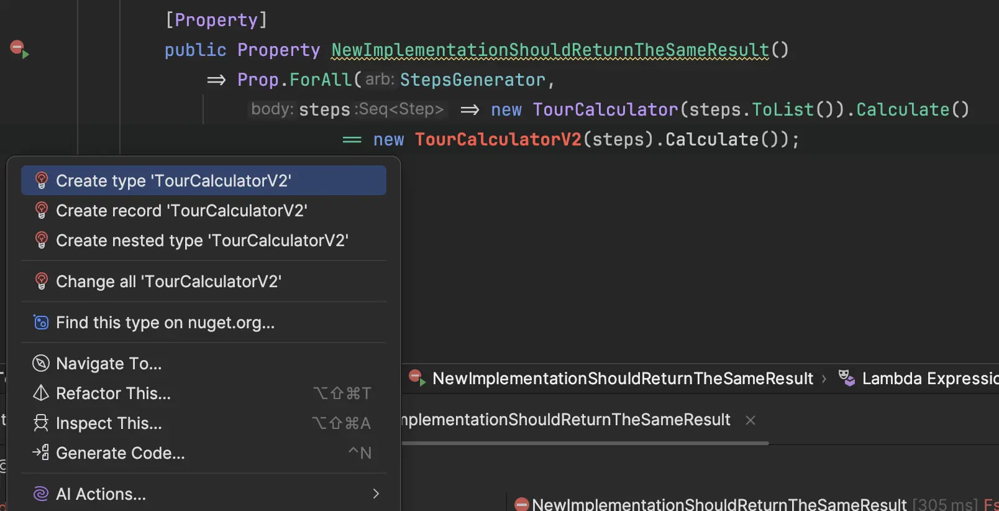
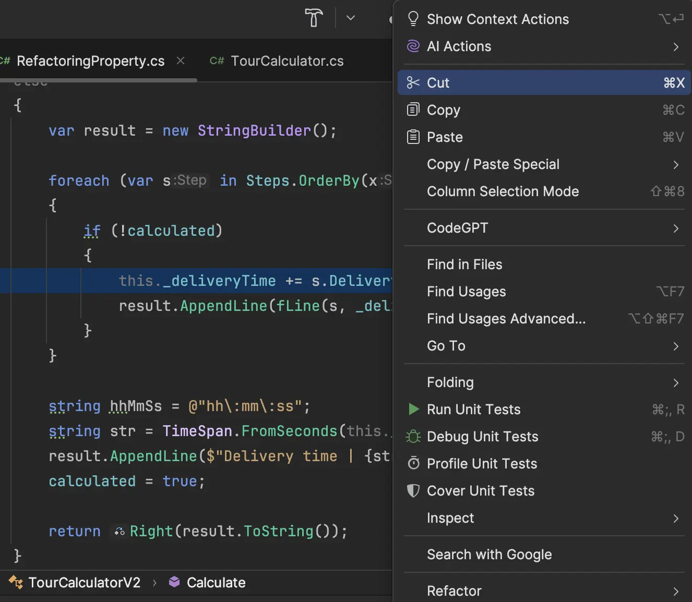
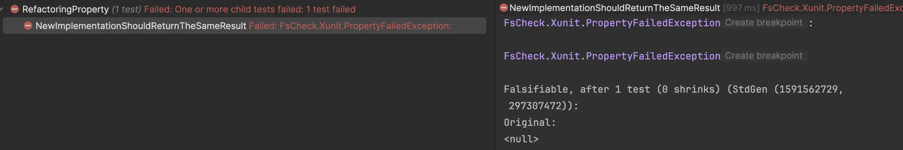
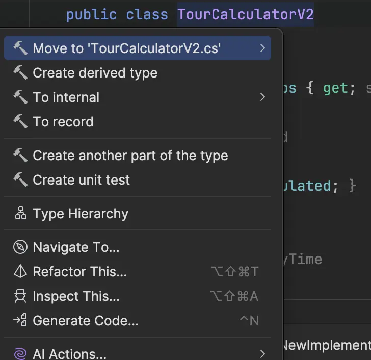
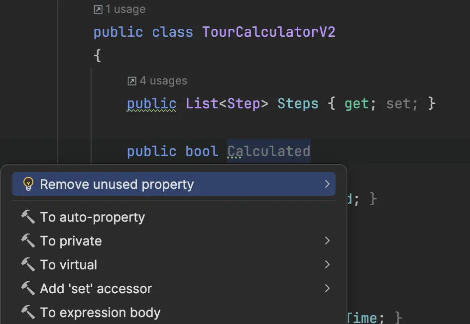
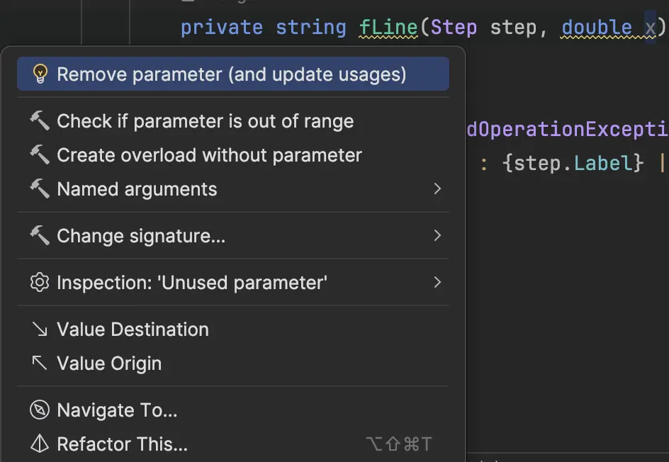
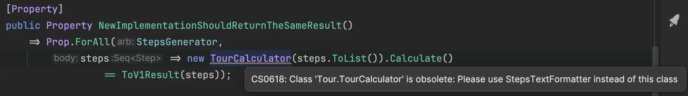

## Day 21: Safely refactor the `TourCalculator`.
We can use the concept of `Property-Based testing` to refactor a given code.

🔴 We create a property that checks `f(x) == new_f(x)`

```csharp
[Property]
public Property NewImplementationShouldReturnTheSameResult()
    => Prop.ForAll(_stepsGenerator,
        steps => new TourCalculator(steps).Calculate()
                 == new TourCalculatorV2(steps).Calculate());
```

- Then we work on the `stepsGenerator` and specify how to create an arbitrary `Step` 

```csharp
private static readonly Arbitrary<Step> _stepGenerator =
(
    from hour in Gen.Choose(0, 23)
    from minute in Gen.Choose(0, 59)
    from second in Gen.Choose(0, 59)
    from label in Arb.Default.StringWithoutNullChars().Generator
    from duration in Gen.Choose(1, 60)
    select new Step(new TimeOnly(hour, minute, second), label.Item, duration)
).ToArbitrary();
```

- We can then use it to generate a collection of `Step` 

```csharp
private static readonly Arbitrary<Seq<Step>> StepsGenerator =
    Gen.Choose(0, 100)
        .Select(x => StepGenerator.Generator.Sample(x, x)
            .ToSeq())
        .ToArbitrary();
```

- Then we generate code for `TourCalculatorV2`



```csharp
public class TourCalculatorV2
{
    public TourCalculatorV2(Seq<Step> steps)
    {
        throw new NotImplementedException();
    }

    public Either<string, string> Calculate()
    {
        throw new NotImplementedException();
    }
}
```

🟢 We copy / paste the existing code inside the `TourCalculatorV2`

```csharp
public class TourCalculatorV2
{
    public List<Step> Steps { get; set; }

    public bool Calculated
    {
        get { return calculated; }
    }

    public double DeliveryTime
    {
        get { return _deliveryTime; }
    }

    private double _deliveryTime = 0;
    private bool calculated = false;

    public TourCalculatorV2(Seq<Step> steps) => Steps = steps.ToList();

    public Either<string, string> Calculate()
    {
        if (Steps.IsNull() || Steps.Count == 0)
        {
            return Left("No locations !!!");
        }
        else
        {
            var result = new StringBuilder();

            foreach (var s in Steps.OrderBy(x => x.Time))
            {
                if (!calculated)
                {
                    this._deliveryTime += s.DeliveryTime;
                    result.AppendLine(fLine(s, _deliveryTime));
                }
            }

            string hhMmSs = @"hh\:mm\:ss";
            string str = TimeSpan.FromSeconds(this._deliveryTime).ToString(hhMmSs);
            result.AppendLine($"Delivery time | {str}");
            calculated = true;

            return Right(result.ToString());
        }
    }

    private string fLine(Step step, double x)
    {
        if (step == null)
            throw new InvalidOperationException();
        else
            return $"{step.Time} : {step.Label} | {step.DeliveryTime} sec";
    }
}
```

> The property is now green

Let's check the robustness of our property by introducing defect(s) in our new implementation
  - Mutate one or several lines



The property fails : that's great our property is acting as a safety net for our refactoring



`Seeing a test failing is as important as seeing it passing`

🔵 Let's make a small refactoring by moving the `TourCalculatorV2`



## Safely refactor
### Identify code smells

```csharp
// Why do we have to instantiate a new calculator at each call ?
// Not a calculator -> String as a return
public class TourCalculatorV2
{
    // Avoid using List : we may favor Immutable Collections
    // Poor encapsulation (public setter)
    public List<Step> Steps { get; set; }
    
    // Why should we expose states to the outside world ?
    public bool Calculated
    {
        get { return calculated; }
    }

    public double DeliveryTime
    {
        get { return _deliveryTime; }
    }

    // Do not need a state to make a query (calculate)...
    private double _deliveryTime = 0;
    private bool calculated = false;

    public TourCalculatorV2(Seq<Step> steps) => Steps = steps.ToList();

    // this function breaks the Command Query separation principle
    // Not a pure function : lie to us because it changes internal state without saying it when calling it
    // Poor method definition (left and right are strings)...
    public Either<string, string> Calculate()
    {
        if (Steps.IsNull() || Steps.Count == 0)
        {
            return Left("No locations !!!");
        }
        else
        {
            // We could fold the collection instead of instantiating this StringBuilder
            var result = new StringBuilder();

            // Old school loop : favor fold for this purpose
            foreach (var s in Steps.OrderBy(x => x.Time))
            {
                // checking internal state
                if (!calculated)
                {
                    // mutate internal state
                    this._deliveryTime += s.DeliveryTime;
                    result.AppendLine(fLine(s, _deliveryTime));
                }
            }

            // Bad naming
            string hhMmSs = @"hh\:mm\:ss";
            string str = TimeSpan.FromSeconds(this._deliveryTime).ToString(hhMmSs);
            result.AppendLine($"Delivery time | {str}");
            // mutation is evil
            calculated = true;

            return Right(result.ToString());
        }
    }

    // unused x parameter
    // poor method name
    private string fLine(Step step, double x)
    {
        // useless check
        if (step == null)
            throw new InvalidOperationException();
        else
            return $"{step.Time} : {step.Label} | {step.DeliveryTime} sec";
    }
}
```

### Surface refactoring
We use our IDE to clean the code

- Remove unused properties


- Remove unused parameter


- Thanks to our IDE and automated refactorings we end-up with:

```csharp
public class TourCalculatorV2(Seq<Step> steps)
{
    private List<Step> Steps { get; } = steps.ToList();
    private double _deliveryTime;
    private bool calculated;

    public Either<string, string> Calculate()
    {
        if (Steps.IsNull() || Steps.Count == 0)
        {
            return Left("No locations !!!");
        }

        var result = new StringBuilder();

        foreach (var s in Steps.OrderBy(x => x.Time))
        {
            if (!calculated)
            {
                _deliveryTime += s.DeliveryTime;
                result.AppendLine(FormatLine(s));
            }
        }

        var str = TimeSpan.FromSeconds(_deliveryTime).ToString(@"hh\:mm\:ss");
        result.AppendLine($"Delivery time | {str}");
        calculated = true;

        return Right(result.ToString());
    }

    private static string FormatLine(Step step)
    {
        if (step == null)
            throw new InvalidOperationException();
        return $"{step.Time} : {step.Label} | {step.DeliveryTime} sec";
    }
}
```

### Remove state / mutation (`_deliveryTime` and `calculated`)

```csharp
public class TourCalculatorV2(Seq<Step> steps)
{
    private List<Step> Steps { get; } = steps.ToList();

    public Either<string, string> Calculate()
    {
        if (Steps.IsNull() || Steps.Count == 0)
        {
            return Left("No locations !!!");
        }

        var deliveryTime = 0;
        var result = new StringBuilder();

        foreach (var s in Steps.OrderBy(x => x.Time))
        {
            deliveryTime += s.DeliveryTime;
            result.AppendLine(FormatLine(s));
        }

        var str = TimeSpan.FromSeconds(deliveryTime).ToString(@"hh\:mm\:ss");
        result.AppendLine($"Delivery time | {str}");

        return Right(result.ToString());
    }

    private static string FormatLine(Step step)
    {
        if (step == null)
            throw new InvalidOperationException();
        return $"{step.Time} : {step.Label} | {step.DeliveryTime} sec";
    }
}
```

### Fold instead of `foreach` loop

```csharp
public class TourCalculatorV2(Seq<Step> steps)
{
    public Either<string, string> Calculate()
    {
        if (steps.IsNull() || steps.Count == 0)
        {
            return Left("No locations !!!");
        }
        else
        {
            return Right(StatementFor(steps) + FormatTotal(steps));
        }
    }

    private static string StatementFor(Seq<Step> steps) =>
        steps.OrderBy(s => s.Time)
            .Fold("", (statement, step) => statement + FormatLine(step));

    private static string FormatTotal(Seq<Step> steps)
    {
        var deliveryTime = steps.Sum(s => s.DeliveryTime);
        var str = TimeSpan.FromSeconds(deliveryTime).ToString(@"hh\:mm\:ss");

        return $"Delivery time | {str}{Environment.NewLine}";
    }

    private static string FormatLine(Step step)
    {
        if (step == null)
            throw new InvalidOperationException();
        return $"{step.Time} : {step.Label} | {step.DeliveryTime} sec{Environment.NewLine}";
    }
}
```

- We then simplify a little bit the code

```csharp
public class TourCalculatorV2(Seq<Step> steps)
{
    public Either<string, string> Calculate()
    {
        if (steps.IsNull() || steps.Count == 0)
        {
            return Left("No locations !!!");
        }

        return Right(StatementFor(steps)
                     + FormatTotal(steps)
                     + NewLine);
    }

    private static string StatementFor(Seq<Step> steps)
        => steps.OrderBy(s => s.Time)
            .Fold(string.Empty, (statement, step) => statement + FormatLine(step) + NewLine);

    private static string FormatTotal(Seq<Step> steps)
        => $"Delivery time | {FormatDeliveryTime(steps)}";

    private static string FormatDeliveryTime(Seq<Step> steps)
        => FromSeconds(steps.Sum(step => step.DeliveryTime))
            .ToString(@"hh\:mm\:ss");

    private static string FormatLine(Step step)
        => $"{step.Time} : {step.Label} | {step.DeliveryTime} sec";
}
```

- Use better name / Make the function pure / clean the class
  - We start by adapting the property

```csharp
[Property]
public Property NewImplementationShouldReturnTheSameResult()
    => Prop.ForAll(StepsGenerator,
        steps => new TourCalculator(steps.ToList()).Calculate()
                 == StepsTextFormatter.Format(steps));
```

- Then adapt the code

```csharp
public static class StepsTextFormatter
{
    public static Either<string, string> Format(Seq<Step> steps)
        => steps.IsEmpty
            ? Left("No locations !!!")
            : Right(StatementFor(steps)
                    + FormatTotal(steps)
                    + NewLine);

    private static string StatementFor(Seq<Step> steps)
        => steps.OrderBy(s => s.Time)
            .Fold(string.Empty, (statement, step) => statement + FormatLine(step) + NewLine);

    private static string FormatLine(Step step)
        => $"{step.Time} : {step.Label} | {step.DeliveryTime} sec";

    private static string FormatTotal(Seq<Step> steps)
        => $"Delivery time | {FormatDeliveryTime(steps)}";

    private static string FormatDeliveryTime(Seq<Step> steps)
        => FromSeconds(steps.Sum(step => step.DeliveryTime))
            .ToString(@"hh\:mm\:ss");
}
```

### Use an `Error` type

To make the method definition more explicit, we decide to use an `Error` record type

```csharp
public record SantaError(string Message);
public static class StepsTextFormatter
{
    public static Either<SantaError, string> Format(Seq<Step> steps)
        => steps.IsEmpty
            ? new SantaError("No locations !!!")
            : StatementFor(steps)
              + FormatTotal(steps)
              + NewLine;
```

- We adapt the property as well

```csharp
[Property]
public Property NewImplementationShouldReturnTheSameResult()
    => Prop.ForAll(StepsGenerator,
        steps => new TourCalculator(steps.ToList()).Calculate()
                 == ToV1Result(steps));

private static Either<string, string> ToV1Result(Seq<Step> steps)
    => StepsTextFormatter.Format(steps).MapLeft(err => err.Message);
```

- We finish by stating that `TourCalculator` is obsolete

```csharp
[Obsolete("Please use StepsTextFormatter instead of this class")]
public class TourCalculator
```



- We have now a new better implementation without having introduced regression and without having spent a lot of time to identify test cases and written those
- We can now plug the callers and :
    - create unit tests that make sense for the new implementation
    - delete the old implementation
    - remove the `RefactoringProperty`

### Reflect
- In what ways might defining properties for your code (like `f(x) == new_f(x)`) impact your approach to test coverage and regression prevention?
- How can you apply `Property-Based Testing` to ensure that future refactorings retain your code’s expected behavior without relying solely on specific test cases?