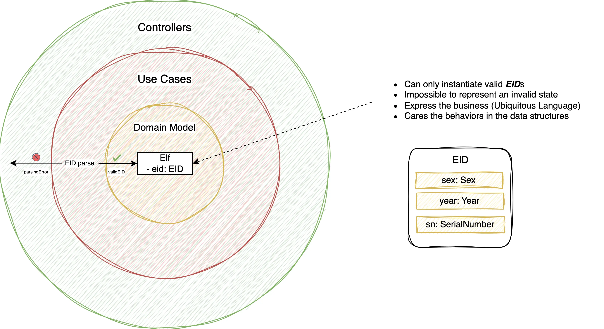
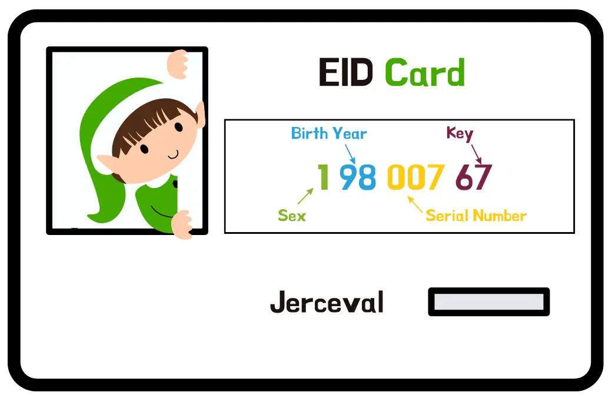
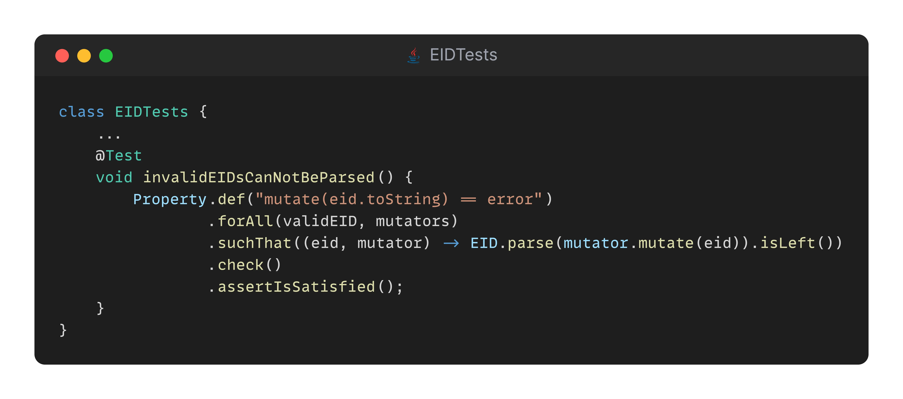

## Day 22: Bulletproof our code with "EID mutations".

The EID program is ready to be released but it does not mean we can not make it even more solid!

> Challenge the EID implementation by creating some mutants...



We have designed a robust `EID` parser making impossible to represent an invalid state.

We reached that, by driving our implementation through the below property:

```text
for all (eid)
parseEID(eid.toString) == eid
```

### Mutators... 
Now, let's add a new property that demonstrates that an invalid `EID` can never be parsed:

```text
for all (validEid)
mutate(eid.toString) == error
```

We propose to generate a valid `EID` and mutate its string representation to create an invalid one. For that we will create some mutators.

We have already started to work on it:

```java
// A record that will represent a mutation to make on the EID
private record Mutator(String name, Function1<EID, Gen<String>> func) {
    public String mutate(EID eid) {
        return func.apply(eid).apply(random);
    }
}

// Define mutators here
// This arbitrary will be used to randomly select a mutation to apply to the EID String representation
private static final Arbitrary<Mutator> mutators = Gen.choose((Mutator) null).arbitrary();

@Test
void invalidEIDsCanNotBeParsed() {
    Property.def("mutate(eid.toString) == error")
            .forAll(validEID, mutators)
            .suchThat((eid, mutator) -> EID.parse(mutator.mutate(eid)).isLeft())
            .check()
            .assertIsSatisfied();
}
```
Read more about it [here](https://abailly.github.io/posts/mutation-testing.html).

#### EID rules
The rules seen earlier still apply:

| Positions | Meaning                                                                                        | Possible values                     |
|-----------|------------------------------------------------------------------------------------------------|-------------------------------------|
| 1         | Sex : 1 for `Sloubi`, 2 for `Gagna`, 3 for `Catact`                                            | 1, 2 or 3                           |
| 2, 3      | Last two digits of the year of birth (which gives the year to the nearest century)             | From 00 to 99                       |
| 4, 5, 6   | "Serial number": birth order                                                                   | From 001 to 999                     |
| 7, 8      | control key = complement to 97 of the number formed by the first 6 digits of the EID modulo 97 | From 01 to 97                       |

Here is an example of such id:


### Starting Point


### Proposed Solution
[](solution/step-by-step.md)
