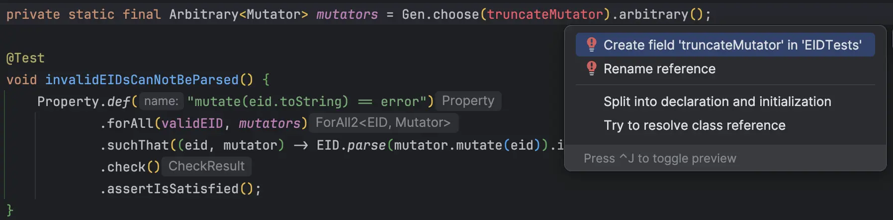
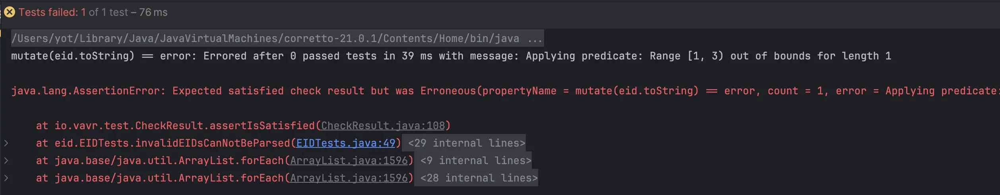
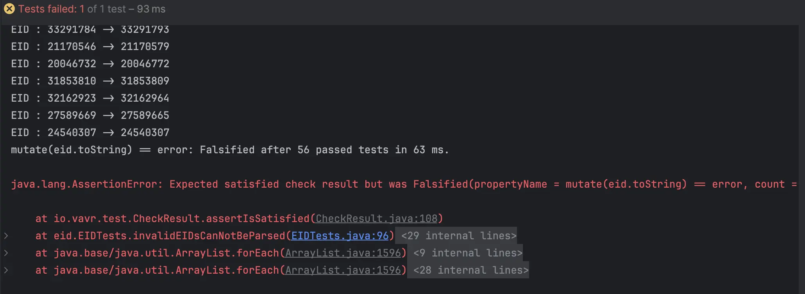

## Day 22: Bulletproof our code with "EID mutations".

We start by thinking about possible mutations for our `EID`s:

```text
Truncate the EID: randomly reduce the size of the id
Invalid Character: replace any character by an invalid one
Sex: one digit greater than 3
Year: one digit only (0 to 9) or greater than 99
Serial number: 2 digits only (0 to 99) or greater than 999
Key: generate an invalid key
```

We do not need to create a mutation to increase the size of the `EID` because it will be done through `Year` and `Serial Number` mutations.

A `mutator` is a `function` that takes an `EID` as an input and returns a `Gen<String>` representing the new `EID` representation:  

```java
private record Mutator(String name, Function1<EID, Gen<String>> func) {
    public String mutate(EID eid) {
        return func.apply(eid).apply(random);
    }
}
```

### Truncate the EID
🔴 As often, let's start by a red step



We hard-code a simple mutation:

```java
private static final Mutator truncateMutator = new Mutator("Truncate mutator", eid ->
        // keep only the first character
        Gen.of(eid.toString().substring(0, 1))
);
```

We can now run it and discover that it is failing...
It throws an exception when calling `substring` method on the `potentialEID`.



We can now investigate our production code to discover the bug, there is no defensive code...

```java
public static Either<ParsingError, EID> parse(String potentialEID) {
    // missing format checking here
    return parseSex(potentialEID.charAt(0))
            .map(EIDBuilder::new)
            .flatMap(eidBuilder -> parseYear(potentialEID.substring(1, 3), eidBuilder))
            .flatMap(eidBuilder -> parseSerialNumber(potentialEID.substring(3, 6), eidBuilder))
            .map(eidBuilder -> new EID(eidBuilder.getSex(), eidBuilder.getYear(), eidBuilder.getSerialNumber()))
            .flatMap(eid -> checkKey(potentialEID.substring(6), eid));
}
```

🟢 Let's add the validation logic

```java
public static Either<ParsingError, EID> parse(String potentialEID) {
    if (potentialEID == null || potentialEID.length() != 8) {
        return Either.left(new ParsingError("Not a valid EID: should have a length of 8"));
    }

    return parseSex(potentialEID.charAt(0))
            .map(EIDBuilder::new)
            .flatMap(eidBuilder -> parseYear(potentialEID.substring(1, 3), eidBuilder))
            .flatMap(eidBuilder -> parseSerialNumber(potentialEID.substring(3, 6), eidBuilder))
            .map(eidBuilder -> new EID(eidBuilder.getSex(), eidBuilder.getYear(), eidBuilder.getSerialNumber()))
            .flatMap(eid -> checkKey(potentialEID.substring(6), eid));
}
```

🔵 We can adapt the production code to make the flow easier to understand and remove the magic constant: 8

```java
public static Either<ParsingError, EID> parse(String potentialEID) {
    return isInvalidLength(potentialEID)
            ? left(new ParsingError("Not a valid EID: should have a length of 8")) :
            parseSafely(potentialEID);

}

private static boolean isInvalidLength(String potentialEID) {
    return potentialEID == null || potentialEID.length() != VALID_LENGTH;
}

private static Either<ParsingError, EID> parseSafely(String potentialEID) {
    return parseSex(potentialEID.charAt(0))
            .map(EIDBuilder::new)
            .flatMap(eidBuilder -> parseYear(potentialEID.substring(1, 3), eidBuilder))
            .flatMap(eidBuilder -> parseSerialNumber(potentialEID.substring(3, 6), eidBuilder))
            .map(eidBuilder -> new EID(eidBuilder.getSex(), eidBuilder.getYear(), eidBuilder.getSerialNumber()))
            .flatMap(eid -> checkKey(potentialEID.substring(6), eid));
}
```

- We can adapt `truncateMutator` to randomly reduce the size of the id

```java
private static final Mutator truncateMutator = new Mutator("Truncate mutator", eid ->
    Gen.choose(1, 8).map(size ->
            size == 1 ? "" : eid.toString().substring(0, size - 1)
    )
);
```

Examples of mutated `EID`s:

```text
EID : 20114038 -> 201
EID : 17082787 -> 17
EID : 24913360 -> 249
EID : 27156040 -> 271560
EID : 17801775 -> 
EID : 16493661 -> 1649366
EID : 20350204 -> 2
```

Let's update our mutation list:

```text
✅ Truncate the EID: randomly reduce the size of the id
Sex: one digit greater than 3
Year: one digit only (0 to 9) or greater than 99
Serial number: 2 digits only (0 to 99) or greater than 999
Key: generate an invalid key
```

### Mutate the Sex character
🔴 Add a `Sex` mutator to our `mutators` list

```java
private static final Arbitrary<Mutator> mutators = Gen.choose(
        truncateMutator,
        sexMutator
).arbitrary();
```

🟢 We create the `Sex` mutator

```java
private static final Mutator sexMutator = new Mutator("Sex mutator", eid ->
        Gen.choose(4, 9)
                .map(invalidSex -> invalidSex + eid.toString().substring(1))
);
```

We generate numbers between 4 and 9.
We may also replace this digit by an invalid character like `A`, `%` or whatever.

Here are some examples of invalid sex mutated `EID`s:

```text
EID : 24942361 -> 54942361
EID : 16363405 -> 56363405
EID : 27317277 -> 47317277
EID : 25720143 -> 45720143
EID : 27295404 -> 87295404
```

🔵 Anything to refactor?

Let's update our mutation list:

```text
✅ Truncate the EID: randomly reduce the size of the id
✅ Sex: one digit greater than 3
Year: one digit only (0 to 9) or greater than 99
Serial number: 2 digits only (0 to 99) or greater than 999
Key: generate an invalid key
```

### Mutate the Year
🔴 As "usual", we add a `yearMutator`

```java
private static final Mutator yearMutator = null;

private static final Arbitrary<Mutator> mutators = Gen.choose(
        truncateMutator,
        sexMutator,
        yearMutator
).arbitrary();
```

🟢 Implement the mutator. 
We start by generating a digit between 1 and 9 and replace the `Year` in the `String`by this `digit`. 

```java
private static final Mutator yearMutator = new Mutator("Year mutator", eid ->
        Gen.choose(1, 9).map(invalidYear ->
                eid.toString().charAt(0) + invalidYear.toString() + eid.toString().substring(3)
        )
);

private static final Arbitrary<Mutator> mutators = Gen.choose(
        truncateMutator,
        sexMutator,
        yearMutator
).arbitrary();
```

Here are some examples of invalid year mutated `EID`s: 

```text
EID : 19162943 -> 1262943
EID : 28520572 -> 2420572
EID : 33487863 -> 3787863
EID : 33258726 -> 3758726
EID : 13820322 -> 1220322
EID : 18609746 -> 1509746
EID : 35746577 -> 3946577
```

We add the logic to mutate the year with a number greater than 99.
We can use the `frequency` method to "ventilate" how to generate invalid years.

```java
private static final Mutator yearMutator = new Mutator("Year mutator", eid ->
    // 70% of values between 100 and 999
    // 30% of values between 1 and 9
    Gen.frequency(of(7, Gen.choose(100, 999)),
                    of(3, Gen.choose(1, 9)))
            .map(invalidYear ->
                    eid.toString().charAt(0) + invalidYear.toString() + eid.toString().substring(3)
            )
);
```

We can now check the resulting mutated `EID`s:

```text
EID : 28893330 -> 284193330
EID : 30578259 -> 3678259
EID : 13697487 -> 1797487
EID : 13535557 -> 150835557
EID : 27678751 -> 212278751
EID : 17833647 -> 1233647
```

🔵 We can refactor the `yearMutator` to improve concatenation

```java
private static final Mutator yearMutator = new Mutator("Year mutator", eid ->
        Gen.frequency(of(7, Gen.choose(100, 999)),
                        of(3, Gen.choose(1, 9)))
                .map(invalidYear ->
                        concat(
                                eid.toString().charAt(0),
                                invalidYear.toString(),
                                eid.toString().substring(3)
                        )
                )
);
```

```text
✅ Truncate the EID: randomly reduce the size of the id
✅ Sex: one digit greater than 3
✅ Year: one digit only (0 to 9) or greater than 99
Serial number: 2 digits only (0 to 99) or greater than 999
Key: generate an invalid key
```

We do the same with `Serial number` and end-up with:

```java
private static final Mutator truncateMutator = new Mutator("Truncate mutator", eid ->
        choose(1, 8).map(size ->
                size == 1 ? "" : eid.toString().substring(0, size - 1)
        )
);

private static final Mutator sexMutator = new Mutator("Sex mutator", eid ->
        choose(4, 9)
                .map(invalidSex -> invalidSex + eid.toString().substring(1))
);

private static final Mutator yearMutator = new Mutator("Year mutator", eid ->
        frequency(of(7, choose(100, 999)), of(3, choose(1, 9)))
                .map(invalidYear ->
                        concat(
                                eid.toString().charAt(0),
                                invalidYear.toString(),
                                eid.toString().substring(3)
                        )
                )
);

private static final Mutator serialNumberMutator = new Mutator("Serial Number mutator", eid ->
        frequency(of(7, choose(1000, 9999)), of(3, choose(1, 99)))
                .map(invalidSerialNumber ->
                        concat(
                                eid.toString().substring(0, 3),
                                invalidSerialNumber.toString(),
                                eid.toString().substring(6))
                )
);

private static final Arbitrary<Mutator> mutators = choose(
        truncateMutator,
        sexMutator,
        yearMutator,
        serialNumberMutator
).arbitrary();
```

Here are some examples of serial number mutated `EID`s:

```text
EID : 19069507 -> 1905907
EID : 24441129 -> 244380129
EID : 17826917 -> 178118617
EID : 16323714 -> 1638814
EID : 27992220 -> 279576920
EID : 11842116 -> 1188216
```

### Mutate the Key
Our mutations list look like this now:

```text
✅ Truncate the EID: randomly reduce the size of the id
✅ Sex: one digit greater than 3
✅ Year: one digit only (0 to 9) or greater than 99
✅ Serial number: 2 digits only (0 to 99) or greater than 999
Key: generate an invalid key
```

We create the `keyMutator` by generating a random int between 0 and 97 that replaces the actual key (2 last digits)

```java
private static final Mutator keyMutator = new Mutator("Key mutator", eid ->
        Gen.choose(0, 97)
                .map(invalidKey -> concat(
                        eid.toString().substring(0, 6),
                        format("%02d", invalidKey)
                ))
);
```

At our first run, it is falsified... meaning a mutated `EID` is a valid one...



From the log, we can see that the mutated value selected to replace the `key` is the `key` itself...

```text
EID : 24540307 -> 24540307
```

We need to adapt the mutator to not use the actual key as a valid generated value:

```java
private static final Mutator keyMutator = new Mutator("Key mutator", eid ->
        Gen.choose(0, 97)
                .filter(x -> x != parseInt(eid.toString().substring(6)))
                .map(invalidKey -> concat(
                        eid.toString().substring(0, 6),
                        format("%02d", invalidKey)
                ))
);
```

We have now finished to implement the mutators:
```text
✅ Truncate the EID: randomly reduce the size of the id
✅ Sex: one digit greater than 3
✅ Year: one digit only (0 to 9) or greater than 99
✅ Serial number: 2 digits only (0 to 99) or greater than 999
✅ Key: generate an invalid key
```

Let's take a look at the mutated values:

```text
Year mutator: 33978308 -> 362978308
Invalid character mutator -> 3337m463
Key mutator: 39901939 -> 39901956
Truncate mutator: 39877688 -> 3987
Year mutator: 13290879 -> 1690879
Serial Number mutator: 32254181 -> 322681
Serial Number mutator: 35395201 -> 353580501
Truncate mutator: 33975932 -> 339759
Key mutator: 15795558 -> 15795507
Sex mutator: 25318879 -> 65318879
```

Here is the final version of the code:

```java
private record Mutator(String name, Function1<EID, Gen<String>> func) {
    public String mutate(EID eid) {
        return func.apply(eid).apply(random);
    }
}

private static final Mutator truncateMutator = new Mutator("Truncate mutator", eid ->
        choose(1, 8).map(size ->
                size == 1 ? "" : eid.toString().substring(0, size - 1)
        )
);

private static final Mutator invalidCharacterMutator = new Mutator("Invalid character mutator", eid ->
        choose(0, 7).map(index -> {
                    char[] chars = eid.toString().toCharArray();
                    chars[index] = (char) (random.nextInt(26) + 'a');

                    return new String(chars);
                })
);


private static final Mutator sexMutator = new Mutator("Sex mutator", eid ->
        choose(4, 9)
                .map(invalidSex -> invalidSex + eid.toString().substring(1))
);
private static final Mutator yearMutator = new Mutator("Year mutator", eid ->
        frequency(of(7, choose(100, 999)), of(3, choose(1, 9)))
                .map(invalidYear ->
                        concat(
                                eid.toString().charAt(0),
                                invalidYear.toString(),
                                eid.toString().substring(3)
                        )
                )
);

private static final Mutator serialNumberMutator = new Mutator("Serial Number mutator", eid ->
        frequency(of(7, choose(1000, 9999)), of(3, choose(1, 99)))
                .map(invalidSerialNumber ->
                        concat(
                                eid.toString().substring(0, 3),
                                invalidSerialNumber.toString(),
                                eid.toString().substring(6))
                )
);

private static final Mutator keyMutator = new Mutator("Key mutator", eid ->
        choose(0, 97)
                .filter(x -> x != parseInt(eid.toString().substring(6)))
                .map(invalidKey -> concat(
                        eid.toString().substring(0, 6),
                        format("%02d", invalidKey)
                ))
);

private static final Arbitrary<Mutator> mutators = choose(
        truncateMutator,
        invalidCharacterMutator,
        sexMutator,
        yearMutator,
        serialNumberMutator,
        keyMutator
).arbitrary();

@Test
void invalidEIDsCanNotBeParsed() {
    Property.def("mutate(eid.toString) == error")
            .forAll(validEID, mutators)
            .suchThat((eid, mutator) -> {
                System.out.println(mutator.name + ":" + mutator.mutate(eid));
                return EID.parse(mutator.mutate(eid)).isLeft();
            })
            .check()
            .assertIsSatisfied();
}
```

> Our implementation is now bullet-proof 🥳🔫

### Reflect
- What do you think of this `mutation-based` approach?
- How could you use it in your own code?
- What are the limits?