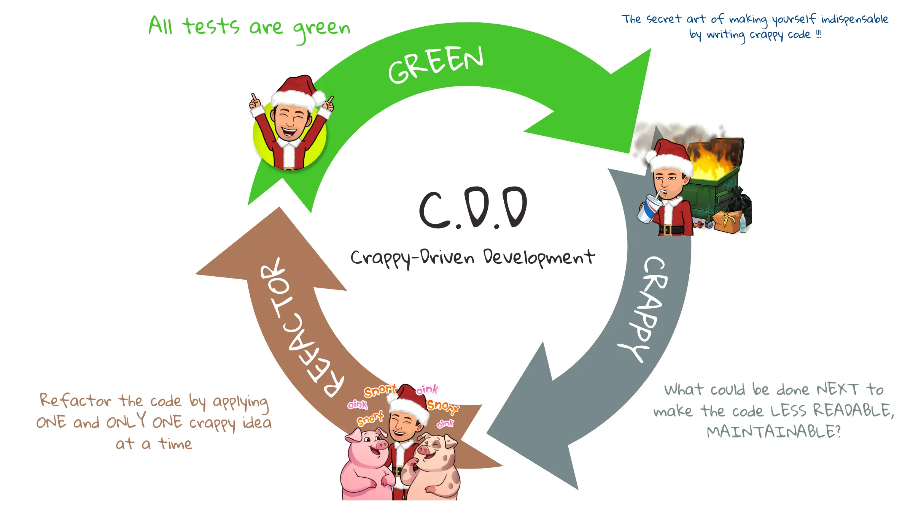
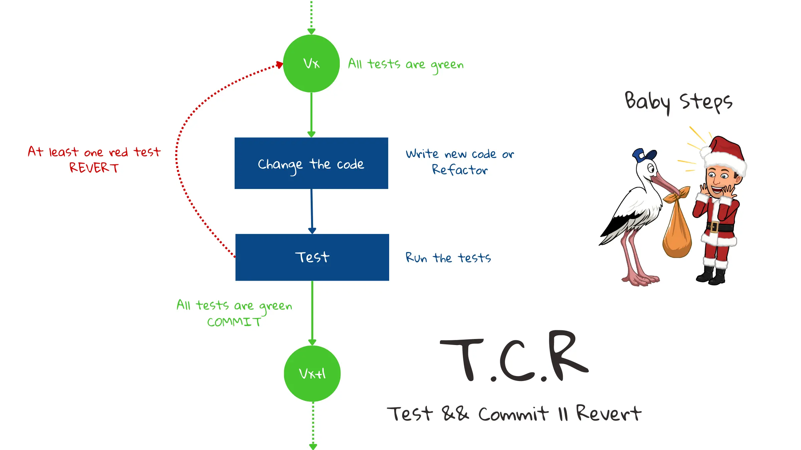
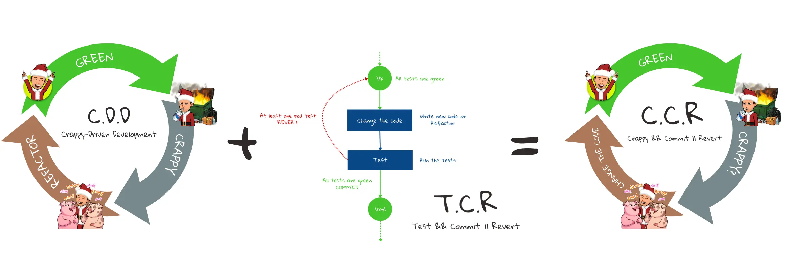
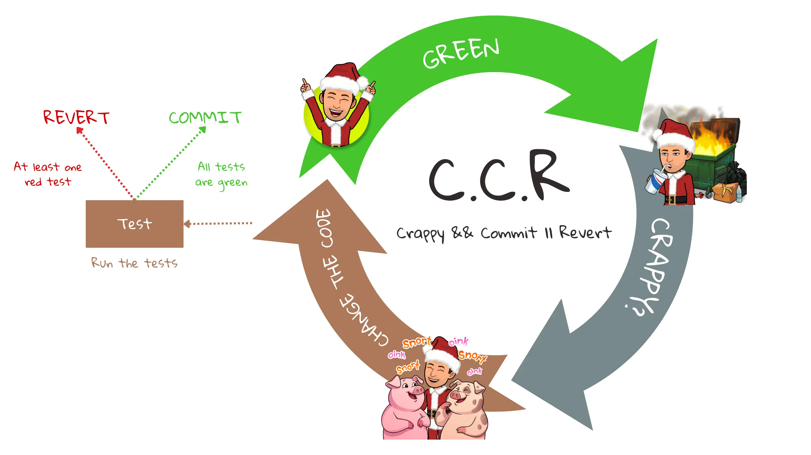
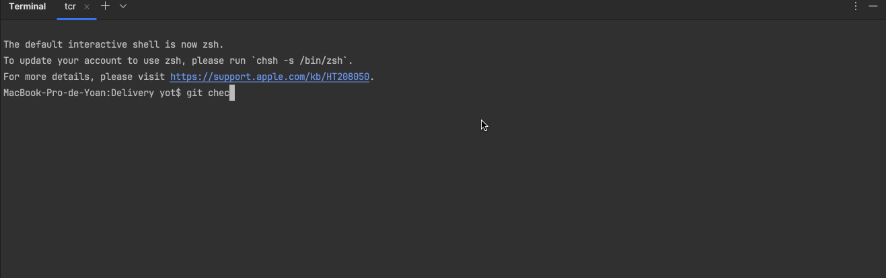
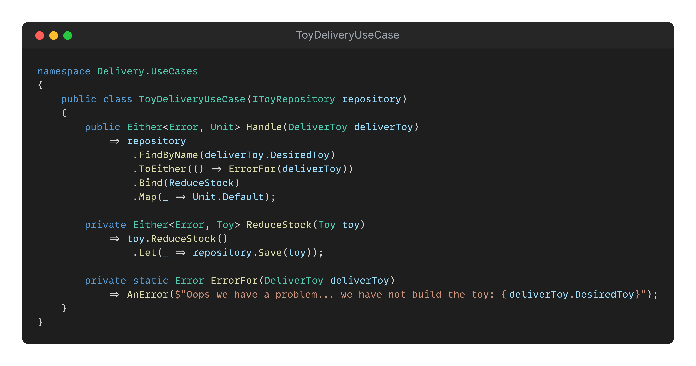

## Day 24: Make yourself indispensable.
It's Christmas Eve 🎅 you've been working hard to help Santa prepare. 
You've written and refactored a lot of code.

Now you're wondering whether Santa will call on your services next year.

> To be sure, you decide to make yourself indispensable by applying the `CDD` (Crappy-Driven Development) technique to the most critical code used to manage the delivery of toys.

### [`Crappy Driven Development`](https://github.com/ythirion/crappy-driven-development) (CDD)
Apply `CDD` to make the code so crappy that no one will be able to understand it...

Follow the golden rules described below:


### `Test && Commit || Revert` (TCR)
To be sure to work in baby steps and apply only one crappy idea at a time, we propose to use `TCR`: [`Test && Commit || Revert`](https://medium.com/@kentbeck_7670/test-commit-revert-870bbd756864) workflow.


We can automate `commit` and `revert` by using `murex` TCR tool. 
Documentation available [here](https://github.com/murex/TCR)

### `Crappy && Commit || Revert` (CCR)
We mix `CDD` and `TCR` for this exercise:


Here is the technique detailed:


You can run `tcr` tool with this command:
```shell
./tcrw
```

Create a branch before running it: 


Enjoy 🤗



### Proposed Solution
[](solution/step-by-step.md)
