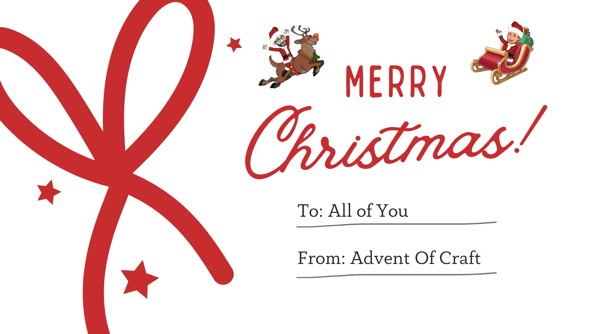

## Day 25: A Message for Your Future Self 🎁

We wish you a `Merry Christmas` 🥳🎅

As our Advent Of Craft calendar comes to an end, Santa wants to give you one last task that combines reflection and a dash of creativity.

Throughout this journey, you’ve tackled `coding exercises`, refined your `craftsmanship`, and explored `powerful practices and techniques`.

Now it’s time to **capture that growth and pass on your wisdom—to yourself**.

Santa has left you a snippet of code for a `Time Capsule program`. 

This program will allow you to leave a message for your future self, preserving the lessons and insights you’ve gained during this adventure.

This challenge isn’t about code — it’s about taking a moment to celebrate your growth, set intentions for the future, and create a small tradition that connects you to the craft you love.

Happy Crafting! 🎅

### Proposed Solution

